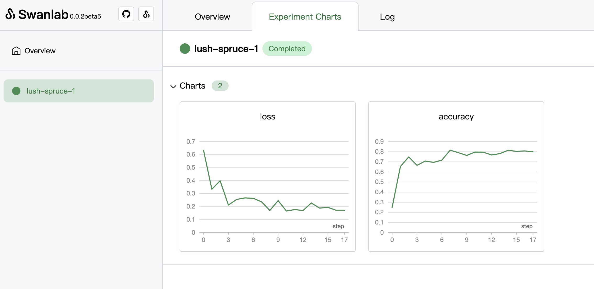

<p align="center">
  
  <br/>
  <br/>
</p>
<p align="center">
  <a href="https://pypi.python.org/pypi/swanlab"></a>
  <a href="https://github.com/SwanHubX/SwanLab/blob/main/LICENSE"></a>
  <a href="https://github.com/SwanHubX/SwanLab/releases"></a>
</p>
<h4 align="center">
  <p>
    <b>English</b> |<a href="https://github.com/SwanHubX/SwanLab/blob/main/README_zh-hans.md">简体中文</a>
  </p>
</h4>


SwanLab is the next-generation machine learning experiment management and visualization tool released by the [SwanHub](https://swanhub.co), designed to facilitate effective collaboration in machine learning training.

SwanLab provides streamlined APIs that make it easy to track machine learning metrics and record configurations. Additionally, SwanLab provides a visual dashboard for the most intuitive way to **monitor**, **analyze**, and **compare** your training.

For specific guidance on SwanLab's features, please refer to the [User Guide](https://geektechstudio.feishu.cn/wiki/UInBw9eaziv17IkwfrOcHCZ1nbc).

Currently, SwanLab is undergoing rapid iterations and will continue to add new features.


## Installation

This repository is tested on Python 3.8+.

SwanLab can be installed using pip as follows:

```bash
pip install swanlab
```


## Quick tour

Let's simulate a simple machine learning training process, using `swanlab.init` to initialize the experiment and record configuration information, and using `swanlab.log` to track key metrics (in this example, it's `loss` and `acc`):

```python
import swanlab
import time
import random

lr = 0.01
epochs = 20

# Initialize the experiment and record configuration information
swanlab.init(
	  description="This is a sample experiment for machine learning training.",
    config={
        "learning_rate": lr,
        "epochs": epochs,
    },
)

# Simulate a machine learning training process
for epoch in range(2, epochs):
    acc = 1 - 2**-epoch - random.random() / epoch - offset
    loss = 2**-epoch + random.random() / epoch + offset
    # Track key metrics
    swanlab.log({"loss": loss, "accuracy": acc})
    time.sleep(0.1)
```

During the program running, a `swanlog` folder will be generated in the directory to record your training data.

If you want to visualize your experiment, open the terminal and enter the root directory (no need to enter the `swanlog` folder), and run the following command:

```bash
swanlab watch
```

If you see the following output, it means that the experimental board is running successfully:

```console
[SwanLab-INFO]:        SwanLab Experiment Dashboard ready in 375ms

                        ➜  Local:   http://127.0.0.1:5092
```

Access`http://127.0.0.1:5092` at this time to enter the experiment dashboard and browse your experimental results：




# License

[Apache 2.0 License](https://github.com/SwanHubX/SwanLab/blob/main/LICENSE)


