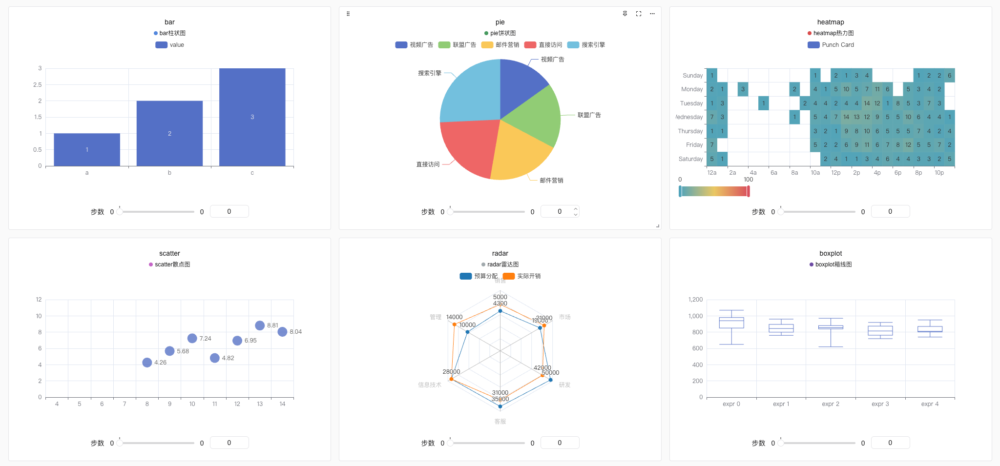
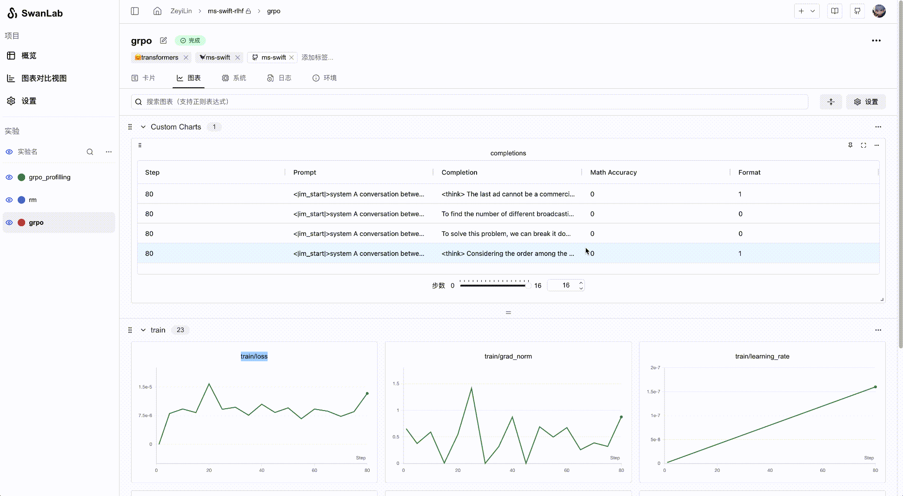
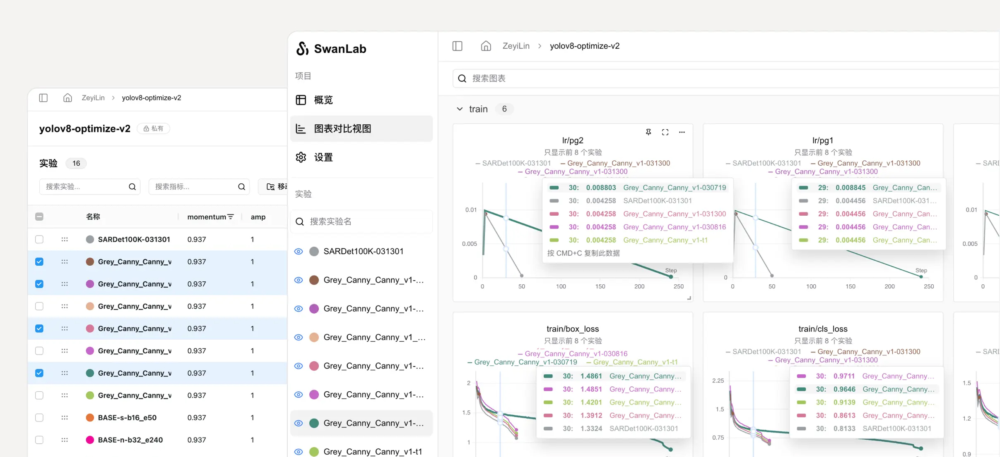
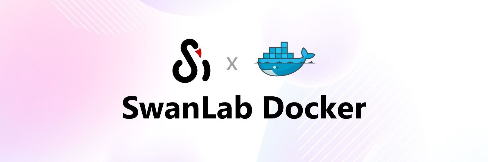

<div align="center">

<picture>
  <source media="(prefers-color-scheme: dark)" srcset="readme_files/swanlab-logo-type2-dark.svg">
  <source media="(prefers-color-scheme: light)" srcset="readme_files/swanlab-logo-type2-light.svg">
  
</picture>

一个开源、现代化设计的深度学习训练跟踪与可视化工具  
同时支持云端/离线使用，适配30+主流框架，与你的实验代码轻松集成

<a href="https://swanlab.cn">🔥SwanLab 在线版</a> · <a href="https://docs.swanlab.cn">📃 文档</a> · <a href="https://github.com/swanhubx/swanlab/issues">报告问题</a> · <a href="https://geektechstudio.feishu.cn/share/base/form/shrcnyBlK8OMD0eweoFcc2SvWKc">建议反馈</a> · <a href="https://docs.swanlab.cn/zh/guide_cloud/general/changelog.html">更新日志</a> ·  <a href="https://swanlab.cn/benchmarks">基线社区</a>

[![][release-shield]][release-link]
[![][dockerhub-shield]][dockerhub-link]
[![][github-stars-shield]][github-stars-link]
[![][github-issues-shield]][github-issues-shield-link]
[![][github-contributors-shield]][github-contributors-link]
[![][license-shield]][license-shield-link]  
[![][tracking-swanlab-shield]][tracking-swanlab-shield-link]
[![][last-commit-shield]][last-commit-shield-link]
[![][pypi-version-shield]][pypi-version-shield-link]
[![][wechat-shield]][wechat-shield-link]
[![][pypi-downloads-shield]][pypi-downloads-shield-link]
[![][colab-shield]][colab-shield-link]


中文 / [English](README_EN.md) / [日本語](README_JP.md) / [Русский](README_RU.md)

👋 加入我们的[微信群](https://docs.swanlab.cn/zh/guide_cloud/community/online-support.html)

<a href="https://hellogithub.com/repository/b442a9fa270e4ccb8847c9ee3445e41b" target="_blank"></a>


</div>

<br/>


## 目录

- [🌟 最近更新](#-最近更新)
- [👋🏻 什么是SwanLab](#-什么是swanlab)
- [📃 在线演示](#-在线演示)
- [🏁 快速开始](#-快速开始)
- [💻 自托管](#-自托管)
- [🔥 实战案例](#-实战案例)
- [🎮 硬件记录](#-硬件记录)
- [🚗 框架集成](#-框架集成)
- [🔌 插件与API](#-插件与api)
- [🆚 与熟悉的工具的比较](#-与熟悉的工具的比较)
- [👥 社区](#-社区)
- [📃 协议](#-协议)

<br/>


## 🌟 最近更新

- 2025.08.19：🤔更强大的图表渲染性能与低侵入式加载动画，让研究者更聚焦于实验分析本身；集成优秀的[MLX-LM](https://github.com/ml-explore/mlx-lm)、[SpecForge](https://github.com/sgl-project/SpecForge)框架，提供更多场景的训练体验；

- 2025.08.06：👥**训练轻协作**上线，支持邀请项目协作者，分享项目链接与二维码；工作区支持列表视图，支持显示项目Tags；

- 2025.07.29：🚀侧边栏支持**实验筛选、排序**；📊表格视图上线**列控制面板**，能够方便地实现列的隐藏与显示；🔐**多API Key**管理上线，让你的数据更安全；swanlab sync提高了对日志文件完整性的兼容，适配训练崩溃等场景；新图表-PR曲线、ROC曲线、混淆矩阵上线，[文档](https://docs.swanlab.cn/api/py-pr_curve.html)；

- 2025.07.17：📊更强大的**折线图配置**，支持灵活配置线型、颜色、粗细、网格、图例位置等；📹支持**swanlab.Video**数据类型，支持记录与可视化GIF格式文件；全局图表仪表盘支持配置Y轴与最大显示实验数；

- 2025.07.10：📚更强大的**文本视图**，支持Markdown渲染与方向键切换，可由`swanlab.echarts.table`与`swanlab.Text`创建，[Demo](https://swanlab.cn/@ZeyiLin/ms-swift-rlhf/runs/d661ty9mslogsgk41fp0p/chart)

- 2025.07.06：🚄支持**resume断点续训**；新插件**文件记录器**；集成[ray](https://github.com/ray-project/ray)框架，[文档](https://docs.swanlab.cn/guide_cloud/integration/integration-ray.html)；集成[ROLL](https://github.com/volcengine/ROLL)框架，感谢[@PanAndy](https://github.com/PanAndy)，[文档](https://docs.swanlab.cn/guide_cloud/integration/integration-roll.html)

- 2025.06.27：📊支持**小折线图局部放大**；支持配置**单个折线图平滑**；大幅改进了图像图表放大后的交互效果；

- 2025.06.20：🤗集成[accelerate](https://github.com/huggingface/accelerate)框架，[PR](https://github.com/huggingface/accelerate/pull/3605)，[文档](https://docs.swanlab.cn/guide_cloud/integration/integration-huggingface-accelerate.html)，增强分布式训练中的实验记录体验；

- 2025.06.18：🐜集成[AREAL](https://github.com/inclusionAI/AReaL)框架，感谢[@xichengpro](https://github.com/xichengpro)，[PR](https://github.com/inclusionAI/AReaL/pull/98)，[文档](https://inclusionai.github.io/AReaL/tutorial/quickstart.html#monitoring-the-training-process)；🖱支持鼠标Hover到侧边栏实验时，高亮相应曲线；支持跨组对比折线图；支持设置实验名裁剪规则；


<details><summary>完整更新日志</summary>

- 2025.06.11：📊支持 **swanlab.echarts.table** 数据类型，支持纯文本图表展示；支持对分组进行**拉伸交互**，以增大同时显示的图表数量；表格视图增加 **指标最大/最小值** 选项；

- 2025.06.08：♻️支持在本地存储完整的实验日志文件，通过 **swanlab sync** 上传本地日志文件到云端/私有化部署端；硬件监控支持**海光DCU**；

- 2025.06.01：🏸支持**图表自由拖拽**；支持**ECharts自定义图表**，增加包括柱状图、饼状图、直方图在内的20+图表类型；硬件监控支持**沐曦GPU**；集成 **[PaddleNLP](https://github.com/PaddlePaddle/PaddleNLP)** 框架；

- 2025.05.25：日志支持记录**标准错误流**，PyTorch Lightning等框架的打印信息可以被更好地记录；硬件监控支持**摩尔线程**；新增运行命令记录安全防护功能，API Key将被自动隐藏；

- 2025.05.14：支持**实验Tag**；支持折线图**Log Scale**；支持**分组拖拽**；大幅度优化了大量指标上传的体验；增加`swanlab.OpenApi`开放接口；

- 2025.05.09：支持**折线图创建**；配置图表功能增加**数据源选择**功能，支持单张图表显示不同的指标；支持生成**训练项目GitHub徽章**；

- 2025.04.23：支持折线图**编辑**，支持自由配置图表的X、Y轴数据范围和标题样式；图表搜索支持**正则表达式**；支持**昆仑芯XPU**的硬件检测与监控；

- 2025.04.11：支持折线图**局部区域选取**；支持全局选择仪表盘折线图的step范围；支持一键隐藏全部图表；

- 2025.04.08：支持**swanlab.Molecule**数据类型，支持记录与可视化生物化学分子数据；支持保存表格视图中的排序、筛选、列顺序变化状态；

- 2025.04.07：我们与 [EvalScope](https://github.com/ModelScope/EvalScope) 完成了联合集成，现在你可以在EvalScope中使用SwanLab来**评估大模型性能**；

- 2025.03.30：支持**swanlab.Settings**方法，支持更精细化的实验行为控制；支持**寒武纪MLU**硬件监控；支持 [Slack通知](https://docs.swanlab.cn/plugin/notification-slack.html)、[Discord通知](https://docs.swanlab.cn/plugin/notification-discord.html)；

- 2025.03.21：🎉🤗HuggingFace Transformers已正式集成SwanLab（>=4.50.0版本），[#36433](https://github.com/huggingface/transformers/pull/36433)；新增 **Object3D图表** ，支持记录与可视化三维点云，[文档](https://docs.swanlab.cn/api/py-object3d.html)；硬件监控支持了 GPU显存（MB）、磁盘利用率、网络上下行 的记录；

- 2025.03.12：🎉🎉SwanLab**私有化部署版**现已发布！！[🔗部署文档](https://docs.swanlab.cn/guide_cloud/self_host/docker-deploy.html)；SwanLab 已支持插件扩展，如 [邮件通知](https://docs.swanlab.cn/plugin/notification-email.html)、[飞书通知](https://docs.swanlab.cn/plugin/notification-lark.html)

- 2025.03.09：支持**实验侧边栏拉宽**；新增外显 Git代码 按钮；新增 **sync_mlflow** 功能，支持与mlflow框架同步实验跟踪；

- 2025.03.06：我们与 [DiffSynth Studio](https://github.com/modelscope/diffsynth-studio) 完成了联合集成，现在你可以在DiffSynth Studio中使用SwanLab来**跟踪和可视化Diffusion模型文生图/视频实验**，[使用指引](https://docs.swanlab.cn/guide_cloud/integration/integration-diffsynth-studio.html)；

- 2025.03.04：新增 **MLFlow转换** 功能，支持将MLFlow实验转换为SwanLab实验，[使用指引](https://docs.swanlab.cn/guide_cloud/integration/integration-mlflow.html)；

- 2025.03.01：新增 **移动实验** 功能，现在可以将实验移动到不同组织的不同项目下了；

- 2025.02.24：我们与 [EasyR1](https://github.com/hiyouga/EasyR1) 完成了联合集成，现在你可以在EasyR1中使用SwanLab来**跟踪和可视化多模态大模型强化学习实验**，[使用指引](https://docs.swanlab.cn/guide_cloud/integration/integration-easyr1.html)

- 2025.02.18：我们与 [Swift](https://github.com/modelscope/ms-swift) 完成了联合集成，现在你可以在Swift的CLI/WebUI中使用SwanLab来**跟踪和可视化大模型微调实验**，[使用指引](https://docs.swanlab.cn/guide_cloud/integration/integration-swift.html)。

- 2025.02.16：新增 **图表移动分组、创建分组** 功能。

- 2025.02.09：我们与 [veRL](https://github.com/volcengine/verl) 完成了联合集成，现在你可以在veRL中使用SwanLab来**跟踪和可视化大模型强化学习实验**，[使用指引](https://docs.swanlab.cn/guide_cloud/integration/integration-verl.html)。

- 2025.02.05：`swanlab.log`支持嵌套字典 [#812](https://github.com/SwanHubX/SwanLab/pull/812)，适配Jax框架特性；支持`name`与`notes`参数；

- 2025.01.22：新增`sync_tensorboardX`与`sync_tensorboard_torch`功能，支持与此两种TensorBoard框架同步实验跟踪；

- 2025.01.17：新增`sync_wandb`功能，[文档](https://docs.swanlab.cn/guide_cloud/integration/integration-wandb.html)，支持与Weights & Biases实验跟踪同步；大幅改进了日志渲染性能

- 2025.01.11：云端版大幅优化了项目表格的性能，并支持拖拽、排序、筛选等交互

- 2025.01.01：新增折线图**持久化平滑**、折线图拖拽式改变大小，优化图表浏览体验

- 2024.12.22：我们与 [LLaMA Factory](https://github.com/hiyouga/LLaMA-Factory) 完成了联合集成，现在你可以在LLaMA Factory中使用SwanLab来**跟踪和可视化大模型微调实验**，[使用指引](https://github.com/hiyouga/LLaMA-Factory?tab=readme-ov-file#use-swanlab-logger)。

- 2024.12.15：**硬件监控（0.4.0）** 功能上线，支持CPU、NPU（Ascend）、GPU（Nvidia）的系统级信息记录与监控。

- 2024.12.06：新增对[LightGBM](https://docs.swanlab.cn/guide_cloud/integration/integration-lightgbm.html)、[XGBoost](https://docs.swanlab.cn/guide_cloud/integration/integration-xgboost.html)的集成；提高了对日志记录单行长度的限制。

- 2024.11.26：环境选项卡-硬件部分支持识别**华为昇腾NPU**与**鲲鹏CPU**；云厂商部分支持识别青云**基石智算**。

</details>

<br>

## 👋🏻 什么是SwanLab

SwanLab 是一款开源、轻量的 AI 模型训练跟踪与可视化工具，提供了一个跟踪、记录、比较、和协作实验的平台。

SwanLab 面向人工智能研究者，设计了友好的Python API 和漂亮的UI界面，并提供**训练可视化、自动日志记录、超参数记录、实验对比、多人协同**等功能。在SwanLab上，研究者能基于直观的可视化图表发现训练问题，对比多个实验找到研究灵感，并通过**在线网页**的分享与基于组织的**多人协同训练**，打破团队沟通的壁垒，提高组织训练效率。

https://github.com/user-attachments/assets/7965fec4-c8b0-4956-803d-dbf177b44f54

以下是其核心特性列表：

**1. 📊 实验指标与超参数跟踪**: 极简的代码嵌入您的机器学习 pipeline，跟踪记录训练关键指标

- ☁️ 支持**云端**使用（类似Weights & Biases），随时随地查看训练进展。[手机看实验的方法](https://docs.swanlab.cn/guide_cloud/general/app.html)

- 📝 支持**超参数记录**、**指标总结**、**表格分析**

- 🌸 **可视化训练过程**: 通过UI界面对实验跟踪数据进行可视化，可以让训练师直观地看到实验每一步的结果，分析指标走势，判断哪些变化导致了模型效果的提升，从而整体性地提升模型迭代效率。

- **支持的元数据类型**：标量指标、图像、音频、文本、视频、3D点云、生物化学分子、Echarts自定义图表...


- **支持的图表类型**：折线图、媒体图（图像、音频、文本、视频）、3D点云、生物化学分子、柱状图、散点图、箱线图、热力图、饼状图、雷达图、[自定义图表](https://docs.swanlab.cn/guide_cloud/experiment_track/log-custom-chart.html)...

[](https://swanlab.cn/@ZeyiLin/swanlab-echarts-demo/charts)

- **LLM生成内容可视化组件**：为大语言模型训练场景打造的文本内容可视化图表，支持Markdown渲染



- **后台自动记录**：日志logging、硬件环境、Git 仓库、Python 环境、Python 库列表、项目运行目录

- **断点续训记录**：支持在训练完成/中断后，补充新的指标数据到同个实验中

**2. ⚡️ 全面的框架集成**: PyTorch、🤗HuggingFace Transformers、PyTorch Lightning、🦙LLaMA Factory、MMDetection、Ultralytics、PaddleDetetion、LightGBM、XGBoost、Keras、Tensorboard、Weights&Biases、OpenAI、Swift、XTuner、Stable Baseline3、Hydra 在内的 **30+** 框架


**3. 💻 硬件监控**: 支持实时记录与监控CPU、NPU（**昇腾Ascend**）、GPU（**英伟达Nvidia**）、MLU（**寒武纪Cambricon**）、XLU（**昆仑芯Kunlunxin**）、DCU（**海光DCU**）、MetaX GPU（**沐曦XPU**）、Moore Threads GPU（**摩尔线程**）、内存的系统级硬件指标

**4. 📦 实验管理**: 通过专为训练场景设计的集中式仪表板，通过整体视图速览全局，快速管理多个项目与实验

**5. 🆚 比较结果**: 通过在线表格与对比图表比较不同实验的超参数和结果，挖掘迭代灵感



**6. 👥 在线协作**: 您可以与团队进行协作式训练，支持将实验实时同步在一个项目下，您可以在线查看团队的训练记录，基于结果发表看法与建议

**7. ✉️ 分享结果**: 复制和发送持久的 URL 来共享每个实验，方便地发送给伙伴，或嵌入到在线笔记中

**8. 💻 支持自托管**: 支持离线环境使用，自托管的社区版同样可以查看仪表盘与管理实验，[使用攻略](#-自托管)

**9. 🔌 插件拓展**: 支持通过插件拓展SwanLab的使用场景，比如 [飞书通知](https://docs.swanlab.cn/plugin/notification-lark.html)、[Slack通知](https://docs.swanlab.cn/plugin/notification-slack.html)、[CSV记录器](https://docs.swanlab.cn/plugin/writer-csv.html)等


> \[!IMPORTANT]
>
> **收藏项目**，你将从 GitHub 上无延迟地接收所有发布通知～ ⭐️


<br>

## 📃 在线演示

来看看 SwanLab 的在线演示：

| [ResNet50 猫狗分类][demo-cats-dogs] | [Yolov8-COCO128 目标检测][demo-yolo] |
| :--------: | :--------: |
| [![][demo-cats-dogs-image]][demo-cats-dogs] | [![][demo-yolo-image]][demo-yolo] |
| 跟踪一个简单的 ResNet50 模型在猫狗数据集上训练的图像分类任务。 | 使用 Yolov8 在 COCO128 数据集上进行目标检测任务，跟踪训练超参数和指标。 |

| [Qwen2 指令微调][demo-qwen2-sft] | [LSTM Google 股票预测][demo-google-stock] |
| :--------: | :--------: |
| [![][demo-qwen2-sft-image]][demo-qwen2-sft] | [![][demo-google-stock-image]][demo-google-stock] |
| 跟踪 Qwen2 大语言模型的指令微调训练，完成简单的指令遵循。 | 使用简单的 LSTM 模型在 Google 股价数据集上训练，实现对未来股价的预测。 |

| [ResNeXt101 音频分类][demo-audio-classification] | [Qwen2-VL COCO数据集微调][demo-qwen2-vl] |
| :--------: | :--------: |
| [![][demo-audio-classification-image]][demo-audio-classification] | [![][demo-qwen2-vl-image]][demo-qwen2-vl] |
| 从ResNet到ResNeXt在音频分类任务上的渐进式实验过程 | 基于Qwen2-VL多模态大模型，在COCO2014数据集上进行Lora微调。 |

| [EasyR1 多模态LLM RL训练][demo-easyr1-rl] | [Qwen2.5-0.5B GRPO训练][demo-qwen2-grpo] |
| :--------: | :--------: |
| [![][demo-easyr1-rl-image]][demo-easyr1-rl] | [![][demo-qwen2-grpo-image]][demo-qwen2-grpo] |
| 使用EasyR1框架进行多模态LLM RL训练 | 基于Qwen2.5-0.5B模型在GSM8k数据集上进行GRPO训练 |

[更多案例](https://docs.swanlab.cn/zh/examples/mnist.html)

<br>

## 🏁 快速开始

### 1.安装

```bash
pip install swanlab
```

<details><summary>源码安装</summary>

如果你想体验最新的特性，可以使用源码安装。

```bash
# 方式一
git clone https://github.com/SwanHubX/SwanLab.git
pip install -e .

# 方式二
pip install git+https://github.com/SwanHubX/SwanLab.git
```

</details>

<details><summary>离线看板拓展安装</summary>

[离线看板文档](https://docs.swanlab.cn/guide_cloud/self_host/offline-board.html)

```bash
pip install 'swanlab[dashboard]'
```

</details>


### 2.登录并获取 API Key

1. 免费[注册账号](https://swanlab.cn)

2. 登录账号，在用户设置 > [API Key](https://swanlab.cn/settings) 里复制您的 API Key

3. 打开终端，输入：

```bash
swanlab login
```

出现提示时，输入您的 API Key，按下回车，完成登陆。

### 3.将 SwanLab 与你的代码集成

```python
import swanlab

# 初始化一个新的swanlab实验
swanlab.init(
    project="my-first-ml",
    config={'learning-rate': 0.003},
)

# 记录指标
for i in range(10):
    swanlab.log({"loss": i, "acc": i})
```

大功告成！前往[SwanLab](https://swanlab.cn)查看你的第一个 SwanLab 实验。

<br>

## 💻 自托管

自托管社区版支持离线查看 SwanLab 仪表盘。



### 1. 使用Docker部署自托管版本

详情请参考：[文档](https://docs.swanlab.cn/guide_cloud/self_host/docker-deploy.html)

```bash
git clone https://github.com/SwanHubX/self-hosted.git
cd self-hosted/docker
```

中国地区快速安装：

```bash
./install.sh
```

从DockerHub拉取镜像安装：

```bash
./install-dockerhub.sh
```

### 2. 将实验指定到自托管服务

登录到自托管服务：

```bash
swanlab login --host http://localhost:8000
```

完成登录后，即可将实验记录到自托管服务。


<br>

## 🔥 实战案例

**使用SwanLab的优秀教程开源项目：**
- [happy-llm](https://github.com/datawhalechina/happy-llm)：从零开始的大语言模型原理与实践教程 
- [self-llm](https://github.com/datawhalechina/self-llm)：《开源大模型食用指南》针对中国宝宝量身打造的基于Linux环境快速微调（全参数/Lora）、部署国内外开源大模型（LLM）/多模态大模型（MLLM）教程 
- [unlock-deepseek](https://github.com/datawhalechina/unlock-deepseek)：DeepSeek 系列工作解读、扩展和复现 
- [Qwen3-SmVL](https://github.com/ShaohonChen/Qwen3-SmVL): 将SmolVLM2的视觉头与Qwen3-0.6B模型进行了拼接微调 
- [OPPO/Agent_Foundation_Models](https://github.com/OPPO-PersonalAI/Agent_Foundation_Models): 通过多Agent蒸馏和Agent RL的端到端Agent基础模型。 

**使用SwanLab的优秀论文：**
- [Animation Needs Attention: A Holistic Approach to Slides Animation Comprehension with Visual-Language Models](https://arxiv.org/abs/2507.03916)
- [Efficient Model Fine-Tuning with LoRA for Biomedical Named Entity Recognition](https://ieeexplore.ieee.org/abstract/document/11082049/)
- [SpectrumWorld: Artificial Intelligence Foundation for Spectroscopy](https://arxiv.org/abs/2508.01188)
- [CodeBoost: Boosting Code LLMs by Squeezing Knowledge from Code Snippets with RL](https://arxiv.org/pdf/2508.05242)

**教程文章：**
- [MNIST手写体识别](https://docs.swanlab.cn/examples/mnist.html)
- [FashionMNIST服装分类](https://docs.swanlab.cn/examples/fashionmnist.html)
- [Cifar10图像分类](https://docs.swanlab.cn/examples/cifar10.html)
- [Resnet猫狗分类](https://docs.swanlab.cn/examples/cats_dogs_classification.html)
- [Yolo目标检测](https://docs.swanlab.cn/examples/yolo.html)
- [UNet医学影像分割](https://docs.swanlab.cn/examples/unet-medical-segmentation.html)
- [音频分类](https://docs.swanlab.cn/examples/audio_classification.html)
- [DQN强化学习-推车倒立摆](https://docs.swanlab.cn/examples/dqn_cartpole.html)
- [LSTM Google股票预测](https://docs.swanlab.cn/examples/audio_classification.html)
- [BERT文本分类](https://docs.swanlab.cn/examples/bert.html)
- [Stable Diffusion文生图微调](https://docs.swanlab.cn/examples/stable_diffusion.html)
- [LLM预训练](https://docs.swanlab.cn/examples/pretrain_llm.html)
- [GLM4指令微调](https://docs.swanlab.cn/examples/glm4-instruct.html)
- [Qwen下游任务训练](https://docs.swanlab.cn/examples/qwen_finetune.html)
- [NER命名实体识别](https://docs.swanlab.cn/examples/ner.html)
- [Qwen3医学模型微调](https://docs.swanlab.cn/examples/qwen3-medical.html)
- [Qwen2-VL多模态大模型微调实战](https://docs.swanlab.cn/examples/qwen_vl_coco.html)
- [GRPO大模型强化学习](https://docs.swanlab.cn/examples/qwen_grpo.html)
- [Qwen3-SmVL-0.6B多模态模型训练](https://docs.swanlab.cn/examples/qwen3_smolvlm_muxi.html)
- [LeRobot 具身智能入门](https://docs.swanlab.cn/examples/robot/lerobot-guide.html)
- [GLM-4.5-Air-LoRA 及 SwanLab 可视化记录](https://github.com/datawhalechina/self-llm/blob/master/models/GLM-4.5-Air/03-GLM-4.5-Air-Lora%20%E5%8F%8A%20Swanlab%20%E5%8F%AF%E8%A7%86%E5%8C%96%E5%BE%AE%E8%B0%83.md)
- [RAG怎么做？SwanLab文档助手方案开源了](https://docs.swanlab.cn/course/prompt_engineering_course/11-swanlab_rag/1.swanlab-rag.html)

🌟如果你有想收录的教程，欢迎提交PR！

<br>

## 🎮 硬件记录

SwanLab会对AI训练过程中所使用的**硬件信息**和**资源使用情况**进行记录，下面是支持情况表格：

| 硬件 | 信息记录 | 资源监控 | 脚本 |
| --- | --- | --- | --- |
| 英伟达GPU | ✅ | ✅ | [nvidia.py](https://github.com/SwanHubX/SwanLab/blob/main/swanlab/data/run/metadata/hardware/gpu/nvidia.py) |
| 昇腾NPU | ✅ | ✅ | [ascend.py](https://github.com/SwanHubX/SwanLab/blob/main/swanlab/data/run/metadata/hardware/npu/ascend.py) |
| 苹果SOC | ✅ | ✅ | [apple.py](https://github.com/SwanHubX/SwanLab/blob/main/swanlab/data/run/metadata/hardware/soc/apple.py) |
| 寒武纪MLU | ✅ | ✅ | [cambricon.py](https://github.com/SwanHubX/SwanLab/blob/main/swanlab/data/run/metadata/hardware/mlu/cambricon.py) |
| 昆仑芯XPU | ✅ | ✅ | [kunlunxin.py](https://github.com/SwanHubX/SwanLab/blob/main/swanlab/data/run/metadata/hardware/xpu/kunlunxin.py) |
| 摩尔线程GPU | ✅ | ✅ | [moorethreads.py](https://github.com/SwanHubX/SwanLab/blob/main/swanlab/data/run/metadata/hardware/gpu/moorethreads.py) |
| 沐曦GPU | ✅ | ✅ | [metax.py](https://github.com/SwanHubX/SwanLab/blob/main/swanlab/data/run/metadata/hardware/gpu/metax.py) |
| 海光DCU | ✅ | ✅ | [hygon.py](https://github.com/SwanHubX/SwanLab/blob/main/swanlab/data/run/metadata/hardware/dcu/hygon.py) |
| CPU     | ✅        | ✅        | [cpu.py](https://github.com/SwanHubX/SwanLab/blob/main/swanlab/data/run/metadata/hardware/cpu.py) |
| 内存        | ✅        | ✅        | [memory.py](https://github.com/SwanHubX/SwanLab/blob/main/swanlab/data/run/metadata/hardware/memory.py) |
| 硬盘        | ✅        | ✅        | [disk.py](https://github.com/SwanHubX/SwanLab/blob/main/swanlab/data/run/metadata/hardware/disk.py) |
| 网络 | ✅ | ✅ | [network.py](https://github.com/SwanHubX/SwanLab/blob/main/swanlab/data/run/metadata/hardware/network.py) |

如果你希望记录其他硬件，欢迎提交Issue与PR！

<br>

## 🚗 框架集成

将你最喜欢的框架与 SwanLab 结合使用！  
下面是我们已集成的框架列表，欢迎提交 [Issue](https://github.com/swanhubx/swanlab/issues) 来反馈你想要集成的框架。

**基础框架**
- [PyTorch](https://docs.swanlab.cn/guide_cloud/integration/integration-pytorch.html)
- [MindSpore](https://docs.swanlab.cn/guide_cloud/integration/integration-ascend.html)
- [Keras](https://docs.swanlab.cn/guide_cloud/integration/integration-keras.html)

**专有/微调框架**
- [PyTorch Lightning](https://docs.swanlab.cn/guide_cloud/integration/integration-pytorch-lightning.html)
- [HuggingFace Transformers](https://docs.swanlab.cn/guide_cloud/integration/integration-huggingface-transformers.html)
- [LLaMA Factory](https://docs.swanlab.cn/guide_cloud/integration/integration-llama-factory.html)
- [Modelscope Swift](https://docs.swanlab.cn/guide_cloud/integration/integration-swift.html)
- [DiffSynth Studio](https://docs.swanlab.cn/guide_cloud/integration/integration-diffsynth-studio.html)
- [Sentence Transformers](https://docs.swanlab.cn/guide_cloud/integration/integration-sentence-transformers.html)
- [PaddleNLP](https://docs.swanlab.cn/guide_cloud/integration/integration-paddlenlp.html)
- [OpenMind](https://modelers.cn/docs/zh/openmind-library/1.0.0/basic_tutorial/finetune/finetune_pt.html#%E8%AE%AD%E7%BB%83%E7%9B%91%E6%8E%A7)
- [Torchtune](https://docs.swanlab.cn/guide_cloud/integration/integration-pytorch-torchtune.html)
- [XTuner](https://docs.swanlab.cn/guide_cloud/integration/integration-xtuner.html)
- [MMEngine](https://docs.swanlab.cn/guide_cloud/integration/integration-mmengine.html)
- [FastAI](https://docs.swanlab.cn/guide_cloud/integration/integration-fastai.html)
- [LightGBM](https://docs.swanlab.cn/guide_cloud/integration/integration-lightgbm.html)
- [XGBoost](https://docs.swanlab.cn/guide_cloud/integration/integration-xgboost.html)
- [MLX-LM](https://docs.swanlab.cn/guide_cloud/integration/integration-mlx-lm.html)

**评估框架**
- [EvalScope](https://docs.swanlab.cn/guide_cloud/integration/integration-evalscope.html)

**计算机视觉**
- [Ultralytics](https://docs.swanlab.cn/guide_cloud/integration/integration-ultralytics.html)
- [MMDetection](https://docs.swanlab.cn/guide_cloud/integration/integration-mmdetection.html)
- [MMSegmentation](https://docs.swanlab.cn/guide_cloud/integration/integration-mmsegmentation.html)
- [PaddleDetection](https://docs.swanlab.cn/guide_cloud/integration/integration-paddledetection.html)
- [PaddleYOLO](https://docs.swanlab.cn/guide_cloud/integration/integration-paddleyolo.html)

**强化学习**
- [Stable Baseline3](https://docs.swanlab.cn/guide_cloud/integration/integration-sb3.html)
- [veRL](https://docs.swanlab.cn/guide_cloud/integration/integration-verl.html)
- [HuggingFace trl](https://docs.swanlab.cn/guide_cloud/integration/integration-huggingface-trl.html)
- [EasyR1](https://docs.swanlab.cn/guide_cloud/integration/integration-easyr1.html)
- [AReaL](https://docs.swanlab.cn/guide_cloud/integration/integration-areal.html)
- [ROLL](https://docs.swanlab.cn/guide_cloud/integration/integration-roll.html)

**其他框架：**
- [Tensorboard](https://docs.swanlab.cn/guide_cloud/integration/integration-tensorboard.html)
- [Weights&Biases](https://docs.swanlab.cn/guide_cloud/integration/integration-wandb.html)
- [MLFlow](https://docs.swanlab.cn/guide_cloud/integration/integration-mlflow.html)
- [HuggingFace Accelerate](https://docs.swanlab.cn/guide_cloud/integration/integration-huggingface-accelerate.html)
- [Ray](https://docs.swanlab.cn/guide_cloud/integration/integration-ray.html)
- [Unsloth](https://docs.swanlab.cn/guide_cloud/integration/integration-unsloth.html)
- [Hydra](https://docs.swanlab.cn/guide_cloud/integration/integration-hydra.html)
- [Omegaconf](https://docs.swanlab.cn/guide_cloud/integration/integration-omegaconf.html)
- [OpenAI](https://docs.swanlab.cn/guide_cloud/integration/integration-openai.html)
- [ZhipuAI](https://docs.swanlab.cn/guide_cloud/integration/integration-zhipuai.html)

[更多集成](https://docs.swanlab.cn/guide_cloud/integration/)

<br>


## 🔌 插件与API

欢迎通过插件来拓展SwanLab的功能，增强你的实验管理体验！

- [自定义你的插件](https://docs.swanlab.cn/plugin/custom-plugin.html)
- [邮件通知](https://docs.swanlab.cn/plugin/notification-email.html)
- [飞书通知](https://docs.swanlab.cn/plugin/notification-lark.html)
- [钉钉通知](https://docs.swanlab.cn/plugin/notification-dingtalk.html)
- [企业微信通知](https://docs.swanlab.cn/plugin/notification-wxwork.html)
- [Discord通知](https://docs.swanlab.cn/plugin/notification-discord.html)
- [Slack通知](https://docs.swanlab.cn/plugin/notification-slack.html)
- [CSV记录器](https://docs.swanlab.cn/plugin/writer-csv.html)
- [文件记录器](https://docs.swanlab.cn/plugin/writer-filelogdir.html)

开放接口：
- [OpenAPI](https://docs.swanlab.cn/api/py-openapi.html)

<br>

## 🆚 与熟悉的工具的比较

### Tensorboard vs SwanLab

- **☁️ 支持在线使用**：
  通过 SwanLab 可以方便地将训练实验在云端在线同步与保存，便于远程查看训练进展、管理历史项目、分享实验链接、发送实时消息通知、多端看实验等。而 Tensorboard 是一个离线的实验跟踪工具。

- **👥 多人协作**：
  在进行多人、跨团队的机器学习协作时，通过 SwanLab 可以轻松管理多人的训练项目、分享实验链接、跨空间交流讨论。而 Tensorboard 主要为个人设计，难以进行多人协作和分享实验。

- **💻 持久、集中的仪表板**：
  无论你在何处训练模型，无论是在本地计算机上、在实验室集群还是在公有云的 GPU 实例中，你的结果都会记录到同一个集中式仪表板中。而使用 TensorBoard 需要花费时间从不同的机器复制和管理
  TFEvent 文件。

- **💪 更强大的表格**：
  通过 SwanLab 表格可以查看、搜索、过滤来自不同实验的结果，可以轻松查看数千个模型版本并找到适合不同任务的最佳性能模型。
  TensorBoard 不适用于大型项目。

### Weights and Biases vs SwanLab

- Weights and Biases 是一个必须联网使用的闭源 MLOps 平台

- SwanLab 不仅支持联网使用，也支持开源、免费、自托管的版本

<br>

## 👥 社区

### 周边仓库

- [self-hosted](https://github.com/swanhubx/self-hosted)：私有化部署脚本仓库
- [SwanLab-Docs](https://github.com/swanhubx/swanlab-docs)：官方文档仓库
- [SwanLab-Dashboard](https://github.com/swanhubx/swanlab-dashboard)：离线看板仓库，存放了由`swanlab watch`打开的轻量离线看板的web代码

### 社区与支持

- [GitHub Issues](https://github.com/SwanHubX/SwanLab/issues)：使用 SwanLab 时遇到的错误和问题
- [电子邮件支持](zeyi.lin@swanhub.co)：反馈关于使用 SwanLab 的问题
- <a href="https://docs.swanlab.cn/guide_cloud/community/online-support.html">微信交流群</a>：交流使用 SwanLab 的问题、分享最新的 AI 技术

### SwanLab README 徽章

如果你喜欢在工作中使用 SwanLab，请将 SwanLab 徽章添加到你的 README 中：

[![][tracking-swanlab-shield]][tracking-swanlab-shield-link]、[![][visualize-swanlab-shield]][visualize-swanlab-shield-link]

```
[](your experiment url)
[](your experiment url)
```

更多设计素材：[assets](https://github.com/SwanHubX/assets)

### 在论文中引用 SwanLab

如果您发现 SwanLab 对您的研究之旅有帮助，请考虑以下列格式引用：

```bibtex
@software{Zeyilin_SwanLab_2023,
  author = {Zeyi Lin, Shaohong Chen, Kang Li, Qiushan Jiang, Zirui Cai,  Kaifang Ji and {The SwanLab team}},
  doi = {10.5281/zenodo.11100550},
  license = {Apache-2.0},
  title = {{SwanLab}},
  url = {https://github.com/swanhubx/swanlab},
  year = {2023}
}
```

### 为 SwanLab 做出贡献

考虑为 SwanLab 做出贡献吗？首先，请花点时间阅读 [贡献指南](CONTRIBUTING.md)。

同时，我们非常欢迎通过社交媒体、活动和会议的分享来支持 SwanLab，衷心感谢！

<br>

**Contributors**

<a href="https://github.com/swanhubx/swanlab/graphs/contributors">
  
</a>

<br>


## 📃 协议

本仓库遵循 [Apache 2.0 License](https://github.com/SwanHubX/SwanLab/blob/main/LICENSE) 开源协议

## Star History

[](https://star-history.com/#swanhubx/swanlab&Date)

<!-- link -->

[release-shield]: https://img.shields.io/github/v/release/swanhubx/swanlab?color=369eff&labelColor=black&logo=github&style=flat-square
[release-link]: https://github.com/swanhubx/swanlab/releases

[license-shield]: https://img.shields.io/badge/license-apache%202.0-white?labelColor=black&style=flat-square
[license-shield-link]: https://github.com/SwanHubX/SwanLab/blob/main/LICENSE

[last-commit-shield]: https://img.shields.io/github/last-commit/swanhubx/swanlab?color=c4f042&labelColor=black&style=flat-square
[last-commit-shield-link]: https://github.com/swanhubx/swanlab/commits/main

[pypi-version-shield]: https://img.shields.io/pypi/v/swanlab?color=orange&labelColor=black&style=flat-square
[pypi-version-shield-link]: https://pypi.org/project/swanlab/

[pypi-downloads-shield]: https://static.pepy.tech/badge/swanlab?labelColor=black&style=flat-square
[pypi-downloads-shield-link]: https://pepy.tech/project/swanlab

[swanlab-cloud-shield]: https://img.shields.io/badge/Product-SwanLab云端版-636a3f?labelColor=black&style=flat-square
[swanlab-cloud-shield-link]: https://swanlab.cn/

[wechat-shield]: https://img.shields.io/badge/WeChat-微信-4cb55e?labelColor=black&style=flat-square
[wechat-shield-link]: https://docs.swanlab.cn/guide_cloud/community/online-support.html

[colab-shield]: https://colab.research.google.com/assets/colab-badge.svg
[colab-shield-link]: https://colab.research.google.com/drive/1RWsrY_1bS8ECzaHvYtLb_1eBkkdzekR3?usp=sharing

[github-stars-shield]: https://img.shields.io/github/stars/swanhubx/swanlab?labelColor&style=flat-square&color=ffcb47
[github-stars-link]: https://github.com/swanhubx/swanlab

[github-issues-shield]: https://img.shields.io/github/issues/swanhubx/swanlab?labelColor=black&style=flat-square&color=ff80eb
[github-issues-shield-link]: https://github.com/swanhubx/swanlab/issues

[github-contributors-shield]: https://img.shields.io/github/contributors/swanhubx/swanlab?color=c4f042&labelColor=black&style=flat-square
[github-contributors-link]: https://github.com/swanhubx/swanlab/graphs/contributors

[demo-cats-dogs]: https://swanlab.cn/@ZeyiLin/Cats_Dogs_Classification/runs/jzo93k112f15pmx14vtxf/chart
[demo-cats-dogs-image]: readme_files/example-catsdogs.png

[demo-yolo]: https://swanlab.cn/@ZeyiLin/ultratest/runs/yux7vclmsmmsar9ear7u5/chart
[demo-yolo-image]: readme_files/example-yolo.png

[demo-qwen2-sft]: https://swanlab.cn/@ZeyiLin/Qwen2-fintune/runs/cfg5f8dzkp6vouxzaxlx6/chart
[demo-qwen2-sft-image]: readme_files/example-qwen2.png

[demo-google-stock]:https://swanlab.cn/@ZeyiLin/Google-Stock-Prediction/charts
[demo-google-stock-image]: readme_files/example-lstm.png

[demo-audio-classification]:https://swanlab.cn/@ZeyiLin/PyTorch_Audio_Classification/charts
[demo-audio-classification-image]: readme_files/example-audio-classification.png

[demo-qwen2-vl]:https://swanlab.cn/@ZeyiLin/Qwen2-VL-finetune/runs/pkgest5xhdn3ukpdy6kv5/chart
[demo-qwen2-vl-image]: readme_files/example-qwen2-vl.jpg

[demo-easyr1-rl]:https://swanlab.cn/@Kedreamix/easy_r1/runs/wzezd8q36bb6dlza6wtpc/chart
[demo-easyr1-rl-image]: readme_files/example-easyr1-rl.png

[demo-qwen2-grpo]:https://swanlab.cn/@kmno4/Qwen-R1/runs/t0zr3ak5r7188mjbjgdsc/chart
[demo-qwen2-grpo-image]: readme_files/example-qwen2-grpo.png

[tracking-swanlab-shield-link]:https://swanlab.cn
[tracking-swanlab-shield]: https://raw.githubusercontent.com/SwanHubX/assets/main/badge2.svg

[visualize-swanlab-shield-link]:https://swanlab.cn
[visualize-swanlab-shield]: https://raw.githubusercontent.com/SwanHubX/assets/main/badge1.svg

[dockerhub-shield]: https://img.shields.io/docker/v/swanlab/swanlab-next?color=369eff&label=docker&labelColor=black&logoColor=white&style=flat-square
[dockerhub-link]: https://hub.docker.com/r/swanlab/swanlab-next/tags
