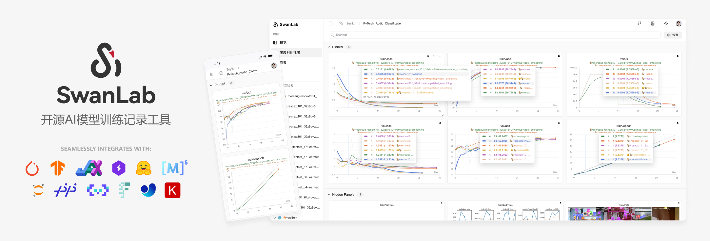
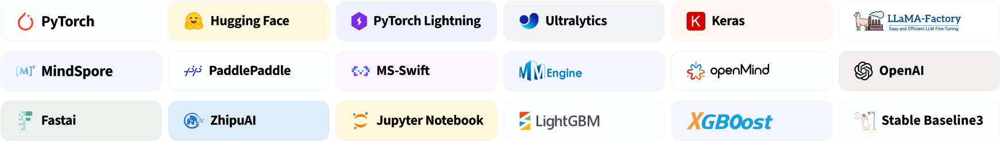

<div align="center">

<picture>
  <source media="(prefers-color-scheme: dark)" srcset="readme_files/swanlab-logo-single-dark.svg">
  <source media="(prefers-color-scheme: light)" srcset="readme_files/swanlab-logo-single.svg">
  
</picture>

<h1>SwanLab</h1>

一个开源、现代化设计的深度学习训练跟踪与可视化工具  
同时支持云端/离线使用，适配30+主流框架，与你的实验代码轻松集成

<a href="https://swanlab.cn">🔥SwanLab 在线版</a> · <a href="https://docs.swanlab.cn">📃 文档</a> · <a href="https://github.com/swanhubx/swanlab/issues">报告问题</a> · <a href="https://geektechstudio.feishu.cn/share/base/form/shrcnyBlK8OMD0eweoFcc2SvWKc">建议反馈</a> · <a href="https://docs.swanlab.cn/zh/guide_cloud/general/changelog.html">更新日志</a>

[![][release-shield]][release-link]
[![][github-stars-shield]][github-stars-link]
[![][github-issues-shield]][github-issues-shield-link]
[![][github-contributors-shield]][github-contributors-link]
[![][license-shield]][license-shield-link]  
[![][tracking-swanlab-shield]][tracking-swanlab-shield-link]
[![][last-commit-shield]][last-commit-shield-link]
[![][pypi-version-shield]][pypi-version-shield-link]
[![][wechat-shield]][wechat-shield-link]
[![][pypi-downloads-shield]][pypi-downloads-shield-link]
[![][colab-shield]][colab-shield-link]




中文 / [English](README_EN.md) / [日本語](README_JP.md) / [Русский](README_RU.md)

👋 加入我们的[微信群](https://docs.swanlab.cn/zh/guide_cloud/community/online-support.html)

<a href="https://hellogithub.com/repository/b442a9fa270e4ccb8847c9ee3445e41b" target="_blank"></a>


</div>

<br/>


## 目录

- [🌟 最近更新](#-最近更新)
- [👋🏻 什么是SwanLab](#-什么是swanlab)
- [📃 在线演示](#-在线演示)
- [🏁 快速开始](#-快速开始)
- [💻 自托管](#-自托管)
- [🚗 框架集成](#-框架集成)
- [🆚 与熟悉的工具的比较](#-与熟悉的工具的比较)
- [👥 社区](#-社区)
- [📃 协议](#-协议)

<br/>


## 🌟 最近更新

- 2025.03.04：新增 **MLFlow** 功能，支持将MLFlow实验转换为SwanLab实验，[使用指引](https://docs.swanlab.cn/guide_cloud/integration/integration-mlflow.html)

- 2025.03.01：新增 **移动实验** 功能，现在可以将实验移动到不同组织的不同项目下了

- 2025.02.24：我们与 [EasyR1](https://github.com/hiyouga/EasyR1) 完成了联合集成，现在你可以在EasyR1中使用SwanLab来**跟踪和可视化多模态大模型强化学习实验**，[使用指引](https://docs.swanlab.cn/guide_cloud/integration/integration-easyr1.html)

- 2025.02.18：我们与 [Swift](https://github.com/modelscope/ms-swift) 完成了联合集成，现在你可以在Swift的CLI/WebUI中使用SwanLab来**跟踪和可视化大模型微调实验**，[使用指引](https://docs.swanlab.cn/guide_cloud/integration/integration-swift.html)。

- 2025.02.16：新增 **图表移动分组、创建分组** 功能。

- 2025.02.09：我们与 [veRL](https://github.com/volcengine/verl) 完成了联合集成，现在你可以在veRL中使用SwanLab来**跟踪和可视化大模型强化学习实验**，[使用指引](https://docs.swanlab.cn/guide_cloud/integration/integration-verl.html)。

- 2025.02.05：`swanlab.log`支持嵌套字典 [#812](https://github.com/SwanHubX/SwanLab/pull/812)，适配Jax框架特性；支持`name`与`notes`参数；

- 2025.01.22：新增`sync_tensorboardX`与`sync_tensorboard_torch`功能，支持与此两种TensorBoard框架同步实验跟踪；

- 2025.01.17：新增`sync_wandb`功能，[文档](https://docs.swanlab.cn/guide_cloud/integration/integration-wandb.html)，支持与Weights & Biases实验跟踪同步；大幅改进了日志渲染性能


<details><summary>完整更新日志</summary>

- 2025.01.11：云端版大幅优化了项目表格的性能，并支持拖拽、排序、筛选等交互

- 2025.01.01：新增折线图**持久化平滑**、折线图拖拽式改变大小，优化图表浏览体验

- 2024.12.22：我们与 [LLaMA Factory](https://github.com/hiyouga/LLaMA-Factory) 完成了联合集成，现在你可以在LLaMA Factory中使用SwanLab来**跟踪和可视化大模型微调实验**，[使用指引](https://github.com/hiyouga/LLaMA-Factory?tab=readme-ov-file#use-swanlab-logger)。

- 2024.12.15：**硬件监控（0.4.0）** 功能上线，支持CPU、NPU（Ascend）、GPU（Nvidia）的系统级信息记录与监控。

- 2024.12.06：新增对[LightGBM](https://docs.swanlab.cn/guide_cloud/integration/integration-lightgbm.html)、[XGBoost](https://docs.swanlab.cn/guide_cloud/integration/integration-xgboost.html)的集成；提高了对日志记录单行长度的限制。

- 2024.11.26：环境选项卡-硬件部分支持识别**华为昇腾NPU**与**鲲鹏CPU**；云厂商部分支持识别青云**基石智算**。

</details>

<br>

## 👋🏻 什么是SwanLab

SwanLab 是一款开源、轻量的 AI 模型训练跟踪与可视化工具，提供了一个跟踪、记录、比较、和协作实验的平台。

SwanLab 面向人工智能研究者，设计了友好的Python API 和漂亮的UI界面，并提供**训练可视化、自动日志记录、超参数记录、实验对比、多人协同**等功能。在SwanLab上，研究者能基于直观的可视化图表发现训练问题，对比多个实验找到研究灵感，并通过**在线网页**的分享与基于组织的**多人协同训练**，打破团队沟通的壁垒，提高组织训练效率。

以下是其核心特性列表：

**1. 📊 实验指标与超参数跟踪**: 极简的代码嵌入您的机器学习 pipeline，跟踪记录训练关键指标

- 支持**云端**使用（类似Weights & Biases），随时随地查看训练进展。[手机看实验的方法](https://docs.swanlab.cn/guide_cloud/general/app.html)
- 支持**超参数记录**与表格展示
- **支持的元数据类型**：标量指标、图像、音频、文本、...
- **支持的图表类型**：折线图、媒体图（图像、音频、文本）、...
- **后台自动记录**：日志logging、硬件环境、Git 仓库、Python 环境、Python 库列表、项目运行目录

**2. ⚡️ 全面的框架集成**: PyTorch、🤗HuggingFace Transformers、PyTorch Lightning、🦙LLaMA Factory、MMDetection、Ultralytics、PaddleDetetion、LightGBM、XGBoost、Keras、Tensorboard、Weights&Biases、OpenAI、Swift、XTuner、Stable Baseline3、Hydra 在内的 **30+** 框架



**3. 💻 硬件监控**: 支持实时记录与监控CPU、NPU（**昇腾Ascend**）、GPU（**英伟达Nvidia**）、内存的系统级硬件指标

**4. 📦 实验管理**: 通过专为训练场景设计的集中式仪表板，通过整体视图速览全局，快速管理多个项目与实验

**4. 🆚 比较结果**: 通过在线表格与对比图表比较不同实验的超参数和结果，挖掘迭代灵感

**5. 👥 在线协作**: 您可以与团队进行协作式训练，支持将实验实时同步在一个项目下，您可以在线查看团队的训练记录，基于结果发表看法与建议

**6. ✉️ 分享结果**: 复制和发送持久的 URL 来共享每个实验，方便地发送给伙伴，或嵌入到在线笔记中

**7. 💻 支持自托管**: 支持离线环境使用，自托管的社区版同样可以查看仪表盘与管理实验

> \[!IMPORTANT]
>
> **收藏项目**，你将从 GitHub 上无延迟地接收所有发布通知～ ⭐️


<br>

## 📃 在线演示

来看看 SwanLab 的在线演示：

| [ResNet50 猫狗分类][demo-cats-dogs] | [Yolov8-COCO128 目标检测][demo-yolo] |
| :--------: | :--------: |
| [![][demo-cats-dogs-image]][demo-cats-dogs] | [![][demo-yolo-image]][demo-yolo] |
| 跟踪一个简单的 ResNet50 模型在猫狗数据集上训练的图像分类任务。 | 使用 Yolov8 在 COCO128 数据集上进行目标检测任务，跟踪训练超参数和指标。 |

| [Qwen2 指令微调][demo-qwen2-sft] | [LSTM Google 股票预测][demo-google-stock] |
| :--------: | :--------: |
| [![][demo-qwen2-sft-image]][demo-qwen2-sft] | [![][demo-google-stock-image]][demo-google-stock] |
| 跟踪 Qwen2 大语言模型的指令微调训练，完成简单的指令遵循。 | 使用简单的 LSTM 模型在 Google 股价数据集上训练，实现对未来股价的预测。 |

| [ResNeXt101 音频分类][demo-audio-classification] | [Qwen2-VL COCO数据集微调][demo-qwen2-vl] |
| :--------: | :--------: |
| [![][demo-audio-classification-image]][demo-audio-classification] | [![][demo-qwen2-vl-image]][demo-qwen2-vl] |
| 从ResNet到ResNeXt在音频分类任务上的渐进式实验过程 | 基于Qwen2-VL多模态大模型，在COCO2014数据集上进行Lora微调。 |


[更多案例](https://docs.swanlab.cn/zh/examples/mnist.html)

<br>

## 🏁 快速开始

### 1.安装

```bash
pip install swanlab
```

<details><summary>源码安装</summary>

如果你想体验最新的特性，可以使用源码安装。

**step1**: 克隆项目

```bash
git clone https://github.com/SwanHubX/SwanLab.git
cd SwanLab
```

**step2**: 修改`swanlab/package.json`中的`version`字段，如`0.10.0`

**step3**: 安装

```bash
pip install -e .
```

</details>

### 2.登录并获取 API Key

1. 免费[注册账号](https://swanlab.cn)

2. 登录账号，在用户设置 > [API Key](https://swanlab.cn/settings) 里复制您的 API Key

3. 打开终端，输入：

```bash
swanlab login
```

出现提示时，输入您的 API Key，按下回车，完成登陆。

### 3.将 SwanLab 与你的代码集成

```python
import swanlab

# 初始化一个新的swanlab实验
swanlab.init(
    project="my-first-ml",
    config={'learning-rate': 0.003},
)

# 记录指标
for i in range(10):
    swanlab.log({"loss": i, "acc": i})
```

大功告成！前往[SwanLab](https://swanlab.cn)查看你的第一个 SwanLab 实验。

<br>

## 💻 自托管

自托管社区版支持离线查看 SwanLab 仪表盘。

### 离线实验跟踪

在 swanlab.init 中设置`logir`和`mode`这两个参数，即可离线跟踪实验：

```python
...

swanlab.init(
    logdir='./logs',
    mode='local',
)

...
```

- 参数`mode`设置为`local`，关闭将实验同步到云端

- 参数`logdir`的设置是可选的，它的作用是指定了 SwanLab 日志文件的保存位置（默认保存在`swanlog`文件夹下）

  - 日志文件会在跟踪实验的过程中被创建和更新，离线看板的启动也将基于这些日志文件

其他部分和云端使用完全一致。

### 开启离线看板

打开终端，使用下面的指令，开启一个 SwanLab 仪表板:

```bash
swanlab watch ./logs
```

运行完成后，SwanLab 会给你 1 个本地的 URL 链接（默认是[http://127.0.0.1:5092](http://127.0.0.1:5092)）

访问该链接，就可以在浏览器用离线看板查看实验了。

<br>

## 🚗 框架集成

将你最喜欢的框架与 SwanLab 结合使用！  
下面是我们已集成的框架列表，欢迎提交 [Issue](https://github.com/swanhubx/swanlab/issues) 来反馈你想要集成的框架。

**基础框架**
- [PyTorch](https://docs.swanlab.cn/guide_cloud/integration/integration-pytorch.html)
- [MindSpore](https://docs.swanlab.cn/guide_cloud/integration/integration-ascend.html)
- [Keras](https://docs.swanlab.cn/guide_cloud/integration/integration-keras.html)

**专有/微调框架**
- [PyTorch Lightning](https://docs.swanlab.cn/guide_cloud/integration/integration-pytorch-lightning.html)
- [HuggingFace Transformers](https://docs.swanlab.cn/guide_cloud/integration/integration-huggingface-transformers.html)
- [OpenMind](https://modelers.cn/docs/zh/openmind-library/1.0.0/basic_tutorial/finetune/finetune_pt.html#%E8%AE%AD%E7%BB%83%E7%9B%91%E6%8E%A7)
- [LLaMA Factory](https://docs.swanlab.cn/guide_cloud/integration/integration-llama-factory.html)
- [Modelscope Swift](https://docs.swanlab.cn/guide_cloud/integration/integration-swift.html)
- [Sentence Transformers](https://docs.swanlab.cn/guide_cloud/integration/integration-sentence-transformers.html)
- [Torchtune](https://docs.swanlab.cn/guide_cloud/integration/integration-pytorch-torchtune.html)
- [XTuner](https://docs.swanlab.cn/guide_cloud/integration/integration-xtuner.html)
- [MMEngine](https://docs.swanlab.cn/guide_cloud/integration/integration-mmengine.html)
- [FastAI](https://docs.swanlab.cn/guide_cloud/integration/integration-fastai.html)
- [LightGBM](https://docs.swanlab.cn/guide_cloud/integration/integration-lightgbm.html)
- [XGBoost](https://docs.swanlab.cn/guide_cloud/integration/integration-xgboost.html)


**计算机视觉**
- [Ultralytics](https://docs.swanlab.cn/guide_cloud/integration/integration-ultralytics.html)
- [MMDetection](https://docs.swanlab.cn/guide_cloud/integration/integration-mmdetection.html)
- [MMSegmentation](https://docs.swanlab.cn/guide_cloud/integration/integration-mmsegmentation.html)
- [PaddleDetection](https://docs.swanlab.cn/guide_cloud/integration/integration-paddledetection.html)
- [PaddleYOLO](https://docs.swanlab.cn/guide_cloud/integration/integration-paddleyolo.html)

**强化学习**
- [Stable Baseline3](https://docs.swanlab.cn/guide_cloud/integration/integration-sb3.html)
- [veRL](https://docs.swanlab.cn/guide_cloud/integration/integration-verl.html)
- [HuggingFace trl](https://docs.swanlab.cn/guide_cloud/integration/integration-huggingface-trl.html)
- [EasyR1](https://docs.swanlab.cn/guide_cloud/integration/integration-easyr1.html)

**其他框架：**
- [Tensorboard](https://docs.swanlab.cn/guide_cloud/integration/integration-tensorboard.html)
- [Weights&Biases](https://docs.swanlab.cn/guide_cloud/integration/integration-wandb.html)
- [MLFlow](https://docs.swanlab.cn/guide_cloud/integration/integration-mlflow.html)
- [HuggingFace Accelerate](https://docs.swanlab.cn/guide_cloud/integration/integration-huggingface-accelerate.html)
- [Unsloth](https://docs.swanlab.cn/guide_cloud/integration/integration-unsloth.html)
- [Hydra](https://docs.swanlab.cn/guide_cloud/integration/integration-hydra.html)
- [Omegaconf](https://docs.swanlab.cn/guide_cloud/integration/integration-omegaconf.html)
- [OpenAI](https://docs.swanlab.cn/guide_cloud/integration/integration-openai.html)
- [ZhipuAI](https://docs.swanlab.cn/guide_cloud/integration/integration-zhipuai.html)

[更多集成](https://docs.swanlab.cn/zh/guide_cloud/integration/integration-pytorch-lightning.html)

<br>

## 🆚 与熟悉的工具的比较

### Tensorboard vs SwanLab

- **☁️ 支持在线使用**：
  通过 SwanLab 可以方便地将训练实验在云端在线同步与保存，便于远程查看训练进展、管理历史项目、分享实验链接、发送实时消息通知、多端看实验等。而 Tensorboard 是一个离线的实验跟踪工具。

- **👥 多人协作**：
  在进行多人、跨团队的机器学习协作时，通过 SwanLab 可以轻松管理多人的训练项目、分享实验链接、跨空间交流讨论。而 Tensorboard 主要为个人设计，难以进行多人协作和分享实验。

- **💻 持久、集中的仪表板**：
  无论你在何处训练模型，无论是在本地计算机上、在实验室集群还是在公有云的 GPU 实例中，你的结果都会记录到同一个集中式仪表板中。而使用 TensorBoard 需要花费时间从不同的机器复制和管理
  TFEvent 文件。

- **💪 更强大的表格**：
  通过 SwanLab 表格可以查看、搜索、过滤来自不同实验的结果，可以轻松查看数千个模型版本并找到适合不同任务的最佳性能模型。
  TensorBoard 不适用于大型项目。

### Weights and Biases vs SwanLab

- Weights and Biases 是一个必须联网使用的闭源 MLOps 平台

- SwanLab 不仅支持联网使用，也支持开源、免费、自托管的版本

<br>

## 👥 社区

### 社区与支持

- [GitHub Issues](https://github.com/SwanHubX/SwanLab/issues)：使用 SwanLab 时遇到的错误和问题
- [电子邮件支持](zeyi.lin@swanhub.co)：反馈关于使用 SwanLab 的问题
- <a href="https://docs.swanlab.cn/guide_cloud/community/online-support.html">微信交流群</a>：交流使用 SwanLab 的问题、分享最新的 AI 技术

### SwanLab README 徽章

如果你喜欢在工作中使用 SwanLab，请将 SwanLab 徽章添加到你的 README 中：

[![][tracking-swanlab-shield]][tracking-swanlab-shield-link]、[![][visualize-swanlab-shield]][visualize-swanlab-shield-link]

```
[](your experiment url)
[](your experiment url)
```

更多设计素材：[assets](https://github.com/SwanHubX/assets)

### 在论文中引用 SwanLab

如果您发现 SwanLab 对您的研究之旅有帮助，请考虑以下列格式引用：

```bibtex
@software{Zeyilin_SwanLab_2023,
  author = {Zeyi Lin, Shaohong Chen, Kang Li, Qiushan Jiang, Zirui Cai,  Kaifang Ji and {The SwanLab team}},
  doi = {10.5281/zenodo.11100550},
  license = {Apache-2.0},
  title = {{SwanLab}},
  url = {https://github.com/swanhubx/swanlab},
  year = {2023}
}
```

### 为 SwanLab 做出贡献

考虑为 SwanLab 做出贡献吗？首先，请花点时间阅读 [贡献指南](CONTRIBUTING.md)。

同时，我们非常欢迎通过社交媒体、活动和会议的分享来支持 SwanLab，衷心感谢！

<br>

**Contributors**

<a href="https://github.com/swanhubx/swanlab/graphs/contributors">
  
</a>

<br>

## 📃 协议

本仓库遵循 [Apache 2.0 License](https://github.com/SwanHubX/SwanLab/blob/main/LICENSE) 开源协议

## Star History

[](https://star-history.com/#swanhubx/swanlab&Date)

<!-- link -->

[release-shield]: https://img.shields.io/github/v/release/swanhubx/swanlab?color=369eff&labelColor=black&logo=github&style=flat-square
[release-link]: https://github.com/swanhubx/swanlab/releases

[license-shield]: https://img.shields.io/badge/license-apache%202.0-white?labelColor=black&style=flat-square
[license-shield-link]: https://github.com/SwanHubX/SwanLab/blob/main/LICENSE

[last-commit-shield]: https://img.shields.io/github/last-commit/swanhubx/swanlab?color=c4f042&labelColor=black&style=flat-square
[last-commit-shield-link]: https://github.com/swanhubx/swanlab/commits/main

[pypi-version-shield]: https://img.shields.io/pypi/v/swanlab?color=orange&labelColor=black&style=flat-square
[pypi-version-shield-link]: https://pypi.org/project/swanlab/

[pypi-downloads-shield]: https://static.pepy.tech/badge/swanlab?labelColor=black&style=flat-square
[pypi-downloads-shield-link]: https://pepy.tech/project/swanlab

[swanlab-cloud-shield]: https://img.shields.io/badge/Product-SwanLab云端版-636a3f?labelColor=black&style=flat-square
[swanlab-cloud-shield-link]: https://swanlab.cn/

[wechat-shield]: https://img.shields.io/badge/WeChat-微信-4cb55e?labelColor=black&style=flat-square
[wechat-shield-link]: https://docs.swanlab.cn/guide_cloud/community/online-support.html

[colab-shield]: https://colab.research.google.com/assets/colab-badge.svg
[colab-shield-link]: https://colab.research.google.com/drive/1RWsrY_1bS8ECzaHvYtLb_1eBkkdzekR3?usp=sharing

[github-stars-shield]: https://img.shields.io/github/stars/swanhubx/swanlab?labelColor&style=flat-square&color=ffcb47
[github-stars-link]: https://github.com/swanhubx/swanlab

[github-issues-shield]: https://img.shields.io/github/issues/swanhubx/swanlab?labelColor=black&style=flat-square&color=ff80eb
[github-issues-shield-link]: https://github.com/swanhubx/swanlab/issues

[github-contributors-shield]: https://img.shields.io/github/contributors/swanhubx/swanlab?color=c4f042&labelColor=black&style=flat-square
[github-contributors-link]: https://github.com/swanhubx/swanlab/graphs/contributors

[demo-cats-dogs]: https://swanlab.cn/@ZeyiLin/Cats_Dogs_Classification/runs/jzo93k112f15pmx14vtxf/chart
[demo-cats-dogs-image]: readme_files/example-catsdogs.png

[demo-yolo]: https://swanlab.cn/@ZeyiLin/ultratest/runs/yux7vclmsmmsar9ear7u5/chart
[demo-yolo-image]: readme_files/example-yolo.png

[demo-qwen2-sft]: https://swanlab.cn/@ZeyiLin/Qwen2-fintune/runs/cfg5f8dzkp6vouxzaxlx6/chart
[demo-qwen2-sft-image]: readme_files/example-qwen2.png

[demo-google-stock]:https://swanlab.cn/@ZeyiLin/Google-Stock-Prediction/charts
[demo-google-stock-image]: readme_files/example-lstm.png

[demo-audio-classification]:https://swanlab.cn/@ZeyiLin/PyTorch_Audio_Classification/charts
[demo-audio-classification-image]: readme_files/example-audio-classification.png

[demo-qwen2-vl]:https://swanlab.cn/@ZeyiLin/Qwen2-VL-finetune/runs/pkgest5xhdn3ukpdy6kv5/chart
[demo-qwen2-vl-image]: readme_files/example-qwen2-vl.jpg

[tracking-swanlab-shield-link]:https://swanlab.cn
[tracking-swanlab-shield]: https://raw.githubusercontent.com/SwanHubX/assets/main/badge2.svg

[visualize-swanlab-shield-link]:https://swanlab.cn
[visualize-swanlab-shield]: https://raw.githubusercontent.com/SwanHubX/assets/main/badge1.svg