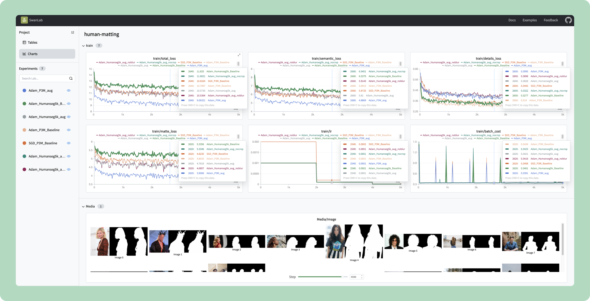
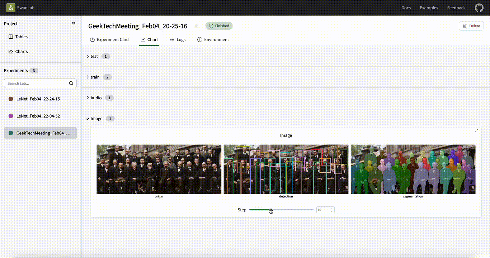
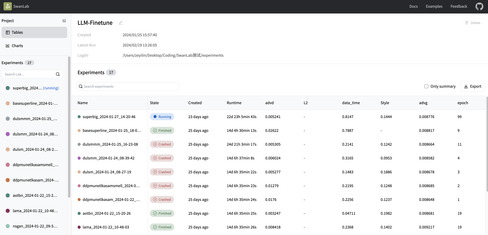
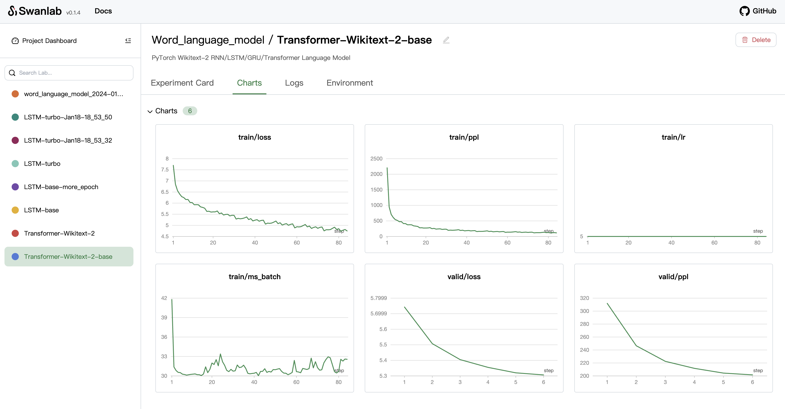

<p align="center">
  
</p>
<h1 align="center"><a href="https://github.com/SwanHubX/SwanLab/tree/main">SwanLab</a></h1>

<p align="center">
Track and visualize all the pieces of your machine learning pipeline
</p>

<p align="center">
  <a href="https://github.com/SwanHubX/SwanLab/stargazers"></a>
  <a href="https://github.com/SwanHubX/SwanLab/blob/main/LICENSE"></a>
  <a href="https://github.com/SwanHubX/SwanLab/commits/main"></a>
  <a href="https://pypi.python.org/pypi/swanlab"></a>
  <a href="https://pepy.tech/project/swanlab"></a>
  <a href="https://github.com/SwanHubX/SwanLab/discussions"></a>
</p>

<p align="center">
  
</p>

<p align="center">
👀 View <a href="https://geektechstudio.feishu.cn/wiki/MwXmw9yDeiZWyQkPnNgcixwWnwu">Document</a> | 👋 Join our <a href="https://geektechstudio.feishu.cn/wiki/NIZ9wp5LRiSqQykizbGcVzUKnic">WeChat</a>
</p>

<p align="center">
English | <a href="README_zh-hans.md">中文</a>
</p>

## Table of Contents

- [Changelog](#changelog)
- [Key Function](#key-function)
- [Installation](#installation)
- [Getting Started](#getting-started)
- [Tutorial](#Tutorial)
- [Use Case](#use-case)
- [LICENSE](#license)

<br>

## Changelog

Upgrade to the latest version: `pip install -U swanlab`。

[24/03/03] 🔧 We fixed some issues in v0.2.1 and added support for switching multimedia chart content by pressing keys.（v0.2.2）

[24/03/01] 🚀 Still Very Big Upgrade！We supported [Text Chart](https://geektechstudio.feishu.cn/wiki/T0L7wYfzGiZUCKkxfehcFwYAnIh)to meet the needs of tasks in NLP, LLM, Agent and other scenarios; We have made a lot of optimizations to line chart's UI, legend, and rendering speed. We improved the rendering performance of Logs —— now viewing terminal printing information with 200k lines is also not lagging.（v0.2.1）

[24/02/08] 🔥 Very Big Upgrade! We supported [Image Chart](https://geektechstudio.feishu.cn/wiki/LZFxwTuegiXxPGkhXcpcBUEXnHb)、[Audio Chart](https://geektechstudio.feishu.cn/wiki/SU6mwcVNbixMf1k95KbcZHDCnJe)、Mutil-Experiments Chart and a series of comprehensive optimizations and improvements! Please be sure to upgrade to the latest version via `pip install -U swanlab`.（v0.2.0）

[24/01/25] 😄 We supported a new Config/Summary table component that supports parameter search. Additionally, we've used new fonts and color schemes.（v0.1.6）

[Full Changelog](https://github.com/SwanHubX/SwanLab/releases)

<br>

## Key Function

- **📊 Visualize Training**: visualize your entire training process.

<div align="center">
  
</div>

- **🚀 Multimedia Charts**: log Image/Audio/Video/Text/object3D...

<div align="center">
  
</div>

- **🧪 Experiments GridView**: compare your key metrics for inspiration faster.

<div align="center">
  
</div>

- **⚡️ Auto Save Environment Info**: Hyperparameters, Config, Metric, Terminal logging, Environment Information auto save.

- **🥔 Offline Support**: SwanLab can run entirely offile, ithout requiring any access to the Internet. For instance, this may be on your local machine, behind a corporate firewall, or in a datacenter.

<br>

## Installation

### with pip

Requirement：Python 3.8+.

Use [pip](https://pip.pypa.io/en/stable/) to install our stable release version. The installation command is as follows:

```bash
pip install -U swanlab
```

### with source code

If you need the bleeding edge of the code and can't wait for a new release, you must [install the library from source](https://geektechstudio.feishu.cn/wiki/DvxSweHUKiAe8yksci3cMflbnwh#SMXHdJ1c1o4jzTxcDticHcwvnHd)。

<br>

## Getting Started

1. First, install the SwanLab SDK with [pip](https://pip.pypa.io/en/stable/):

```bash
pip install -U swanlab
```

2. Second, Use the example code snippet below as a template to integrate SwanLab to your Python script:
```python
import swanlab

# Start a SwanLab Run with swanlab.init
swanlab.init(
  # Save model inputs and hyperparameters in a swanlab.config object
  config={'epochs': 20, 'learning_rate': 0.01}, 
  # Specify the save path of the log file
  logdir="./logs",
)

# Model training code here...

# Log metrics over time for visualizing performance with swanlab.log
for epoch in range(1, swanlab.config.epochs):
    swanlab.log({"loss": loss})
```

For example, We wrote a simulation experiment script:

```python
import swanlab
import random

offset = random.random() / 5

run = swanlab.init(
    experiment_name="Example",
    description="It's a ML experiment.",
    config={
        "learning_rate": 0.01,
        "epochs": 20,
    },
    logdir="./logs"
)

# Simulate the ML training process
for epoch in range(2, run.config.epochs):
    acc = 1 - 2**-epoch - random.random() / epoch - offset
    loss = 2**-epoch + random.random() / epoch + offset
    swanlab.log({"loss": loss, "accuracy": acc})
```


3. Third, open the terminal and use the following command to start a SwanLab dashboard:
```bash
$ swanlab watch -l ./logs
```

SwanLab will give you a URL link (default is http://127.0.0.1:5092). Check the link to see the visualization results of your first experiment in the browser.

<div align="center">
  
</div>

<br>

## Tutorial

**Get Started**
- [Installation](#安装)
- [Quick Start](https://geektechstudio.feishu.cn/wiki/UInBw9eaziv17IkwfrOcHCZ1nbc)
- [Run Dashboard](https://geektechstudio.feishu.cn/wiki/YsEfwC79viJL2nk5TgPcAOUhn5U)  

**Python API**
- [init](https://geektechstudio.feishu.cn/wiki/H7Wbwt91LiCJtnkpHOzcar4TnCc)
- [log](https://geektechstudio.feishu.cn/wiki/RmjXwjmgUi5zGCkBPsTc5ygQn4g)
- [config](https://geektechstudio.feishu.cn/wiki/HkTOwxLkHiUC84kJNrlcohyGnuh)
- [Image](https://geektechstudio.feishu.cn/wiki/LZFxwTuegiXxPGkhXcpcBUEXnHb)
- [Audio](https://geektechstudio.feishu.cn/wiki/SU6mwcVNbixMf1k95KbcZHDCnJe)
- [Text](https://geektechstudio.feishu.cn/wiki/T0L7wYfzGiZUCKkxfehcFwYAnIh)

**CLI API**
- [watch](https://geektechstudio.feishu.cn/wiki/Q6I5wdyr9iRYkdkZ2gYcHQkxnCU)

**技巧**
- [Remotely view Dashboard](https://geektechstudio.feishu.cn/wiki/Icesw6coTidDsPkN960c0lNtnCb)
- [Pass argparse into swanlab.config](https://geektechstudio.feishu.cn/wiki/CT1Xwo6ehimNH5kz7y9csTGkn0e)

<br>

## Use Case

Learn how to use SwanLab more effectively by following these use cases:

| Code Cases | Description | 
| ------- | ------- |
| [Hello World](https://github.com/SwanHubX/SwanLab-examples/tree/main/Hello_World) | Getting Started |
| [MNIST](https://github.com/SwanHubX/SwanLab-examples/tree/main/MNIST) | Handwriting recognition based on a plain net and MNIST dataset with pytroch, swanlab. |
| [Image Classification](https://github.com/SwanHubX/SwanLab-examples/blob/main/Resnet50) | Cat and dog classification based on ResNet50 with pytorch, swanlab and gradio. [Tutorial](https://zhuanlan.zhihu.com/p/676430630). |
| [Text Generation](https://github.com/SwanHubX/SwanLab-examples/blob/main/Word_language_model) | Text generation based on Word_language_model (RNN/LSTM/GRU/Transformer) |
| [UIE-Finetune](https://github.com/SwanHubX/SwanLab-examples/tree/main/UIE) | how to use personal data to finetune UIE model and monitor training process through swanlab |

<br>

## LICENSE

This project is currently licensed under [Apache 2.0 License](https://github.com/SwanHubX/SwanLab/blob/main/LICENSE).
