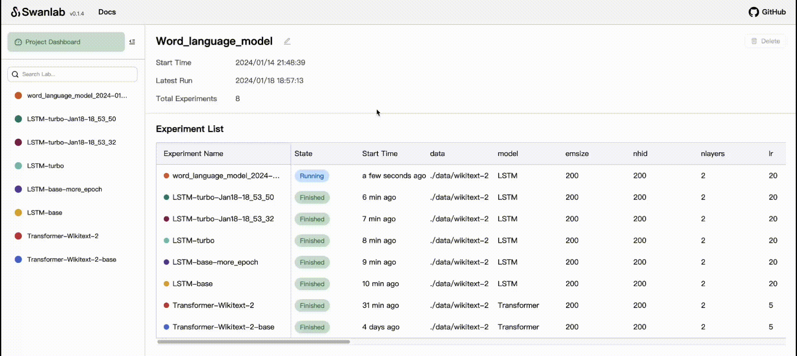
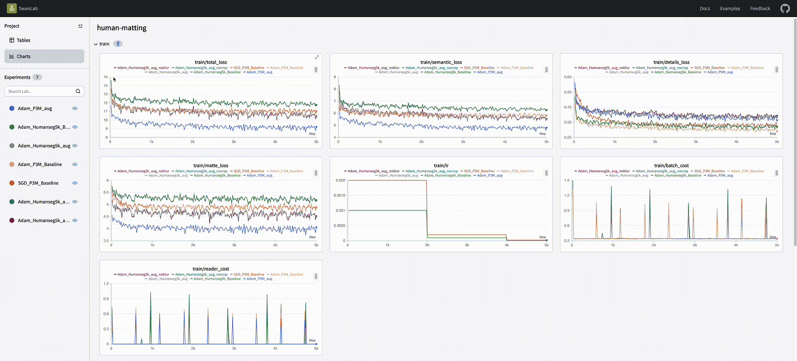
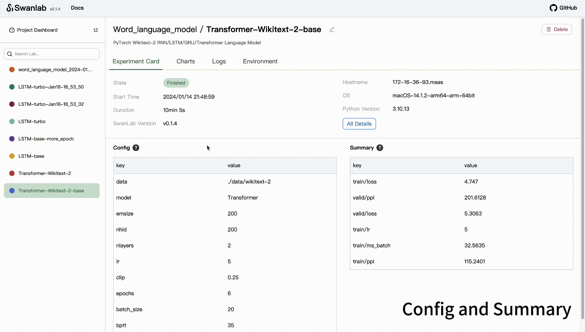

<p align="center">
  
</p>
<h1 align="center"><a href="https://github.com/SwanHubX/SwanLab/tree/main">SwanLab</a></h1>

<p align="center">
Track and visualize all the pieces of your machine learning pipeline
</p>

<p align="center">
  <a href="https://github.com/SwanHubX/SwanLab/stargazers"></a>
  <a href="https://github.com/SwanHubX/SwanLab/blob/main/LICENSE"></a>
  <a href="https://github.com/SwanHubX/SwanLab/commits/main"></a>
  <a href="https://pypi.python.org/pypi/swanlab"></a>
  <a href="https://pepy.tech/project/swanlab"></a>
  <a href="https://github.com/SwanHubX/SwanLab/discussions"></a>
</p>

<p align="center">
👋 Join our <a href="https://geektechstudio.feishu.cn/wiki/NIZ9wp5LRiSqQykizbGcVzUKnic">WeChat</a>
</p>

<p align="center">
English | <a href="README_zh-hans.md">中文</a>
</p>

## Table of Contents

- [Table of Contents](#table-of-contents)
- [Key Function](#key-function)
- [Changelog](#changelog)
- [Installation](#installation)
- [Getting Started](#getting-started)
- [Use Case](#use-case)
- [More Tips](#more-tips)
- [LICENSE](#license)

## Key Function

- **🧪 Experiments GridView**: compare your key metrics for inspiration faster

<div align="center">
  
</div>

- **📊 Charts**: visualize your entire training process

<div align="center">
  
</div>

- **⚡️ Track machine-learning pipeline**: Hyperparameters, Config, Metric, Terminal logging, Environment Information auto save

<div align="center">
  
</div>


- **🥔 Offline Support**: SwanLab can run entirely offile, ithout requiring any access to the Internet. For instance, this may be on your local machine, behind a corporate firewall, or in a datacenter

> [!NOTE]
> See the SwanLab <a href="https://geektechstudio.feishu.cn/wiki/MwXmw9yDeiZWyQkPnNgcixwWnwu">Documentaion</a> and <a href="https://github.com/SwanHubX/SwanLab-examples">Examples</a> for a full description of the SwanLab.

<br>

## Changelog

[24/01/23] 🚨 We use SQLite database and Peewee to replace the previous basic configuration information reading and writing solution by [#114](https://github.com/SwanHubX/SwanLab/issues/114). It's a major change that is highly beneficial for the future of the project, but the drawback is that it's not compatible with old versions (swanlab<=v0.1.4) of log data files. Therefore, if you need to visualize log files generated by older versions, please use [transfer script](script/transfer_logfile_0.1.4.py)

Additionally, we supported export the experiment list as `CSV`, new environment record items `Run path` and `logdir`, added interactive quick copy function, and new API `swanlab.config`.

[24/01/14] 🔥 We supported a new UI, tracking additional environment information, including command, git commit/branch and memory. Additionally, we've added a `logdir` API, allowing developers to set the directory for log files.

[24/01/07] ✨ We supported delete experiment and edit experiment inforamation on Dashboard.

[Full Changelog](https://github.com/SwanHubX/SwanLab/releases)

<br>

## Installation

### with pip

Requirement：Python 3.8+.

Use [pip](https://pip.pypa.io/en/stable/) to install our stable release version. The installation command is as follows:

```bash
pip install -U swanlab
```

### with source code

If you need the bleeding edge of the code and can't wait for a new release, you must [install the library from source](https://geektechstudio.feishu.cn/wiki/DvxSweHUKiAe8yksci3cMflbnwh#SMXHdJ1c1o4jzTxcDticHcwvnHd)。

<br>

## Getting Started

1. First, install the SwanLab SDK with [pip](https://pip.pypa.io/en/stable/):

```bash
pip install -U swanlab
```

2. Second, Use the example code snippet below as a template to integrate SwanLab to your Python script:
```python
import swanlab

# Start a SwanLab Run with swanlab.init
swanlab.init(
  # save model inputs and hyperparameters in a swanlab.config object
  config={'learning_rate': 0.01},
)

# Model training code here...

# Log metrics over time for visualizing performance with swanlab.log
for epoch in range(1, 20):
    swanlab.log({"loss": loss})
```

3. Third, Run a Dashboard: 
```bash
$ swanlab watch
```

That's it! Open http://127.0.0.1:5092 to view a dashboard of your first SwanLab Experiment.

<br>

## Use Case

Learn how to use SwanLab more effectively by following these use cases:

| Code Cases | Description | 
| ------- | ------- |
| [Hello World](https://github.com/SwanHubX/SwanLab-examples/tree/main/Hello_World) | Getting Started |
| [MNIST](https://github.com/SwanHubX/SwanLab-examples/tree/main/MNIST) | Handwriting recognition based on a plain net and MNIST dataset with pytroch, swanlab. |
| [Image Classification](https://github.com/SwanHubX/SwanLab-examples/blob/main/Resnet50) | Cat and dog classification based on ResNet50 with pytorch, swanlab and gradio. [Tutorial](https://zhuanlan.zhihu.com/p/676430630). |
| [Text Generation](https://github.com/SwanHubX/SwanLab-examples/blob/main/Word_language_model) | Text generation based on Word_language_model (RNN/LSTM/GRU/Transformer) |

<br>

## More Tips

🏄‍♀️ Experiment Dashboard：

<details>
<summary>Set a log directory save path and run the Dashboard using it</summary>

Set a log directory save path, such as `./logs`:

```python
import swanlab 

swanlab.init(
  logdir="./logs"
)
```

Run the Dashboard using it:

```bash
$ swanlab watch --logdir ./logs_path
```

</details>

<details>
<summary>Set the Host and Port for the Dashboard</summary>

```bash
$ swanlab watch --host 0.0.0.0 --port 8080
```

</details>

<details>
<summary>Remotely access Dashboard</summary>

- Link：[Access the SwanLab Dashboard While Training on a Remote Server](https://zhuanlan.zhihu.com/p/677224865)

</details>

⚙️ Other：

<details>
<summary>argparse init swanlab.config</summary>

`swanlab.config` supports directly passing variables of type `argparse.Namespace`, such as:

```python
import argparse
import swanlab

parser = argparse.ArgumentParser()
···
args = parser.parse_args()


swanlab.init(
    config=args
)
```

</details>


<br>

## LICENSE

This project is currently licensed under [Apache 2.0 License](https://github.com/SwanHubX/SwanLab/blob/main/LICENSE).
