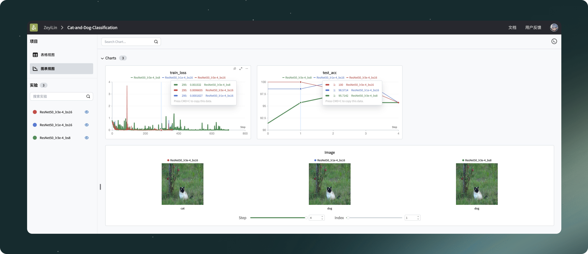

<p align="center">
<a href="https://swanlab.cn">SwanLab Cloud</a> · <a href="https://docs.swanlab.cn">Document</a> · <a href="https://geektechstudio.feishu.cn/wiki/NIZ9wp5LRiSqQykizbGcVzUKnic">WeChat</a> · <a href="https://github.com/swanhubx/swanlab/issues">Report Issue</a> · <a href="https://geektechstudio.feishu.cn/share/base/form/shrcnyBlK8OMD0eweoFcc2SvWKc">Feedback</a> · <a href="https://github.com/SwanHubX/SwanLab/blob/main/CHANGELOG.md">Changelog</a>


</p>

<p align="center">
  <a href="https://github.com/SwanHubX/SwanLab/blob/main/LICENSE"></a>
  <a href="https://github.com/SwanHubX/SwanLab/commits/main"></a>
  <a href="https://pypi.python.org/pypi/swanlab"></a>
  <a href="https://pepy.tech/project/swanlab"></a>
  <a href="https://github.com/swanhubx/swanlab/issues"></a>
  <br>
  <a href="https://swanlab.cn" target="_blank">
        </a>
  <a href="https://geektechstudio.feishu.cn/wiki/NIZ9wp5LRiSqQykizbGcVzUKnic" target="_blank">
        </a>
  <a href="https://www.xiaohongshu.com/user/profile/605786b90000000001003a81" target="_blank">
        </a>

</p>

<div align="center">
  <a href="./README.md"></a>
  <a href="./README_cn.md"></a>
</div>

<details>
<summary>Table of contents</summary>

#### TOC

- [👋🏻 Introduction](#-Introduction)
- [🏁 Quick Start](#🏁-quick-start)
    - [1.Installation](#1installation)
    - [2.Log In and Get the API Key](#2log-in-and-get-the-api-key)
    - [3.Integrate SwanLab with Your Code](#3-integrate-swanlab-with-your-code)
- [📃 More Examples](#-more-examples)
- [💻 Self-hosted](#-self-hosted)
    - [Offline Experiment Tracking](#offline-experiment-tracking)
    - [Open Offline Dashboard](#open-offline-board)
- [🚗 Integration](#-integration)
- [🆚 Comparison with Familiar Tools](#-comparison-with-familiar-tools)
    - [Tensorboard vs SwanLab](#tensorboard-vs-swanlab)
    - [Weights & Biases vs SwanLab](#weights-and-biases-vs-swanlab)
- [🛣️ Roadmap](#%EF%B8%8F-roadmap)
    - [In Progress Now](#in-progress-now)
    - [Next Planned](#next-planned)
    - [Long Term Concern](#long-term-concern)
- [👥 Community](#-community)
    - [Community and Support](#community-and-support)
    - [SwanLab README Badge](#swanlab-readme-badge)
    - [Citing SwanLab in the Paper](#citing-swanlab-in-the-paper)
    - [Contribute to SwanLab](#contribute-to-swanlab)
    - [Download Icon](#download-icon)
- [📃 License](#-license)

<br/>

</details>

## 👋🏻 Introduction

SwanLab is an open-source, lightweight AI experiment tracking tool that provides a platform for tracking, comparing, and
collaborating on experiments, aiming to accelerate the research and development efficiency of AI teams by 100 times.

SwanLab是一个开源、轻量级的AI实验跟踪工具，提供了一个跟踪、比较、和协作实验的平台，旨在加速AI研发团队100倍的研发效率。

It offers a user-friendly API and a decent interface, combining features such as tracking hyperparameter, recording
metric, online collaboration, sharing experiment link, real-time message notifications, allowing you to quickly track ML
experiments, visualize processes, and share with peers.

By using, researchers can accumulate their training experiences and seamlessly communicate and collaborate with peers.
Machine learning engineers can develop models for production more efficiently.



Here is the English version of the core feature list for an AI platform:

**1. 📊 Experimental Metrics and Tracking Hyperparameter**: Embed your machine learning pipeline with minimalistic code
and track key training metrics.

- Flexible recording of hyperparameters and experiment configurations.
- **Supported metadata types**: scalar metrics, images, audio, text, etc.
- **Supported chart types**: line graphs, media charts (images, audio, text), etc.
- **Automatic logging**: console logging, GPU hardware, Git information, Python interpreter, list of Python libraries,
  code directory.

**2. ⚡️ Comprehensive Framework Integration**: PyTorch、Tensorflow、PyTorch Lightning、🤗HuggingFace、Transformers、MMEngine、Ultralytics、fastai、Tensorboard、OpenAI、ZhipuAI、Hydra、...

**3. 📦 Organizing Experiments**: Centralized dashboard for efficiently managing multiple projects and experiments,
providing an overview of training at a glance.

**4. 🆚 Comparing Results**: Use online tables and paired charts to compare the hyperparameters and outcomes of different
experiments, developing iterative inspiration.

**5. 👥 Online Collaboration**: Collaborate with your team on training projects, supporting real-time synchronization of
experiments under the same project, allowing you to synchronize training records of the team online and share insights
and suggestions based on results.

**6. ✉️ Sharing Results**: Copy and send persistent URLs to share each experiment, efficiently send them to colleagues,
or embed them in online notes.

**7. 💻 Self-hosting Support**: Supports offline mode with a self-hosted community version that also allows for dashboard
viewing and experiment management.

> \[!IMPORTANT]
>
> **Star Us**, You will receive all release notifications from GitHub without any delay ~ ⭐️


<br>

## 🏁 Quick Start

### 1.Installation

```bash
pip install swanlab
```

### 2.Log in and get the API Key

1. **Free [Sign Up](https://swanlab.cn)**

2. **Log in to your account**, go to User Settings > [API Key](https://swanlab.cn/settings) and copy your API Key.

3. **Open your terminal and enter**:

```bash
swanlab login
```

When prompted, enter your API Key and press Enter to complete the login.

### 3. Integrate SwanLab with Your Code

```python
import swanlab

# Create a new SwanLab experiment
swanlab.init(
    project="my-first-ml",
    config={'learning-rate': 0.003}
)

# Log metrics
for i in range(10):
    swanlab.log({"loss": i})
```

**All set!** Visit [SwanLab](https://swanlab.cn) to see your first SwanLab experiment.


<br>

## 📃 More Examples

<details>
<summary>MNIST</summary>

```python
import os
import torch
from torch import nn, optim, utils
import torch.nn.functional as F
from torchvision.datasets import MNIST
from torchvision.transforms import ToTensor
import swanlab


# CNN网络构建
class ConvNet(nn.Module):
    def __init__(self):
        super().__init__()
        # 1,28x28
        self.conv1 = nn.Conv2d(1, 10, 5)  # 10, 24x24
        self.conv2 = nn.Conv2d(10, 20, 3)  # 128, 10x10
        self.fc1 = nn.Linear(20 * 10 * 10, 500)
        self.fc2 = nn.Linear(500, 10)

    def forward(self, x):
        in_size = x.size(0)
        out = self.conv1(x)  # 24
        out = F.relu(out)
        out = F.max_pool2d(out, 2, 2)  # 12
        out = self.conv2(out)  # 10
        out = F.relu(out)
        out = out.view(in_size, -1)
        out = self.fc1(out)
        out = F.relu(out)
        out = self.fc2(out)
        out = F.log_softmax(out, dim=1)
        return out


# 捕获并可视化前20张图像
def log_images(loader, num_images=16):
    images_logged = 0
    logged_images = []
    for images, labels in loader:
        # images: batch of images, labels: batch of labels
        for i in range(images.shape[0]):
            if images_logged < num_images:
                # 使用swanlab.Image将图像转换为wandb可视化格式
                logged_images.append(swanlab.Image(images[i], caption=f"Label: {labels[i]}"))
                images_logged += 1
            else:
                break
        if images_logged >= num_images:
            break
    swanlab.log({"MNIST-Preview": logged_images})


if __name__ == "__main__":

    # 初始化swanlab
    run = swanlab.init(
        project="MNIST-example",
        experiment_name="ConvNet",
        description="Train ConvNet on MNIST dataset.",
        config={
            "model": "CNN",
            "optim": "Adam",
            "lr": 0.001,
            "batch_size": 512,
            "num_epochs": 10,
            "train_dataset_num": 55000,
            "val_dataset_num": 5000,
        },
    )

    # 设置训练机、验证集和测试集
    dataset = MNIST(os.getcwd(), train=True, download=True, transform=ToTensor())
    train_dataset, val_dataset = utils.data.random_split(
        dataset, [run.config.train_dataset_num, run.config.val_dataset_num]
    )

    train_loader = utils.data.DataLoader(train_dataset, batch_size=run.config.batch_size, shuffle=True)
    val_loader = utils.data.DataLoader(val_dataset, batch_size=1, shuffle=False)

    # 初始化模型、损失函数和优化器
    model = ConvNet()
    criterion = nn.CrossEntropyLoss()
    optimizer = optim.Adam(model.parameters(), lr=run.config.lr)

    # （可选）看一下数据集的前16张图像
    log_images(train_loader, 16)

    # 开始训练
    for epoch in range(1, run.config.num_epochs):
        swanlab.log({"train/epoch": epoch})
        # 训练循环
        for iter, batch in enumerate(train_loader):
            x, y = batch
            optimizer.zero_grad()
            output = model(x)
            loss = criterion(output, y)
            loss.backward()
            optimizer.step()

            print(
                f"Epoch [{epoch}/{run.config.num_epochs}], Iteration [{iter + 1}/{len(train_loader)}], Loss: {loss.item()}"
            )

            if iter % 20 == 0:
                swanlab.log({"train/loss": loss.item()}, step=(epoch - 1) * len(train_loader) + iter)

        # 每4个epoch验证一次
        if epoch % 2 == 0:
            model.eval()
            correct = 0
            total = 0
            with torch.no_grad():
                for batch in val_loader:
                    x, y = batch
                    output = model(x)
                    _, predicted = torch.max(output, 1)
                    total += y.size(0)
                    correct += (predicted == y).sum().item()

            accuracy = correct / total
            swanlab.log({"val/accuracy": accuracy})
```

</details>

<details>
<summary>FashionMNSIT</summary>

```python
import os
import torch
from torch import nn, optim, utils
import torch.nn.functional as F
from torchvision.datasets import FashionMNIST
from torchvision.transforms import ToTensor
import swanlab


# ResNet网络构建
class Basicblock(nn.Module):
    def __init__(self, in_planes, planes, stride=1):
        super(Basicblock, self).__init__()
        self.conv1 = nn.Sequential(
            nn.Conv2d(in_channels=in_planes, out_channels=planes, kernel_size=3, stride=stride, padding=1, bias=False),
            nn.BatchNorm2d(planes),
            nn.ReLU()
        )
        self.conv2 = nn.Sequential(
            nn.Conv2d(in_channels=planes, out_channels=planes, kernel_size=3, stride=1, padding=1, bias=False),
            nn.BatchNorm2d(planes),
        )

        if stride != 1 or in_planes != planes:
            self.shortcut = nn.Sequential(
                nn.Conv2d(in_channels=in_planes, out_channels=planes, kernel_size=3, stride=stride, padding=1),
                nn.BatchNorm2d(planes)
            )
        else:
            self.shortcut = nn.Sequential()

    def forward(self, x):
        out = self.conv1(x)
        out = self.conv2(out)
        out += self.shortcut(x)
        out = F.relu(out)
        return out


class ResNet(nn.Module):
    def __init__(self, block, num_block, num_classes):
        super(ResNet, self).__init__()
        self.in_planes = 16
        self.conv1 = nn.Sequential(
            nn.Conv2d(in_channels=1, out_channels=16, kernel_size=3, stride=1, padding=1),
            nn.BatchNorm2d(16),
            nn.ReLU()
        )
        self.maxpool = nn.MaxPool2d(kernel_size=3, stride=1, padding=1)

        self.block1 = self._make_layer(block, 16, num_block[0], stride=1)
        self.block2 = self._make_layer(block, 32, num_block[1], stride=2)
        self.block3 = self._make_layer(block, 64, num_block[2], stride=2)
        # self.block4 = self._make_layer(block, 512, num_block[3], stride=2)

        self.outlayer = nn.Linear(64, num_classes)

    def _make_layer(self, block, planes, num_block, stride):
        layers = []
        for i in range(num_block):
            if i == 0:
                layers.append(block(self.in_planes, planes, stride))
            else:
                layers.append(block(planes, planes, 1))
        self.in_planes = planes
        return nn.Sequential(*layers)

    def forward(self, x):
        x = self.maxpool(self.conv1(x))
        x = self.block1(x)  # [200, 64, 28, 28]
        x = self.block2(x)  # [200, 128, 14, 14]
        x = self.block3(x)  # [200, 256, 7, 7]
        # out = self.block4(out)
        x = F.avg_pool2d(x, 7)  # [200, 256, 1, 1]
        x = x.view(x.size(0), -1)  # [200,256]
        out = self.outlayer(x)
        return out


# 捕获并可视化前20张图像
def log_images(loader, num_images=16):
    images_logged = 0
    logged_images = []
    for images, labels in loader:
        # images: batch of images, labels: batch of labels
        for i in range(images.shape[0]):
            if images_logged < num_images:
                # 使用swanlab.Image将图像转换为wandb可视化格式
                logged_images.append(swanlab.Image(images[i], caption=f"Label: {labels[i]}", size=(128, 128)))
                images_logged += 1
            else:
                break
        if images_logged >= num_images:
            break
    swanlab.log({"Preview/MNIST": logged_images})


if __name__ == "__main__":
    # 设置device
    try:
        use_mps = torch.backends.mps.is_available()
    except AttributeError:
        use_mps = False

    if torch.cuda.is_available():
        device = "cuda"
    elif use_mps:
        device = "mps"
    else:
        device = "cpu"

    # 初始化swanlab
    run = swanlab.init(
        project="FashionMNIST",
        workspace="SwanLab",
        experiment_name="Resnet18-Adam",
        config={
            "model": "Resnet34",
            "optim": "Adam",
            "lr": 0.001,
            "batch_size": 32,
            "num_epochs": 10,
            "train_dataset_num": 55000,
            "val_dataset_num": 5000,
            "device": device,
            "num_classes": 10,
        },
    )

    # 设置训练机、验证集和测试集
    dataset = FashionMNIST(os.getcwd(), train=True, download=True, transform=ToTensor())
    train_dataset, val_dataset = utils.data.random_split(
        dataset, [run.config.train_dataset_num, run.config.val_dataset_num]
    )

    train_loader = utils.data.DataLoader(train_dataset, batch_size=run.config.batch_size, shuffle=True)
    val_loader = utils.data.DataLoader(val_dataset, batch_size=1, shuffle=False)

    # 初始化模型、损失函数和优化器
    if run.config.model == "Resnet18":
        model = ResNet(Basicblock, [1, 1, 1, 1], 10)
    elif run.config.model == "Resnet34":
        model = ResNet(Basicblock, [2, 3, 5, 2], 10)
    elif run.config.model == "Resnet50":
        model = ResNet(Basicblock, [3, 4, 6, 3], 10)

    model.to(torch.device(device))

    criterion = nn.CrossEntropyLoss()
    optimizer = optim.Adam(model.parameters(), lr=run.config.lr)

    # （可选）看一下数据集的前16张图像
    log_images(train_loader, 16)

    # 开始训练
    for epoch in range(1, run.config.num_epochs + 1):
        swanlab.log({"train/epoch": epoch}, step=epoch)
        # 训练循环
        for iter, batch in enumerate(train_loader):
            x, y = batch
            x, y = x.to(device), y.to(device)
            optimizer.zero_grad()
            output = model(x)
            loss = criterion(output, y)
            loss.backward()
            optimizer.step()

            if iter % 40 == 0:
                print(
                    f"Epoch [{epoch}/{run.config.num_epochs}], Iteration [{iter + 1}/{len(train_loader)}], Loss: {loss.item()}"
                )
                swanlab.log({"train/loss": loss.item()}, step=(epoch - 1) * len(train_loader) + iter)

        # 每4个epoch验证一次
        if epoch % 2 == 0:
            model.eval()
            correct = 0
            total = 0
            with torch.no_grad():
                for batch in val_loader:
                    x, y = batch
                    x, y = x.to(device), y.to(device)
                    output = model(x)
                    _, predicted = torch.max(output, 1)
                    total += y.size(0)
                    correct += (predicted == y).sum().item()

            accuracy = correct / total
            swanlab.log({"val/accuracy": accuracy}, step=epoch)
```

</details>

<br>

## 💻 Self-hosted

The community edition supports offline viewing of SwanLab dashboards.

### Offline Experiment Tracking

Set the parameters `logir` and `mode` in swanlab.init to track experiments offline:

```python
...

swanlab.init(
    logdir='./logs',
    mode='local',
)

...
```

- The parameter `mode` is set to `local`, which disables synchronizing the experiment to the cloud.

- The setting of the parameter `logdir` is optional, and it specifies the location for saving SwanLab log files (by
  default saved in the `swanlog` folder).

- Log files will be created and updated during tracking of experiments, and launching offline dashboards will also be
  based on these log files.

Other parts are completely consistent with cloud usage.

### Open Offline Board

Open the terminal and use the following command to open a SwanLab dashboard:

```bash
swanlab watch -l ./logs
```

After the operation is completed, SwanLab will provide you with a local URL link (default
is [http://127.0.0.1:5092](http://127.0.0.1:5092)).

Visit this link to view the experiment offline in the browser dashboard.

<br>

## 🚗 Integration

Combine your favorite framework with
SwanLab, [More Integration](https://docs.swanlab.cn/zh/guide_cloud/integration/integration-pytorch-lightning.html).

<details>
  <summary>
    <strong>⚡️ PyTorch Lightning</strong>
  </summary>
  <br>

Create an instance using `SwanLabLogger` and pass it into the `logger` parameter of `Trainer` to enable SwanLab to
record training metrics.

```python
from swanlab.integration.pytorch_lightning import SwanLabLogger
import importlib.util
import os
import pytorch_lightning as pl
from torch import nn, optim, utils
from torchvision.datasets import MNIST
from torchvision.transforms import ToTensor

encoder = nn.Sequential(nn.Linear(28 * 28, 128), nn.ReLU(), nn.Linear(128, 3))
decoder = nn.Sequential(nn.Linear(3, 128), nn.ReLU(), nn.Linear(128, 28 * 28))


class LitAutoEncoder(pl.LightningModule):
    def __init__(self, encoder, decoder):
        super().__init__()
        self.encoder = encoder
        self.decoder = decoder

    def training_step(self, batch, batch_idx):
        # training_step defines the train loop.
        # it is independent of forward
        x, y = batch
        x = x.view(x.size(0), -1)
        z = self.encoder(x)
        x_hat = self.decoder(z)
        loss = nn.functional.mse_loss(x_hat, x)
        # Logging to TensorBoard (if installed) by default
        self.log("train_loss", loss)
        return loss

    def test_step(self, batch, batch_idx):
        # test_step defines the test loop.
        # it is independent of forward
        x, y = batch
        x = x.view(x.size(0), -1)
        z = self.encoder(x)
        x_hat = self.decoder(z)
        loss = nn.functional.mse_loss(x_hat, x)
        # Logging to TensorBoard (if installed) by default
        self.log("test_loss", loss)
        return loss

    def configure_optimizers(self):
        optimizer = optim.Adam(self.parameters(), lr=1e-3)
        return optimizer


# init the autoencoder
autoencoder = LitAutoEncoder(encoder, decoder)

# setup data
dataset = MNIST(os.getcwd(), train=True, download=True, transform=ToTensor())
train_dataset, val_dataset = utils.data.random_split(dataset, [55000, 5000])
test_dataset = MNIST(os.getcwd(), train=False, download=True, transform=ToTensor())

train_loader = utils.data.DataLoader(train_dataset)
val_loader = utils.data.DataLoader(val_dataset)
test_loader = utils.data.DataLoader(test_dataset)

swanlab_logger = SwanLabLogger(
    project="swanlab_example",
    experiment_name="example_experiment",
    cloud=False,
)

trainer = pl.Trainer(limit_train_batches=100, max_epochs=5, logger=swanlab_logger)

trainer.fit(model=autoencoder, train_dataloaders=train_loader, val_dataloaders=val_loader)
trainer.test(dataloaders=test_loader)

```

</details>

<details>
<summary>
  <strong> 🤗HuggingFace Transformers</strong>
</summary>

<br>

Create an instance using `SwanLabCallback` and pass it into the `callbacks` parameter of `Trainer` to enable SwanLab to
record training metrics.

```python
import evaluate
import numpy as np
import swanlab
from swanlab.integration.huggingface import SwanLabCallback
from datasets import load_dataset
from transformers import AutoModelForSequenceClassification, AutoTokenizer, Trainer, TrainingArguments


def tokenize_function(examples):
    return tokenizer(examples["text"], padding="max_length", truncation=True)


def compute_metrics(eval_pred):
    logits, labels = eval_pred
    predictions = np.argmax(logits, axis=-1)
    return metric.compute(predictions=predictions, references=labels)


dataset = load_dataset("yelp_review_full")

tokenizer = AutoTokenizer.from_pretrained("bert-base-cased")

tokenized_datasets = dataset.map(tokenize_function, batched=True)

small_train_dataset = tokenized_datasets["train"].shuffle(seed=42).select(range(1000))
small_eval_dataset = tokenized_datasets["test"].shuffle(seed=42).select(range(1000))

metric = evaluate.load("accuracy")

model = AutoModelForSequenceClassification.from_pretrained("bert-base-cased", num_labels=5)

training_args = TrainingArguments(
    output_dir="test_trainer",
    report_to="none",
    num_train_epochs=3,
    logging_steps=50,
)

swanlab_callback = SwanLabCallback(experiment_name="TransformersTest", cloud=False)

trainer = Trainer(
    model=model,
    args=training_args,
    train_dataset=small_train_dataset,
    eval_dataset=small_eval_dataset,
    compute_metrics=compute_metrics,
    callbacks=[swanlab_callback],
)

trainer.train()
```

</details>

<details>
<summary>
  <strong> MMEngine(MMDetection etc.)</strong>
</summary>
<br>

Integrate `SwanlabVisBackend` into MMEngine to enable automatic logging of training metrics by SwanLab.

Add the following code snippet to your MM config file to start training:

```python
custom_imports = dict(imports=["swanlab.integration.mmengine"], allow_failed_imports=False)

vis_backends = [
    dict(
        type="SwanlabVisBackend",
        save_dir="runs/swanlab",
        init_kwargs={
            "project": "swanlab-mmengine",
        },
    ),
]

visualizer = dict(
    type="Visualizer",
    vis_backends=vis_backends,
)
```
</details>

<details>
<summary>
  <strong> Ultralytics</strong>
</summary>
<br>

Integrating SwanLab into Ultralytics is very simple; you can use the `add_swanlab_callback` function:

```python
from ultralytics import YOLO
from swanlab.integration.ultralytics import add_swanlab_callback

model = YOLO("yolov8n.yaml")
model.load()

add_swanlab_callback(model)

model.train(
    data="./coco.yaml",
    epochs=50, 
    imgsz=320,
)
```

</details>


<br>

## 🆚 Comparison with familiar tools

### Tensorboard vs SwanLab

- **☁️ Online Usage Support**:
  With SwanLab, training experiments can be conveniently synchronized and saved in the cloud, allowing for remote
  monitoring of training progress, managing historical projects, sharing experiment links, sending real-time
  notification messages, and viewing experiments across multiple devices. In contrast, TensorBoard is an offline
  experiment tracking tool.

- **👥 Collaborative Multi-user Environment**:
  SwanLab facilitates easy management of multi-person training projects and sharing of experiment links for
  collaborative machine learning across teams. It also enables cross-space communication and discussion. On the other
  hand, TensorBoard is primarily designed for individual use, making it difficult to collaborate and share experiments
  with multiple users.

- **💻 Persistent, Centralized Dashboard**:
  Regardless of where you are training your models, be it on a local computer, a lab cluster, or on public cloud GPU
  instances, your results are logged to the same centralized dashboard. Using TensorBoard, on the other hand, requires
  spending time copying and managing TFEvent files from different machines.

- **💪 More Powerful Tables**:
  SwanLab tables allow you to view, search, and filter results from various experiments, making it easy to review
  thousands of model versions to find the best-performing models for different tasks. TensorBoard is not well-suited for
  large-scale projects.

### Weights and Biases vs SwanLab

- Weights and Biases is an online-only, proprietary MLOps platform.

- Not only does SwanLab support online usage, but it also offers an open-source, free, and self-hosted version.

<br>

## 🛣️ Roadmap

Tools evolve in iteration and feedback~, welcome
to [submit feature suggestions](https://geektechstudio.feishu.cn/share/base/form/shrcnyBlK8OMD0eweoFcc2SvWKc)

### In Progress Now

- `Table`: More flexible multidimensional table charts, suitable for LLM, AIGC, model evaluation and other scenarios.

- **Email notification📧**: When training is interrupted unexpectedly, when training is completed, and when custom
  situations occur, send notification emails.

### Next Planned

- `Molecule`: Visualization charts of biochemistry molecules

- `Plot`: Free chart drawing method

- `Api`: Access SwanLab data through API.

- **System hardware records**: Record a series of hardware conditions such as GPU, CPU, disk, network, etc.

- **Code records**: Record training code

- **More integrations**: LightGBM, XGBoost, openai, chatglm, mm series,...
- ...

### Long-term Concern

- The most beneficial collaborative way for AI team innovation

- The most user-friendly UI interaction

- Viewing experiments on mobile

<br>

## 👥 Community

### Community and support

- [GitHub Issues](https://github.com/SwanHubX/SwanLab/issues)：Errors and issues encountered when using SwanLab
- [Email support](zeyi.lin@swanhub.co)：Feedback on issues with using SwanLab
- <a href="https://geektechstudio.feishu.cn/wiki/NIZ9wp5LRiSqQykizbGcVzUKnic">WeChat</a>：Discuss issues using SwanLab,
  share the latest AI technology.

### SwanLab README Badge

If you like to use SwanLab in your work, please add the SwanLab badge to your README:

[](https://github.com/swanhubx/swanlab)

```
[](https://github.com/swanhubx/swanlab)
```

### Citing SwanLab in the paper

If you find SwanLab helpful for your research journey, please consider citing in the following format:

```bibtex
@software{Zeyilin_SwanLab_2023,
  author = {Zeyi Lin, Shaohong Chen, Kang Li, Qiushan Jiang, Zirui Cai,  Kaifang Ji and {The SwanLab team}},
  doi = {10.5281/zenodo.11100550},
  license = {Apache-2.0},
  title = {{SwanLab}},
  url = {https://github.com/swanhubx/swanlab},
  year = {2023}
}
```

### Contribute to SwanLab

Considering contributing to SwanLab? First, please take some time to read
the [Contribution Guidelines](CONTRIBUTING.md).

At the same time, we warmly welcome support for SwanLab through social media, events, and conference sharing. Thank you!

<br>

**Contributors**

<a href="https://github.com/swanhubx/swanlab/graphs/contributors">
  
</a>

### Download Icon

[SwanLab-Icon-SVG](readme_files/swanlab-logo.svg)

<br>

## 📃 License

This repository follows the [Apache 2.0 License](https://github.com/SwanHubX/SwanLab/blob/main/LICENSE) open source
license.
