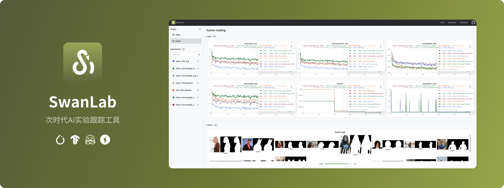
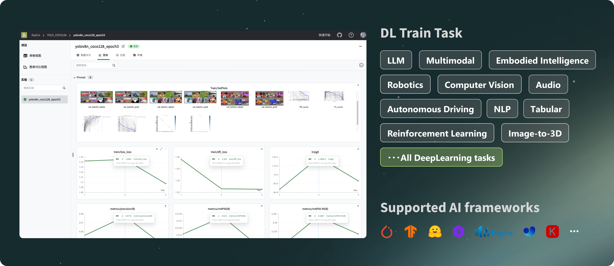
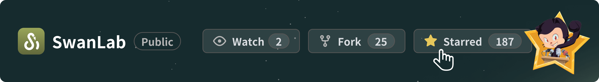
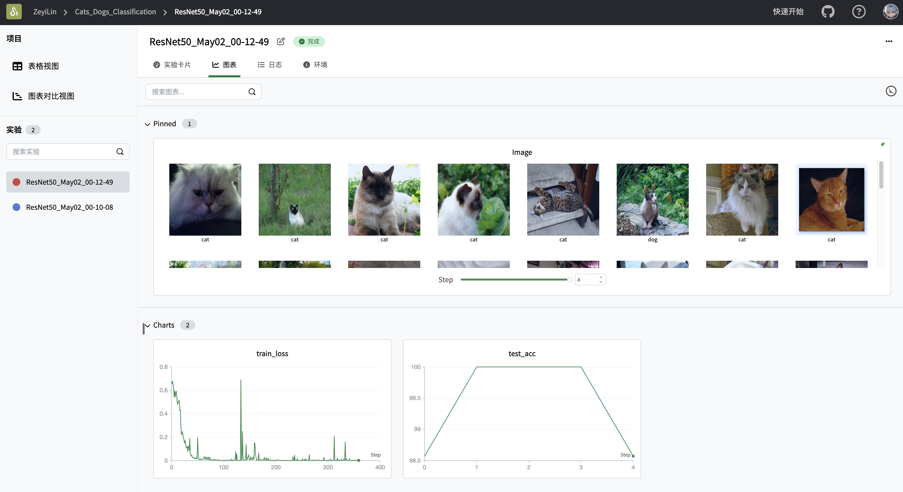
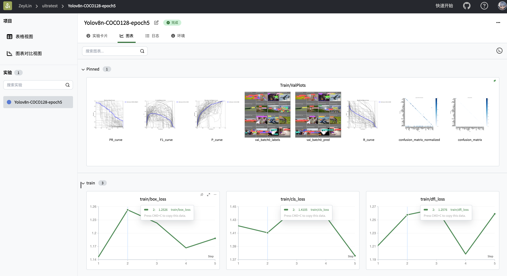
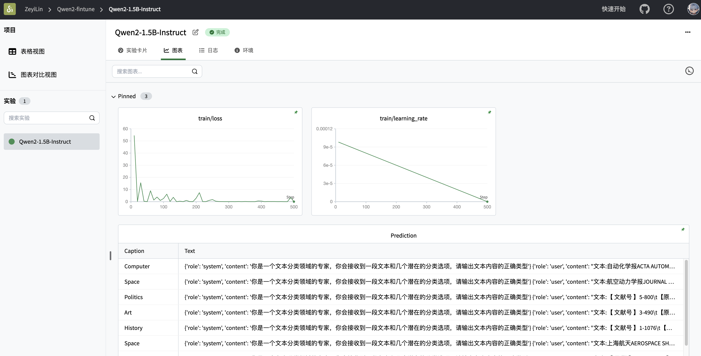
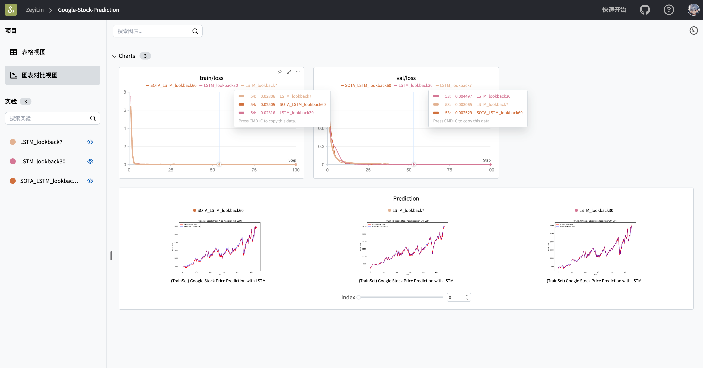

[](https://swanlab.cn/)

<div align="center">

<a href="https://swanlab.cn">🔥SwanLab 在线版</a> · <a href="https://docs.swanlab.cn">📃 文档</a> · <a href="https://github.com/swanhubx/swanlab/issues">报告问题</a> · <a href="https://geektechstudio.feishu.cn/share/base/form/shrcnyBlK8OMD0eweoFcc2SvWKc">建议反馈</a> · <a href="https://docs.swanlab.cn/zh/guide_cloud/general/changelog.html">更新日志</a>

[![license][license-shield]][license-shield-link]
[![last-commit][last-commit-shield]][last-commit-shield-link]
[![pypi-version][pypi-version-shield]][pypi-version-shield-link]
[![pypi-downloads][pypi-downloads-shield]][pypi-downloads-shield-link]
[![issues][issues-shield]][issues-shield-link]
<br>
[![swanlab-cloud][swanlab-cloud-shield]][swanlab-cloud-shield-link]
[![wechat][wechat-shield]][wechat-shield-link]
[![colab][colab-shield]][colab-shield-link]

中文 / [English](README_EN.md) / [日本語](README_JP.md) / [Русский](README_RU.md)

👋 加入我们的[微信群](https://docs.swanlab.cn/zh/guide_cloud/community/online-support.html)

</div>

## 目录

- [👋🏻 什么是SwanLab](#-什么是swanlab)
- [📃 在线演示](#-在线演示)
- [🏁 快速开始](#-快速开始)
- [💻 自托管](#-自托管)
- [🚗 框架集成](#-框架集成)
- [🆚 与熟悉的工具的比较](#-与熟悉的工具的比较)
- [👥 社区](#-社区)
- [📃 协议](#-协议)

<br/>

## 👋🏻 什么是SwanLab

SwanLab 是一款开源、轻量的 AI 实验跟踪工具，提供了一个跟踪、比较、和协作实验的平台。

SwanLab 提供了友好的 API 和漂亮的界面，结合了超参数跟踪、指标记录、在线协作、实验链接分享等功能，让您可以快速跟踪 AI 实验、可视化过程、记录超参数，并分享给伙伴。

以下是其核心特性列表：

**1. 📊 实验指标与超参数跟踪**: 极简的代码嵌入您的机器学习 pipeline，跟踪记录训练关键指标

- 自由的超参数与实验配置记录
- 支持的元数据类型：标量指标、图像、音频、文本、...
- 支持的图表类型：折线图、媒体图（图像、音频、文本）、...
- 自动记录：控制台 logging、GPU 硬件、Git 信息、Python 解释器、Python 库列表、代码目录



**2. ⚡️ 全面的框架集成**: PyTorch、Tensorflow、PyTorch Lightning、🤗HuggingFace、Transformers、MMEngine、Ultralytics、fastai、Tensorboard、OpenAI、ZhipuAI、Hydra、...

**3. 📦 组织实验**: 集中式仪表板，快速管理多个项目与实验，通过整体视图速览训练全局

**4. 🆚 比较结果**: 通过在线表格与对比图表比较不同实验的超参数和结果，挖掘迭代灵感

**5. 👥 在线协作**: 您可以与团队进行协作式训练，支持将实验实时同步在一个项目下，您可以在线查看团队的训练记录，基于结果发表看法与建议

**6. ✉️ 分享结果**: 复制和发送持久的 URL 来共享每个实验，方便地发送给伙伴，或嵌入到在线笔记中

**7. 💻 支持自托管**: 支持不联网使用，自托管的社区版同样可以查看仪表盘与管理实验

> \[!IMPORTANT]
>
> **收藏项目**，你将从 GitHub 上无延迟地接收所有发布通知～ ⭐️



<br>

## 📃 在线演示

来看看 SwanLab 的在线演示：

|                    [ResNet50 猫狗分类](https://swanlab.cn/@ZeyiLin/Cats_Dogs_Classification/runs/jzo93k112f15pmx14vtxf/chart)                    |                [Yolov8-COCO128 目标检测](https://swanlab.cn/@ZeyiLin/ultratest/runs/yux7vclmsmmsar9ear7u5/chart)                 |
| :----------------------------------------------------------------------------------------------------------------------------------------------: | :------------------------------------------------------------------------------------------------------------------------------: |
| <a href="https://swanlab.cn/@ZeyiLin/Cats_Dogs_Classification/runs/jzo93k112f15pmx14vtxf/chart">  </a> | <a href="https://swanlab.cn/@ZeyiLin/ultratest/runs/yux7vclmsmmsar9ear7u5/chart">  </a> |
|                                          跟踪一个简单的 ResNet50 模型在猫狗数据集上训练的图像分类任务。                                          |                             使用 Yolov8 在 COCO128 数据集上进行目标检测任务，跟踪训练超参数和指标。                              |

|                     [Qwen2 指令微调](https://swanlab.cn/@ZeyiLin/Qwen2-fintune/runs/cfg5f8dzkp6vouxzaxlx6/chart)                      |                  [LSTM Google 股票预测](https://swanlab.cn/@ZeyiLin/Google-Stock-Prediction/charts)                  |
| :-----------------------------------------------------------------------------------------------------------------------------------: | :------------------------------------------------------------------------------------------------------------------: |
| <a href="https://swanlab.cn/@ZeyiLin/Qwen2-fintune/runs/cfg5f8dzkp6vouxzaxlx6/chart">  </a> | <a href="https://swanlab.cn/@ZeyiLin/Google-Stock-Prediction/charts">  </a> |
|                                       跟踪 Qwen2 大语言模型的指令微调训练，完成简单的指令遵循。                                       |                        使用简单的 LSTM 模型在 Google 股价数据集上训练，实现对未来股价的预测。                        |

[更多案例](https://docs.swanlab.cn/zh/examples/mnist.html)

<br>

## 🏁 快速开始

### 1.安装

```bash
pip install swanlab
```

### 2.登录并获取 API Key

1. 免费[注册账号](https://swanlab.cn)

2. 登录账号，在用户设置 > [API Key](https://swanlab.cn/settings) 里复制您的 API Key

3. 打开终端，输入：

```bash
swanlab login
```

出现提示时，输入您的 API Key，按下回车，完成登陆。

### 3.将 SwanLab 与你的代码集成

```python
import swanlab

# 初始化一个新的swanlab实验
swanlab.init(
    project="my-first-ml",
    config={'learning-rate': 0.003},
)

# 记录指标
for i in range(10):
    swanlab.log({"loss": i, "acc": i})
```

大功告成！前往[SwanLab](https://swanlab.cn)查看你的第一个 SwanLab 实验。


<br>

## 💻 自托管

自托管社区版支持离线查看 SwanLab 仪表盘。

### 离线实验跟踪

在 swanlab.init 中设置`logir`和`mode`这两个参数，即可离线跟踪实验：

```python
...

swanlab.init(
    logdir='./logs',
    mode='local',
)

...
```

- 参数`mode`设置为`local`，关闭将实验同步到云端

- 参数`logdir`的设置是可选的，它的作用是指定了 SwanLab 日志文件的保存位置（默认保存在`swanlog`文件夹下）

  - 日志文件会在跟踪实验的过程中被创建和更新，离线看板的启动也将基于这些日志文件

其他部分和云端使用完全一致。

### 开启离线看板

打开终端，使用下面的指令，开启一个 SwanLab 仪表板:

```bash
swanlab watch ./logs
```

运行完成后，SwanLab 会给你 1 个本地的 URL 链接（默认是[http://127.0.0.1:5092](http://127.0.0.1:5092)）

访问该链接，就可以在浏览器用离线看板查看实验了。

<br>

## 🚗 框架集成

将您最喜欢的框架与 SwanLab 结合使用，[更多集成](https://docs.swanlab.cn/zh/guide_cloud/integration/integration-pytorch-lightning.html)。

<details>
  <summary>
    <strong>⚡️ PyTorch Lightning</strong>
  </summary>
  <br>

使用`SwanLabLogger`创建示例，并代入`Trainer`的`logger`参数中，即可实现 SwanLab 记录训练指标。

```python
from swanlab.integration.pytorch_lightning import SwanLabLogger
import importlib.util
import os
import pytorch_lightning as pl
from torch import nn, optim, utils
from torchvision.datasets import MNIST
from torchvision.transforms import ToTensor

encoder = nn.Sequential(nn.Linear(28 * 28, 128), nn.ReLU(), nn.Linear(128, 3))
decoder = nn.Sequential(nn.Linear(3, 128), nn.ReLU(), nn.Linear(128, 28 * 28))


class LitAutoEncoder(pl.LightningModule):
    def __init__(self, encoder, decoder):
        super().__init__()
        self.encoder = encoder
        self.decoder = decoder

    def training_step(self, batch, batch_idx):
        # training_step defines the train loop.
        # it is independent of forward
        x, y = batch
        x = x.view(x.size(0), -1)
        z = self.encoder(x)
        x_hat = self.decoder(z)
        loss = nn.functional.mse_loss(x_hat, x)
        # Logging to SwanLab (if installed) by default
        self.log("train_loss", loss)
        return loss

    def test_step(self, batch, batch_idx):
        # test_step defines the test loop.
        # it is independent of forward
        x, y = batch
        x = x.view(x.size(0), -1)
        z = self.encoder(x)
        x_hat = self.decoder(z)
        loss = nn.functional.mse_loss(x_hat, x)
        # Logging to SwanLab (if installed) by default
        self.log("test_loss", loss)
        return loss

    def configure_optimizers(self):
        optimizer = optim.Adam(self.parameters(), lr=1e-3)
        return optimizer


# init the autoencoder
autoencoder = LitAutoEncoder(encoder, decoder)

# setup data
dataset = MNIST(os.getcwd(), train=True, download=True, transform=ToTensor())
train_dataset, val_dataset = utils.data.random_split(dataset, [55000, 5000])
test_dataset = MNIST(os.getcwd(), train=False, download=True, transform=ToTensor())

train_loader = utils.data.DataLoader(train_dataset)
val_loader = utils.data.DataLoader(val_dataset)
test_loader = utils.data.DataLoader(test_dataset)

swanlab_logger = SwanLabLogger(
    project="swanlab_example",
    experiment_name="example_experiment",
    cloud=False,
)

trainer = pl.Trainer(limit_train_batches=100, max_epochs=5, logger=swanlab_logger)

trainer.fit(model=autoencoder, train_dataloaders=train_loader, val_dataloaders=val_loader)
trainer.test(dataloaders=test_loader)

```

</details>

<details>
<summary>
  <strong> 🤗HuggingFace Transformers</strong>
</summary>

<br>

使用`SwanLabCallback`创建示例，并代入`Trainer`的`callbacks`参数中，即可实现 SwanLab 记录训练指标。

```python
import evaluate
import numpy as np
import swanlab
from swanlab.integration.huggingface import SwanLabCallback
from datasets import load_dataset
from transformers import AutoModelForSequenceClassification, AutoTokenizer, Trainer, TrainingArguments


def tokenize_function(examples):
    return tokenizer(examples["text"], padding="max_length", truncation=True)


def compute_metrics(eval_pred):
    logits, labels = eval_pred
    predictions = np.argmax(logits, axis=-1)
    return metric.compute(predictions=predictions, references=labels)


dataset = load_dataset("yelp_review_full")

tokenizer = AutoTokenizer.from_pretrained("bert-base-cased")

tokenized_datasets = dataset.map(tokenize_function, batched=True)

small_train_dataset = tokenized_datasets["train"].shuffle(seed=42).select(range(1000))
small_eval_dataset = tokenized_datasets["test"].shuffle(seed=42).select(range(1000))

metric = evaluate.load("accuracy")

model = AutoModelForSequenceClassification.from_pretrained("bert-base-cased", num_labels=5)

training_args = TrainingArguments(
    output_dir="test_trainer",
    report_to="none",
    num_train_epochs=3,
    logging_steps=50,
)

swanlab_callback = SwanLabCallback(experiment_name="TransformersTest", cloud=False)

trainer = Trainer(
    model=model,
    args=training_args,
    train_dataset=small_train_dataset,
    eval_dataset=small_eval_dataset,
    compute_metrics=compute_metrics,
    callbacks=[swanlab_callback],
)

trainer.train()
```

</details>

<details>
<summary>
  <strong> MMEngine(MMDetection etc.)</strong>
</summary>
<br>

将 SwanLab 专为 MMEngine 设计的`SwanlabVisBackend`集成到 MMEngine 中，即可实现 SwanLab 自动记录训练指标。

在你的 MM 配置文件中，加入下面的代码片段，开始训练即可。

```python
custom_imports = dict(imports=["swanlab.integration.mmengine"], allow_failed_imports=False)

vis_backends = [
    dict(
        type="SwanlabVisBackend",
        save_dir="runs/swanlab",
        init_kwargs={
            "project": "swanlab-mmengine",
        },
    ),
]

visualizer = dict(
    type="Visualizer",
    vis_backends=vis_backends,
)
```

</details>

<details>
<summary>
  <strong> Ultralytics</strong>
</summary>
<br>

将 SwanLab 集成到 Ultralytics 中非常简单，只需要用`add_swanlab_callback`函数即可实现:

```python
from ultralytics import YOLO
from swanlab.integration.ultralytics import add_swanlab_callback

model = YOLO("yolov8n.yaml")
model.load()

# 添加swanlab回调
add_swanlab_callback(model)

model.train(
    data="./coco.yaml",
    epochs=50,
    imgsz=320,
)
```

</details>

<br>

## 🆚 与熟悉的工具的比较

### Tensorboard vs SwanLab

- **☁️ 支持在线使用**：
  通过 SwanLab 可以方便地将训练实验在云端在线同步与保存，便于远程查看训练进展、管理历史项目、分享实验链接、发送实时消息通知、多端看实验等。而 Tensorboard 是一个离线的实验跟踪工具。

- **👥 多人协作**：
  在进行多人、跨团队的机器学习协作时，通过 SwanLab 可以轻松管理多人的训练项目、分享实验链接、跨空间交流讨论。而 Tensorboard 主要为个人设计，难以进行多人协作和分享实验。

- **💻 持久、集中的仪表板**：
  无论你在何处训练模型，无论是在本地计算机上、在实验室集群还是在公有云的 GPU 实例中，你的结果都会记录到同一个集中式仪表板中。而使用 TensorBoard 需要花费时间从不同的机器复制和管理
  TFEvent 文件。

- **💪 更强大的表格**：
  通过 SwanLab 表格可以查看、搜索、过滤来自不同实验的结果，可以轻松查看数千个模型版本并找到适合不同任务的最佳性能模型。
  TensorBoard 不适用于大型项目。

### Weights and Biases vs SwanLab

- Weights and Biases 是一个必须联网使用的闭源 MLOps 平台

- SwanLab 不仅支持联网使用，也支持开源、免费、自托管的版本

<br>

## 👥 社区

### 社区与支持

- [GitHub Issues](https://github.com/SwanHubX/SwanLab/issues)：使用 SwanLab 时遇到的错误和问题
- [电子邮件支持](zeyi.lin@swanhub.co)：反馈关于使用 SwanLab 的问题
- <a href="https://geektechstudio.feishu.cn/wiki/NIZ9wp5LRiSqQykizbGcVzUKnic">微信交流群</a>：交流使用 SwanLab 的问题、分享最新的 AI 技术

### SwanLab README 徽章

如果你喜欢在工作中使用 SwanLab，请将 SwanLab 徽章添加到你的 README 中：

[](https://github.com/swanhubx/swanlab)

```
[](https://github.com/swanhubx/swanlab)
```

### 在论文中引用 SwanLab

如果您发现 SwanLab 对您的研究之旅有帮助，请考虑以下列格式引用：

```bibtex
@software{Zeyilin_SwanLab_2023,
  author = {Zeyi Lin, Shaohong Chen, Kang Li, Qiushan Jiang, Zirui Cai,  Kaifang Ji and {The SwanLab team}},
  doi = {10.5281/zenodo.11100550},
  license = {Apache-2.0},
  title = {{SwanLab}},
  url = {https://github.com/swanhubx/swanlab},
  year = {2023}
}
```

### 为 SwanLab 做出贡献

考虑为 SwanLab 做出贡献吗？首先，请花点时间阅读 [贡献指南](CONTRIBUTING.md)。

同时，我们非常欢迎通过社交媒体、活动和会议的分享来支持 SwanLab，衷心感谢！

### 下载 Icon

[SwanLab-Icon-SVG](readme_files/swanlab-logo.svg)

<br>

**Contributors**

<a href="https://github.com/swanhubx/swanlab/graphs/contributors">
  
</a>

<br>

## 📃 协议

本仓库遵循 [Apache 2.0 License](https://github.com/SwanHubX/SwanLab/blob/main/LICENSE) 开源协议

<!-- link -->

[license-shield]: https://img.shields.io/github/license/SwanHubX/SwanLab.svg?color=brightgreen
[license-shield-link]: https://github.com/SwanHubX/SwanLab/blob/main/LICENSE
[last-commit-shield]: https://img.shields.io/github/last-commit/SwanHubX/SwanLab
[last-commit-shield-link]: https://github.com/SwanHubX/SwanLab/commits/main
[pypi-version-shield]: https://img.shields.io/pypi/v/swanlab?color=orange
[pypi-version-shield-link]: https://pypi.org/project/swanlab/
[pypi-downloads-shield]: https://static.pepy.tech/badge/swanlab
[pypi-downloads-shield-link]: https://pepy.tech/project/swanlab
[issues-shield]: https://img.shields.io/github/issues/swanhubx/swanlab
[issues-shield-link]: https://github.com/swanhubx/swanlab/issues
[swanlab-cloud-shield]: https://img.shields.io/badge/Product-SwanLab云端版-636a3f
[swanlab-cloud-shield-link]: https://swanlab.cn/
[wechat-shield]: https://img.shields.io/badge/WeChat-微信-4cb55e
[wechat-shield-link]: https://geektechstudio.feishu.cn/wiki/NIZ9wp5LRiSqQykizbGcVzUKnic
[colab-shield]: https://colab.research.google.com/assets/colab-badge.svg
[colab-shield-link]: https://colab.research.google.com/drive/1RWsrY_1bS8ECzaHvYtLb_1eBkkdzekR3?usp=sharing
