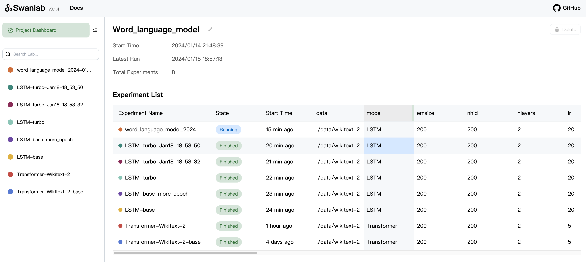
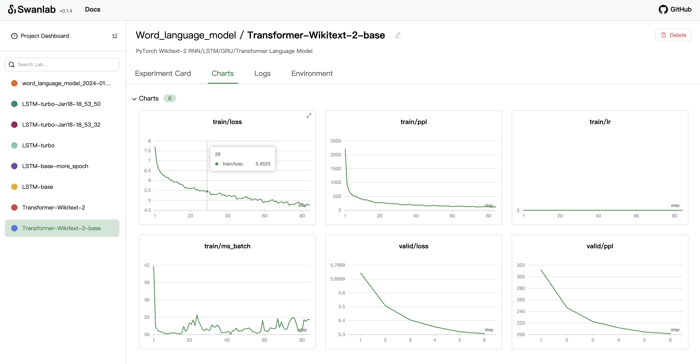

<p align="center">
  
</p>
<h1 align="center"><a href="https://github.com/SwanHubX/SwanLab/tree/main">SwanLab</a></h1>

<p align="center">
Track and visualize all the pieces of your machine learning pipeline
</p>

<p align="center">
  <a href="https://pypi.python.org/pypi/swanlab"></a>
  <a href="https://pepy.tech/project/swanlab"></a>
  <a href="https://github.com/SwanHubX/SwanLab/discussions"></a>
  <a href="https://geektechstudio.feishu.cn/wiki/space/7310593325374013444?ccm_open_type=lark_wiki_spaceLink&open_tab_from=wiki_home"></a>
  <a href="https://github.com/SwanHubX/SwanLab/blob/main/LICENSE"></a>
</p>

<p align="center">
  <b>English | <a href="README_zh-hans.md">简体中文</a></b>
</p>

<p align="center">
👋 Join our <a href="https://geektechstudio.feishu.cn/wiki/NIZ9wp5LRiSqQykizbGcVzUKnic">WeChat</a>


# Table of Contents

- [Key Function](#key-function)
- [Changelog](#changelog)
- [Use Case](#use-case)
- [Getting Started](#getting-started)
- [Tips](#tips)
- [LICENSE](#license)

<br>

# Key Function

- **Experiments GridView**: compare your key metrics for inspiration faster

<div align="center">
  
</div>

- **Charts**: visualize your entire training process

<div align="center">
  
</div>

- **Track machine-learning pipeline**: Hyperparameters, Config, Metric, Terminal logging, Environment Information auto save

<div align="center">
  
</div>


- **Offline Support**: SwanLab can run entirely offile, ithout requiring any access to the Internet. For instance, this may be on your local machine, behind a corporate firewall, or in a datacenter

See the SwanLab <a href="https://geektechstudio.feishu.cn/wiki/MwXmw9yDeiZWyQkPnNgcixwWnwu">Documentaion</a> and <a href="https://github.com/SwanHubX/SwanLab-examples">Examples</a> for a full description of the SwanLab.

<br>

# Changelog

[24/01/14] We supported a new UI, tracking additional environment information, including command, git commit/branch and memory. Additionally, we've added a `logdir` API, allowing developers to set the directory for log files.

[24/01/07] We supported delete experiment and edit experiment inforamation on Dashboard.

[24/01/01] We fixed some bugs to make SwanLab more stable.

[Full Changelog](https://github.com/SwanHubX/SwanLab/releases)

<br>

# Use Case

Learn how to use SwanLab more effectively by following these use cases:

| Title | Description | 
| ------- | ------- |
| [Hello World](https://github.com/SwanHubX/SwanLab-examples/tree/main/Hello_World) | Getting Started |
| [MNIST](https://github.com/SwanHubX/SwanLab-examples/tree/main/MNIST) | Handwriting recognition based on a plain net and MNIST dataset with pytroch, swanlab. |
| [Image Classification](https://github.com/SwanHubX/SwanLab-examples/blob/main/Resnet50) | Cat and dog classification based on ResNet50 with pytorch, swanlab and gradio. [Tutorial](https://zhuanlan.zhihu.com/p/676430630). |
| [Text Generation](https://github.com/SwanHubX/SwanLab-examples/blob/main/Word_language_model) | Text generation based on Word_language_model (RNN/LSTM/GRU/Transformer) |

<br>

# Getting Started

1. First, install the SwanLab SDK with [pip](https://pip.pypa.io/en/stable/):

```bash
pip install -U swanlab
```

> [!NOTE]
> The installation of SwanLab requires Python 3.8+

2. Second, Use the example code snippet below as a template to integrate SwanLab to your Python script:
```Python
import swanlab

# Start a SwanLab Run with swanlab.init
swanlab.init(
  # save model inputs and hyperparameters in a swanlab.config object
  config={'learning_rate': 0.01},
  logdir="./logs"
)

# Model training code here...

# Log metrics over time for visualizing performance with swanlab.log
for epoch in range(1, 20):
    swanlab.log({"loss": loss})
```

3. Third, Run a Dashboard: 
```bash
$ swanlab watch --logdir ./logs
```

That's it! Open http://127.0.0.1:5092 to view a dashboard of your first SwanLab Experiment.

<div align="center">
  
</div>


<br>

# Tips

| Title | Description | 
| ------- | ------- |
| [PyTorch+SwanLab+Gradio: Resnet50_cats_vs dogs](https://zhuanlan.zhihu.com/p/676430630) | A complete tutorial on how to train a cat and dog classification model based on Resnet50, visualize the training process, and deploy Gradio demo. |
| [Remotely access Dashboard](https://zhuanlan.zhihu.com/p/677224865) | How to Access the SwanLab Dashboard While Training on a Remote Server. |
| [Use Argparse init swanlab.config](https://geektechstudio.feishu.cn/wiki/CT1Xwo6ehimNH5kz7y9csTGkn0e) | How to Better Utilize argparse and swanlab.config Together |

<br>

# LICENSE

This project is currently licensed under [Apache 2.0 License](https://github.com/SwanHubX/SwanLab/blob/main/LICENSE).
