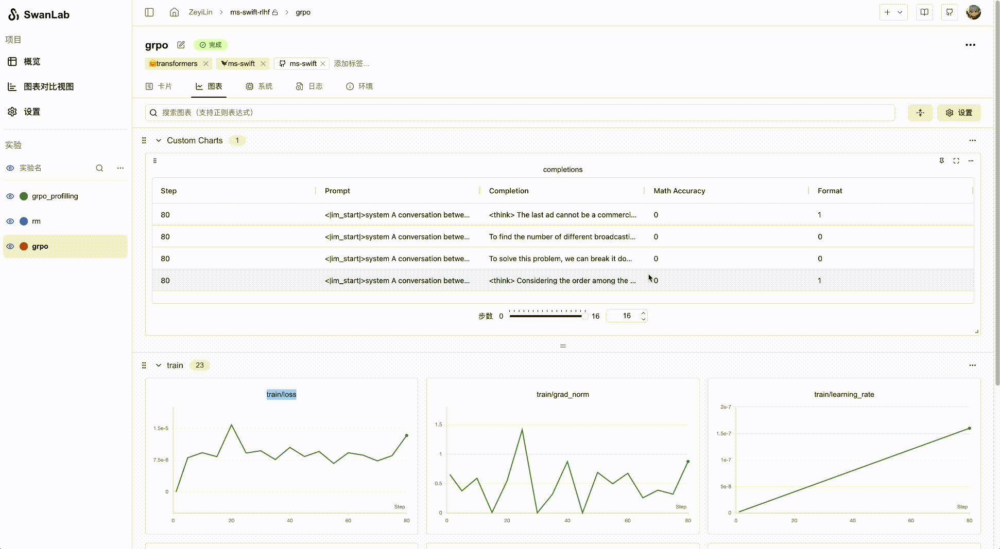

<div align="center">

<picture>
  <source media="(prefers-color-scheme: dark)" srcset="readme_files/swanlab-logo-type2-dark.svg">
  <source media="(prefers-color-scheme: light)" srcset="readme_files/swanlab-logo-type2-light.svg">
  
</picture>

An open-source, modern-designed deep learning training tracking and visualization tool  
Supports both cloud/offline usage, integrates with 30+ mainstream frameworks, and easily integrates with your experimental code.

<a href="https://swanlab.cn">🔥SwanLab Online</a> · <a href="https://docs.swanlab.cn">📃 Documentation</a> · <a href="https://github.com/swanhubx/swanlab/issues">Report Issues</a> · <a href="https://geektechstudio.feishu.cn/share/base/form/shrcnyBlK8OMD0eweoFcc2SvWKc">Feedback</a> · <a href="https://docs.swanlab.cn/en/guide_cloud/general/changelog.html">Changelog</a>

[![][release-shield]][release-link]
[![][dockerhub-shield]][dockerhub-link]
[![][github-stars-shield]][github-stars-link]
[![][github-issues-shield]][github-issues-shield-link]
[![][github-contributors-shield]][github-contributors-link]
[![][license-shield]][license-shield-link]  
[![][tracking-swanlab-shield]][tracking-swanlab-shield-link]
[![][last-commit-shield]][last-commit-shield-link]
[![][pypi-version-shield]][pypi-version-shield-link]
[![][wechat-shield]][wechat-shield-link]
[![][pypi-downloads-shield]][pypi-downloads-shield-link]
[![][colab-shield]][colab-shield-link]


[中文](README.md) / English / [日本語](README_JP.md) / [Русский](README_RU.md)

👋 Join our [WeChat Group](https://docs.swanlab.cn/en/guide_cloud/community/online-support.html)

</div>


## Table of Contents

- [🌟 Recent Updates](#-recent-updates)
- [👋🏻 What is SwanLab](#-what-is-swanlab)
- [📃 Online Demo](#-online-demo)
- [🏁 Quick Start](#-quick-start)
- [💻 Self-Hosting](#-self-hosting)
- 🔥 [Tutorials](#-tutorials)
- [🚗 Framework Integration](#-framework-integration)
- [🔌 Plugins](#-plugins)
- [🎮 Hardware Monitoring](#-hardware-monitoring)
- [🆚 Comparison with Familiar Tools](#-comparison-with-familiar-tools)
- [👥 Community](#-community)
- [📃 License](#-license)

<br/>

## 🌟 Recent Updates

- 2025.10.15: 📊 Line chart configuration now supports **X-axis data source selection**; sidebar now supports displaying pinned columns in table view, enhancing experiment data alignment capabilities;

- 2025.09.22: 📊 New UI launched; table view now supports global sorting and filtering; unified data level for table view and chart view.

- 2025.09.12: 🔢 Added support for **scalar chart**, flexibly displaying the statistical values of experiment indicators; organization management page has been upgraded, providing more powerful permission control and project management capabilities;

- 2025.08.19: 🤔 Optimized chart rendering performance, allowing researchers to focus more on experiment analysis; integrated excellent [MLX-LM](https://github.com/ml-explore/mlx-lm) and [SpecForge](https://github.com/sgl-project/SpecForge) frameworks, providing more training scenarios;

- 2025.08.06: 👥 **Training Collaboration** is now available, supporting inviting project collaborators, sharing project links and QR codes; the workspace now supports list view, and project Tags are now displayed;

- 2025.07.29: 🚀 Added support for experiment filtering and sorting in the sidebar; 📊 Added column control panel to the table view, allowing easy hiding and displaying of columns; 🔐 Added support for managing multiple API Keys, making your data more secure; swanlab sync now supports training crash log files; PR curve, ROC curve, confusion matrix are now available, [documentation](https://docs.swanlab.cn/api/py-pr_curve.html);

- 2025.07.17: 📊 Added support for **line chart configuration**, supporting flexible configuration of line type, color, thickness, grid, legend position, etc.; 📹 Added support for **swanlab.Video** data type, supporting recording and visualizing GIF format files; Global chart dashboard now supports configuring Y-axis and maximum number of experiments displayed.

- 2025.07.10: 📚 Added support for **text view**, supporting Markdown rendering and direction key switching, which can be created by `swanlab.echarts.table` and `swanlab.Text`, [Demo](https://swanlab.cn/@ZeyiLin/ms-swift-rlhf/runs/d661ty9mslogsgk41fp0p/chart)

- 2025.07.06: 🚄 Added support for resume training; new plugin [File Logger](https://docs.swanlab.cn/en/plugin/writer-filelogdir.html); integrated [ray](https://github.com/ray-project/ray) framework, [documentation](https://docs.swanlab.cn/guide_cloud/integration/integration-ray.html); integrated [ROLL](https://github.com/volcengine/ROLL) framework, thanks to [@PanAndy](https://github.com/PanAndy), [documentation](https://docs.swanlab.cn/guide_cloud/integration/integration-roll.html)


<details><summary>Full Changelog</summary>

- 2025.06.27: Added support for **small line chart zooming**; added support for configuring **single line chart smoothing**; significantly improved the interaction effect of image charts after zooming.

- 2025.06.20: 🤗 Integrated the [accelerate](https://github.com/huggingface/accelerate) framework, [PR](https://github.com/huggingface/accelerate/pull/3605), [documentation](https://docs.swanlab.cn/guide_cloud/integration/integration-huggingface-accelerate.html), enhancing the experience of recording and analyzing experiments in distributed training.

- 2025.06.18: 🐜 Integrated the [AREAL](https://github.com/inclusionAI/AReaL) framework, thanks to [@xichengpro](https://github.com/xichengpro), [PR](https://github.com/inclusionAI/AReaL/pull/98), [documentation](https://inclusionai.github.io/AReaL/tutorial/quickstart.html#monitoring-the-training-process); 🖱 Added support for highlighting corresponding curves when hovering the mouse over sidebar experiments; Added support for cross-group comparison line charts; Added support for setting experiment name trimming rules;

- 2025.06.11: 📊 Added support for **swanlab.echarts.table** data type, supporting pure text chart display; added support for **stretch interaction** for groups, allowing more charts to be displayed at the same time; added **maximum/minimum value** options for table views;

- 2025.06.08: ♻️ Added support for storing complete experiment log files locally and uploading them to the cloud/private deployment via **swanlab sync**; Hardware monitoring now supports **Hygon DCU**;

- 2025.06.01: 🏸 Added support for **chart free dragging**; added support for **ECharts custom chart**; added support for **PaddleNLP** framework; hardware monitoring supports **MetaX GPU**;

- 2025.05.25: Logging now supports capturing the **standard error stream**, allowing better recording of output from frameworks like PyTorch Lightning; hardware monitoring now includes support for **Moore Threads**; added a security feature for logging runtime commands, where API Keys will be automatically hidden.

- 2025.05.14: Added support for **experiment tags**; added support for **Log Scale** for line charts; added support for **group dragging**; significantly optimized the experience of uploading a large number of metrics.

- 2025.05.09: Added support for line chart creation; enhanced the chart configuration feature with data source selection, enabling a single chart to display different metrics; introduced the ability to generate GitHub badges for training projects.

- 2025.04.23: Added support for editing line charts, allowing free configuration of X and Y axis data ranges and title styles; chart search now supports regular expressions; added hardware detection and monitoring for Kunlun Core XPU.

- 2025.04.11: Added support for **local selection** for line charts; supports the step range of the current graph.

- 2025.04.08: Added support for the **swanlab.Molecule** data type, enabling recording and visualization of biochemical molecular data; also supports saving the state of sorting, filtering, and column order changes in table views.

- 2025.04.07: We completed joint integration with [EvalScope](https://github.com/ModelScope/EvalScope). Now you can use **SwanLab** in EvalScope to **evaluate LLM performance**.

- 2025.03.30: Added support for the **swanlab.Settings** method, enabling more precise control over experiment behavior; added support for **Cambricon MLU** hardware monitoring; integrated [Slack notifications](https://docs.swanlab.cn/plugin/notification-slack.html) and [Discord notifications](https://docs.swanlab.cn/plugin/notification-discord.html).


- 2025.03.21: 🎉🤗 HuggingFace Transformers has officially integrated SwanLab (version >=4.50.0), [#36433](https://github.com/huggingface/transformers/pull/36433); Added **Object3D chart** support, now you can track and visualize 3D point clouds, [docs](https://docs.swanlab.cn/en/api/py-object3d.html); Hardware monitoring supports the recording of GPU memory (MB), disk utilization, and network sent and received.

- 2025.03.12: 🎉🎉 The **Privatized Deployment Edition** of SwanLab is now available!! [🔗 Deployment Documentation](https://docs.swanlab.cn/en/guide_cloud/self_host/docker-deploy.html); SwanLab now supports plugin extensions, such as [Email Notification](https://docs.swanlab.cn/en/plugin/notification-email.html) and [Lark Notification](https://docs.swanlab.cn/en/plugin/notification-lark.html).

- 2025.03.09: Added **experiment sidebar width** support; added **external Git code** button; added **sync_mlflow** feature, supporting synchronization with mlflow framework.

- 2025.03.06: We completed integration with [DiffSynth Studio](https://github.com/modelscope/diffsynth-studio). Now you can use SwanLab in DiffSynth Studio to **track and visualize Diffusion model text-to-image/video experiments**. [Usage Guide](https://docs.swanlab.cn/en/guide_cloud/integration/integration-diffsynth-studio.html)

- 2025.03.04: Added **MLFlow** feature, supporting conversion of MLFlow experiments to SwanLab experiments. [Usage Guide](https://docs.swanlab.cn/en/guide_cloud/integration/integration-mlflow.html)

- 2025.03.01: Added **move experiment** feature, now you can move experiments to different projects in different organizations.

- 2025.02.24: We completed integration with [EasyR1](https://github.com/hiyouga/EasyR1). Now you can use SwanLab in EasyR1 to **track and visualize large model fine-tuning experiments**. [Usage Guide](https://github.com/hiyouga/EasyR1?tab=readme-ov-file#merge-checkpoint-in-hugging-face-format).

- 2025.02.18: We completed integration with [Swift](https://github.com/modelscope/ms-swift). Now you can use SwanLab in Swift's CLI/WebUI to **track and visualize large model fine-tuning experiments**. [Usage Guide](https://docs.swanlab.cn/en/guide_cloud/integration/integration-swift.html).

- 2025.02.16: Added **chart moving group** and **create group** features.

- 2025.02.09: We completed integration with [veRL](https://github.com/volcengine/verl). Now you can use SwanLab in veRL to **track and visualize large model reinforcement learning experiments**. [Usage Guide](https://docs.swanlab.cn/en/guide_cloud/integration/integration-verl.html).

- 2025.02.05: `swanlab.log` supports nested dictionaries [#812](https://github.com/SwanHubX/SwanLab/pull/812), adapting Jax framework features; supports `name` and `notes` parameters.

- 2025.01.22: Added `sync_tensorboardX` and `sync_tensorboard_torch` features, supporting synchronization of experiment tracking with these two TensorBoard frameworks.

- 2025.01.17: Added `sync_wandb` feature, [docs](https://docs.swanlab.cn/en/guide_cloud/integration/integration-wandb.html), supporting synchronization with Weights & Biases experiment tracking; significantly improved log rendering performance.

- 2025.01.11: The cloud version enhanced project table performance with drag-and-drop, sorting, and filtering support.

- 2025.01.01: Added **persistent smoothing** for line charts and drag-to-resize functionality for line charts, improving chart browsing experience.

- 2024.12.22: We completed integration with [LLaMA Factory](https://github.com/hiyouga/LLaMA-Factory). Now you can use SwanLab in LLaMA Factory to **track and visualize large model fine-tuning experiments**. [Usage Guide](https://github.com/hiyouga/LLaMA-Factory?tab=readme-ov-file#use-swanlab-logger).

- 2024.12.15: **Hardware Monitoring (0.4.0)** is now available, supporting system-level information recording and monitoring for CPU, NPU (Ascend), and GPU (Nvidia).

- 2024.12.06: Added integration with [LightGBM](https://docs.swanlab.cn/en/guide_cloud/integration/integration-lightgbm.html) and [XGBoost](https://docs.swanlab.cn/en/guide_cloud/integration/integration-xgboost.html); increased the limit for single-line log length.

- 2024.11.26: Environment tab - Hardware section now supports identifying **Huawei Ascend NPU** and **Kunpeng CPU**; cloud provider section now supports identifying **QingCloud Jishi Computing**.

</details>

<br>

## 👋🏻 What is SwanLab

SwanLab is an open-source, lightweight AI model training tracking and visualization tool, providing a platform for tracking, recording, comparing, and collaborating on experiments.

SwanLab is designed for AI researchers, offering a friendly Python API and a beautiful UI interface, and providing features such as **training visualization, automatic logging, hyperparameter recording, experiment comparison, and multi-user collaboration**. With SwanLab, researchers can identify training issues through intuitive visual charts, compare multiple experiments to find research inspiration, and break down team communication barriers through **online web sharing** and **multi-user collaborative training** within organizations, improving organizational training efficiency.

https://github.com/user-attachments/assets/7965fec4-c8b0-4956-803d-dbf177b44f54

Here is a list of its core features:

**1. 📊 Experiment Metrics and Hyperparameter Tracking**: Minimal code integration into your machine learning pipeline to track and record key training metrics.

- ☁️ Supports **cloud** usage (similar to Weights & Biases), allowing you to check training progress anytime, anywhere. [How to view experiments on mobile](https://docs.swanlab.cn/en/guide_cloud/general/app.html).


- 🌸 **Visualizing the Training Process**: By visualizing experiment tracking data through the UI interface, trainers can intuitively observe the results at each step of the experiment, analyze metric trends, and determine which changes led to improved model performance—ultimately enhancing the overall efficiency of model iteration.    


- Supports **hyperparameter recording** and table display.

- **Supported metadata types**: Scalar metrics, images, audio, text, 3D point clouds, biological chemical molecules, Echarts custom chart...

- **Resume Training Record**: Supports recording new metrics data to the same experiment after training is completed/interrupted.


- **Supported chart types**: Line charts, media charts (images, audio, text, 3D point clouds, biological chemical molecules), Bar charts, Scatter charts, Box plots, Heat maps, Pie charts, Radar charts, [Custom charts](https://docs.swanlab.cn/guide_cloud/experiment_track/log-custom-chart.html)...


- **Text Chart**: A text chart for large language model training, supporting Markdown rendering.



- **Automatic background logging**: Logging, hardware environment, Git repository, Python environment, Python library list, project runtime directory.

**2. ⚡️ Comprehensive Framework Integration**: PyTorch, 🤗HuggingFace Transformers, PyTorch Lightning, 🦙LLaMA Factory, MMDetection, Ultralytics, PaddleDetection, LightGBM, XGBoost, Keras, Tensorboard, Weights&Biases, OpenAI, Swift, XTuner, Stable Baseline3, Hydra, and more, totaling **30+** frameworks.


**3. 💻 Hardware Monitoring**: Supports real-time recording and monitoring of system-level hardware metrics for CPU, NPU (Ascend), GPU (Nvidia), MLU (Cambricon), and memory.

**4. 📦 Experiment Management**: Through a centralized dashboard designed for training scenarios, quickly overview and manage multiple projects and experiments.

**5. 🆚 Result Comparison**: Compare hyperparameters and results of different experiments through online tables and comparison charts to uncover iteration insights.

**6. 👥 Online Collaboration**: Collaborate with your team on training, supporting real-time synchronization of experiments under a single project. You can view team training records online and provide feedback and suggestions based on results.

**7. ✉️ Share Results**: Copy and send persistent URLs to share each experiment, easily send to partners, or embed in online notes.

**8. 💻 Self-Hosting Support**: Supports offline usage, and the self-hosted community edition also allows viewing dashboards and managing experiments.

**9. 🔌 Plugin Extensions**: Supports extending SwanLab's usage scenarios through plugins, such as [Lark Notifications](https://docs.swanlab.cn/plugin/notification-lark.html), [Slack Notifications](https://docs.swanlab.cn/plugin/notification-slack.html), [CSV Logger](https://docs.swanlab.cn/plugin/writer-csv.html), etc.

> \[!IMPORTANT]
>
> **Star the project** to receive all release notifications from GitHub without delay～ ⭐️


<br>

## 📃 Online Demo

Check out SwanLab's online demos:

| [ResNet50 Cat-Dog Classification][demo-cats-dogs] | [Yolov8-COCO128 Object Detection][demo-yolo] |
| :--------: | :--------: |
| [![][demo-cats-dogs-image]][demo-cats-dogs] | [![][demo-yolo-image]][demo-yolo] |
| Track a simple ResNet50 model training on a cat-dog dataset for image classification. | Use Yolov8 on the COCO128 dataset for object detection, tracking training hyperparameters and metrics. |

| [Qwen2 Instruction Fine-Tuning][demo-qwen2-sft] | [LSTM Google Stock Prediction][demo-google-stock] |
| :--------: | :--------: |
| [![][demo-qwen2-sft-image]][demo-qwen2-sft] | [![][demo-google-stock-image]][demo-google-stock] |
| Track Qwen2 large language model instruction fine-tuning for simple instruction following. | Use a simple LSTM model on Google stock price dataset to predict future stock prices. |

| [ResNeXt101 Audio Classification][demo-audio-classification] | [Qwen2-VL COCO Dataset Fine-Tuning][demo-qwen2-vl] |
| :--------: | :--------: |
| [![][demo-audio-classification-image]][demo-audio-classification] | [![][demo-qwen2-vl-image]][demo-qwen2-vl] |
| Progressive experimental process from ResNet to ResNeXt on audio classification tasks. | Fine-tune Qwen2-VL multimodal large model on COCO2014 dataset using Lora. |

| [EasyR1 multimodal LLM RL Training][demo-easyr1-rl] | [Qwen2.5-0.5B GRPO Training][demo-qwen2-grpo] |
| :--------: | :--------: |
| [![][demo-easyr1-rl-image]][demo-easyr1-rl] | [![][demo-qwen2-grpo-image]][demo-qwen2-grpo] |
| Use EasyR1 framework for multimodal LLM RL training | Fine-tune Qwen2.5-0.5B model on GSM8k dataset using GRPO. |

[More Examples](https://docs.swanlab.cn/en/examples/mnist.html)

<br>

## 🏁 Quick Start

### 1. Installation

```bash
pip install swanlab
```

<details><summary>Install from Source</summary>

If you want to experience the latest features, you can install from the source code.

```bash
# Method 1
git clone https://github.com/SwanHubX/SwanLab.git
pip install -e .

# Method 2
pip install git+https://github.com/SwanHubX/SwanLab.git
```

</details>

<details><summary>Dashboard Extension Installation</summary>

[Dashboard Extension Documentation](https://docs.swanlab.cn/en/guide_cloud/self_host/offline-board.html)

```bash
pip install 'swanlab[dashboard]'
```

</details>

### 2. Login and Get API Key

1. Register for free at [SwanLab](https://swanlab.cn).

2. Log in, and copy your API Key from User Settings > [API Key](https://swanlab.cn/settings).

3. Open the terminal and enter:

```bash
swanlab login
```

When prompted, enter your API Key, press Enter, and complete the login.

### 3. Integrate SwanLab with Your Code

```python
import swanlab

# Initialize a new SwanLab experiment
swanlab.init(
    project="my-first-ml",
    config={'learning-rate': 0.003},
)

# Log metrics
for i in range(10):
    swanlab.log({"loss": i, "acc": i})
```

Done! Head over to [SwanLab](https://swanlab.cn) to view your first SwanLab experiment.

<br>

## 💻 Self-Hosted

The self-hosted community edition supports offline viewing of the SwanLab dashboard.


### 1. Deploy the Self-Hosted Version Using Docker

For detailed instructions, refer to: [Documentation](https://docs.swanlab.cn/en/guide_cloud/self_host/docker-deploy.html)

```bash
git clone https://github.com/SwanHubX/self-hosted.git
cd self-hosted/docker
```

Quick installation for China:

```bash
./install.sh
```

Pull and install the image from DockerHub:

```bash
./install-dockerhub.sh
```

### 2. Specify Experiments to the Self-Hosted Service

Log in to the self-hosted service:

```bash
swanlab login --host http://localhost:8000
```

After logging in, you can record experiments to the self-hosted service.

<br>

## 🔥 Tutorials

**Excellent Open-Source Tutorial Projects Using SwanLab:**

- [happy-llm](https://github.com/datawhalechina/happy-llm): A tutorial on the principles and practice of large language models from scratch. 
- [self-llm](https://github.com/datawhalechina/self-llm): "A Cookbook for Open-Source Large Models" - A tutorial tailored for Chinese users on quickly fine-tuning (full-parameter/LoRA) and deploying domestic and international open-source Large Language Models (LLMs) / Multi-modal Large Models (MLLMs) in a Linux environment. 
- [unlock-deepseek](https://github.com/datawhalechina/unlock-deepseek): Interpretation, extension, and reproduction of the DeepSeek series of works. 
- [Qwen3-SmVL](https://github.com/ShaohonChen/Qwen3-SmVL): The visual head of SmolVLM2 was concatenated and fine-tuned with the Qwen3-0.6B model. 
- [OPPO/Agent_Foundation_Models](https://github.com/OPPO-PersonalAI/Agent_Foundation_Models): Chain-of-Agents: A chain-of-agents model through multi-agent distillation and agent RL. 

**Excellent Research Papers Using SwanLab:**

- [CQLLM: A Framework for Generating CodeQL Security Vulnerability Detection Code Based on Large Language Model](https://www.preprints.org/manuscript/202510.1458)
- [Animation Needs Attention: A Holistic Approach to Slides Animation Comprehension with Visual-Language Models](https://arxiv.org/abs/2407.03916)
- [Efficient Model Fine-Tuning with LoRA for Biomedical Named Entity Recognition](https://ieeexplore.ieee.org/abstract/document/11082049/)
- [SpectrumWorld: Artificial Intelligence Foundation for Spectroscopy](https://arxiv.org/abs/2508.01188)
- [CodeBoost: Boosting Code LLMs by Squeezing Knowledge from Code Snippets with RL](https://arxiv.org/pdf/2508.05242)

**Tutorial Articles:**

- [MNIST Handwritten Digit Recognition](https://docs.swanlab.cn/en/examples/mnist.html)
- [FashionMNIST Apparel Classification](https://docs.swanlab.cn/en/examples/fashionmnist.html)
- [CIFAR-10 Image Classification](https://docs.swanlab.cn/en/examples/cifar10.html)
- [ResNet Cat vs. Dog Classification](https://docs.swanlab.cn/en/examples/cats_dogs_classification.html)
- [YOLO Object Detection](https://docs.swanlab.cn/en/examples/yolo.html)
- [U-Net Medical Image Segmentation](https://docs.swanlab.cn/en/examples/unet-medical-segmentation.html)
- [Audio Classification](https://docs.swanlab.cn/en/examples/audio_classification.html)
- [DQN Reinforcement Learning - CartPole](https://docs.swanlab.cn/en/examples/dqn_cartpole.html)
- [LSTM Google Stock Price Prediction](https://docs.swanlab.cn/en/examples/audio_classification.html)
- [BERT Text Classification](https://docs.swanlab.cn/en/examples/bert.html)
- [Stable Diffusion Text-to-Image Fine-Tuning](https://docs.swanlab.cn/en/examples/stable_diffusion.html)
- [LLM Pre-training](https://docs.swanlab.cn/en/examples/pretrain_llm.html)
- [GLM4 Instruction Fine-Tuning](https://docs.swanlab.cn/en/examples/glm4-instruct.html)
- [Qwen Downstream Task Training](https://docs.swanlab.cn/en/examples/qwen_finetune.html)
- [NER (Named Entity Recognition)](https://docs.swanlab.cn/en/examples/ner.html)
- [Qwen3 Medical Model Fine-Tuning](https://docs.swanlab.cn/en/examples/qwen3-medical.html)
- [Qwen2-VL Multimodal Large Model Fine-Tuning in Practice](https://docs.swanlab.cn/en/examples/qwen_vl_coco.html)
- [GRPO Large Model Reinforcement Learning](https://docs.swanlab.cn/en/examples/qwen_grpo.html)
- [Training the Qwen3-SmVL-0.6B Multimodal Model](https://docs.swanlab.cn/en/examples/qwen3_smolvlm_muxi.html)
- [Getting Started with Embodied AI using LeRobot](https://docs.swanlab.cn/en/examples/robot/lerobot-guide.html)
- [GLM-4.5-Air-LoRA and SwanLab Visualization](https://github.com/datawhalechina/self-llm/blob/master/models/GLM-4.5-Air/03-GLM-4.5-Air-Lora%20%E5%8F%8A%20Swanlab%20%E5%8F%AF%E8%A7%86%E5%8C%96%E5%BE%AE%E8%B0%83.md)
- [How to do RAG? SwanLab Document Assistant Solution Released](https://docs.swanlab.cn/course/prompt_engineering_course/11-swanlab_rag/1.swanlab-rag.html)

<br>

## 🚗 Framework Integration

Use your favorite frameworks with SwanLab!  
Below is a list of frameworks we have integrated. Feel free to submit an [Issue](https://github.com/swanhubx/swanlab/issues) to request integration for your desired framework.

**Basic Frameworks**
- [PyTorch](https://docs.swanlab.cn/en/guide_cloud/integration/integration-pytorch.html)
- [MindSpore](https://docs.swanlab.cn/en/guide_cloud/integration/integration-ascend.html)
- [Keras](https://docs.swanlab.cn/en/guide_cloud/integration/integration-keras.html)

**Specialized/Fine-Tuning Frameworks**
- [PyTorch Lightning](https://docs.swanlab.cn/en/guide_cloud/integration/integration-pytorch-lightning.html)
- [HuggingFace Transformers](https://docs.swanlab.cn/en/guide_cloud/integration/integration-huggingface-transformers.html)
- [LLaMA Factory](https://docs.swanlab.cn/en/guide_cloud/integration/integration-llama-factory.html)
- [Modelscope Swift](https://docs.swanlab.cn/en/guide_cloud/integration/integration-swift.html)
- [DiffSynth Studio](https://docs.swanlab.cn/en/guide_cloud/integration/integration-diffsynth-studio.html)
- [Sentence Transformers](https://docs.swanlab.cn/en/guide_cloud/integration/integration-sentence-transformers.html)
- [PaddleNLP](https://docs.swanlab.cn/guide_cloud/integration/integration-paddlenlp.html)
- [OpenMind](https://modelers.cn/docs/zh/openmind-library/1.0.0/basic_tutorial/finetune/finetune_pt.html#%E8%AE%AD%E7%BB%83%E7%9B%91%E6%8E%A7)
- [Torchtune](https://docs.swanlab.cn/en/guide_cloud/integration/integration-pytorch-torchtune.html)
- [XTuner](https://docs.swanlab.cn/en/guide_cloud/integration/integration-xtuner.html)
- [MMEngine](https://docs.swanlab.cn/en/guide_cloud/integration/integration-mmengine.html)
- [FastAI](https://docs.swanlab.cn/en/guide_cloud/integration/integration-fastai.html)
- [LightGBM](https://docs.swanlab.cn/en/guide_cloud/integration/integration-lightgbm.html)
- [XGBoost](https://docs.swanlab.cn/en/guide_cloud/integration/integration-xgboost.html)
- [MLX-LM](https://docs.swanlab.cn/en/guide_cloud/integration/integration-mlx-lm.html)

**Evaluation Frameworks**
- [EvalScope](https://docs.swanlab.cn/en/guide_cloud/integration/integration-evalscope.html)

**Computer Vision**
- [Ultralytics](https://docs.swanlab.cn/en/guide_cloud/integration/integration-ultralytics.html)
- [MMDetection](https://docs.swanlab.cn/en/guide_cloud/integration/integration-mmdetection.html)
- [MMSegmentation](https://docs.swanlab.cn/en/guide_cloud/integration/integration-mmsegmentation.html)
- [PaddleDetection](https://docs.swanlab.cn/en/guide_cloud/integration/integration-paddledetection.html)
- [PaddleYOLO](https://docs.swanlab.cn/en/guide_cloud/integration/integration-paddleyolo.html)

**Reinforcement Learning**
- [Stable Baseline3](https://docs.swanlab.cn/en/guide_cloud/integration/integration-sb3.html)
- [veRL](https://docs.swanlab.cn/en/guide_cloud/integration/integration-verl.html)
- [HuggingFace trl](https://docs.swanlab.cn/en/guide_cloud/integration/integration-huggingface-trl.html)
- [EasyR1](https://docs.swanlab.cn/en/guide_cloud/integration/integration-easyr1.html)
- [AReaL](https://docs.swanlab.cn/en/guide_cloud/integration/integration-areal.html)
- [ROLL](https://docs.swanlab.cn/en/guide_cloud/integration/integration-roll.html)

**Other Frameworks:**
- [Tensorboard](https://docs.swanlab.cn/en/guide_cloud/integration/integration-tensorboard.html)
- [Weights&Biases](https://docs.swanlab.cn/en/guide_cloud/integration/integration-wandb.html)
- [MLFlow](https://docs.swanlab.cn/en/guide_cloud/integration/integration-mlflow.html)
- [HuggingFace Accelerate](https://docs.swanlab.cn/en/guide_cloud/integration/integration-huggingface-accelerate.html)
- [Ray](https://docs.swanlab.cn/en/guide_cloud/integration/integration-ray.html)
- [Unsloth](https://docs.swanlab.cn/en/guide_cloud/integration/integration-unsloth.html)
- [Hydra](https://docs.swanlab.cn/en/guide_cloud/integration/integration-hydra.html)
- [Omegaconf](https://docs.swanlab.cn/en/guide_cloud/integration/integration-omegaconf.html)
- [OpenAI](https://docs.swanlab.cn/en/guide_cloud/integration/integration-openai.html)
- [ZhipuAI](https://docs.swanlab.cn/en/guide_cloud/integration/integration-zhipuai.html)

[More Integrations](https://docs.swanlab.cn/en/guide_cloud/integration/integration-pytorch-lightning.html)

<br>

## 🔌 Plugins

Enhance your experiment management experience by extending SwanLab's functionality through plugins!

- [Customize Your Plugin](https://docs.swanlab.cn/en/plugin/custom-plugin.html)
-  [Email Notification](https://docs.swanlab.cn/en/plugin/notification-email.html)
-  [Lark Notification](https://docs.swanlab.cn/en/plugin/notification-lark.html)
-  [DingTalk Notification](https://docs.swanlab.cn/en/plugin/notification-dingtalk.html)
-  [WXWork Notification](https://docs.swanlab.cn/en/plugin/notification-wxwork.html)
-  [Discord Notification](https://docs.swanlab.cn/en/plugin/notification-discord.html)
-  [Slack Notification](https://docs.swanlab.cn/en/plugin/notification-slack.html)
-  [Bark Notification](https://docs.swanlab.cn/plugin/notification-bark.html)
-  [CSV Logger](https://docs.swanlab.cn/en/plugin/writer-csv.html)
-  [File Logger](https://docs.swanlab.cn/en/plugin/writer-filelogdir.html)

<br>

## 🎮 Hardware Monitoring

SwanLab records the **hardware information** and **resource usage** during AI training. Below is a table of supported hardware:

| Hardware | Information Recording | Resource Monitoring | Script |
| --- | --- | --- | --- |
| Nvidia GPU | ✅ | ✅ | [nvidia.py](https://github.com/SwanHubX/SwanLab/blob/main/swanlab/data/run/metadata/hardware/gpu/nvidia.py) |
| Ascend NPU | ✅ | ✅ | [ascend.py](https://github.com/SwanHubX/SwanLab/blob/main/swanlab/data/run/metadata/hardware/npu/ascend.py) |
| Apple SOC        | ✅                     | ✅                   | [apple.py](https://github.com/SwanHubX/SwanLab/blob/main/swanlab/data/run/metadata/hardware/soc/apple.py) |
| Combricon MLU    | ✅                     | ✅                   | [cambricon.py](https://github.com/SwanHubX/SwanLab/blob/main/swanlab/data/run/metadata/hardware/mlu/cambricon.py) |
| Kunlunxin XPU    | ✅                     | ✅                   | [kunlunxin.py](https://github.com/SwanHubX/SwanLab/blob/main/swanlab/data/run/metadata/hardware/xpu/kunlunxin.py) |
| MooreThreads GPU | ✅ | ✅ | [moorethreads.py](https://github.com/SwanHubX/SwanLab/blob/main/swanlab/data/run/metadata/hardware/gpu/moorethreads.py) |
| MetaX GPU | ✅ | ✅ | [metax.py](https://github.com/SwanHubX/SwanLab/blob/main/swanlab/data/run/metadata/hardware/gpu/metax.py) |
| Hygon DCU | ✅ | ✅ | [hygon.py](https://github.com/SwanHubX/SwanLab/blob/main/swanlab/data/run/metadata/hardware/dcu/hygon.py) |
| CPU              | ✅                     | ✅                   | [cpu.py](https://github.com/SwanHubX/SwanLab/blob/main/swanlab/data/run/metadata/hardware/cpu.py) |
| Memory | ✅ | ✅ | [memory.py](https://github.com/SwanHubX/SwanLab/blob/main/swanlab/data/run/metadata/hardware/memory.py) |
| Disk | ✅ | ✅ | [disk.py](https://github.com/SwanHubX/SwanLab/blob/main/swanlab/data/run/metadata/hardware/disk.py) |
| Network | ✅ | ✅ | [network.py](https://github.com/SwanHubX/SwanLab/blob/main/swanlab/data/run/metadata/hardware/network.py) |

If you wish to document other hardware, feel free to submit an Issue or PR!

<br>


## 🆚 Comparison with Familiar Tools

### Tensorboard vs SwanLab

- **☁️ Online Support**:
  SwanLab allows convenient cloud-based synchronization and storage of training experiments, enabling remote viewing of training progress, managing historical projects, sharing experiment links, sending real-time notifications, and multi-device experiment viewing. Tensorboard, on the other hand, is an offline experiment tracking tool.

- **👥 Multi-User Collaboration**:
  SwanLab facilitates multi-user, cross-team machine learning collaboration by easily managing team training projects, sharing experiment links, and enabling cross-space discussions. Tensorboard is primarily designed for individual use, making multi-user collaboration and experiment sharing difficult.

- **💻 Persistent, Centralized Dashboard**:
  Regardless of where you train your models—on a local computer, a lab cluster, or a public cloud GPU instance—your results are recorded in the same centralized dashboard. TensorBoard requires time-consuming copying and management of TFEvent files from different machines.

- **💪 More Powerful Tables**:
  SwanLab tables allow you to view, search, and filter results from different experiments, making it easy to review thousands of model versions and identify the best-performing models for different tasks. TensorBoard is not suitable for large-scale projects.

### Weights and Biases vs SwanLab

- Weights and Biases is a closed-source MLOps platform that requires an internet connection.

- SwanLab not only supports online usage but also offers an open-source, free, self-hosted version.

<br>

## 👥 Community

### Repositories

- [self-hosted](https://github.com/swanhubx/self-hosted): The repository for private deployment scripts.
- [SwanLab-Docs](https://github.com/swanhubx/swanlab-docs): The official documentation repository.
- [SwanLab-Dashboard](https://github.com/swanhubx/swanlab-dashboard): The offline dashboard repository, which contains the web code for the lightweight offline dashboard opened by `swanlab watch`.


### Community and Support

- [GitHub Issues](https://github.com/SwanHubX/SwanLab/issues): Errors and issues encountered while using SwanLab.
- [Email Support](zeyi.lin@swanhub.co): Feedback and questions about using SwanLab.
- <a href="https://docs.swanlab.cn/en/guide_cloud/community/online-support.html">WeChat Group</a>: Discuss SwanLab usage and share the latest AI technologies.

### SwanLab README Badge

If you enjoy using SwanLab in your work, please add the SwanLab badge to your README:

[![][tracking-swanlab-shield]][tracking-swanlab-shield-link]、[![][visualize-swanlab-shield]][visualize-swanlab-shield-link]

```
[](your experiment url)
[](your experiment url)
```

More design materials: [assets](https://github.com/SwanHubX/assets)

### Citing SwanLab in Papers

If you find SwanLab helpful in your research journey, please consider citing it in the following format:

```bibtex
@software{Zeyilin_SwanLab_2023,
  author = {Zeyi Lin, Shaohong Chen, Kang Li, Qiushan Jiang, Zirui Cai,  Kaifang Ji and {The SwanLab team}},
  doi = {10.5281/zenodo.11100550},
  license = {Apache-2.0},
  title = {{SwanLab}},
  url = {https://github.com/swanhubx/swanlab},
  year = {2023}
}
```

### Contributing to SwanLab

Considering contributing to SwanLab? First, take a moment to read the [Contribution Guide](CONTRIBUTING.md).

We also greatly appreciate support through social media, events, and conference sharing. Thank you!

<br>

**Contributors**

<a href="https://github.com/swanhubx/swanlab/graphs/contributors">
  
</a>

<br>


## 📃 License

This repository is licensed under the [Apache 2.0 License](https://github.com/SwanHubX/SwanLab/blob/main/LICENSE).

## Star History

[](https://star-history.com/#swanhubx/swanlab&Date)

<!-- link -->

[release-shield]: https://img.shields.io/github/v/release/swanhubx/swanlab?color=369eff&labelColor=black&logo=github&style=flat-square
[release-link]: https://github.com/swanhubx/swanlab/releases

[license-shield]: https://img.shields.io/badge/license-apache%202.0-white?labelColor=black&style=flat-square
[license-shield-link]: https://github.com/SwanHubX/SwanLab/blob/main/LICENSE

[last-commit-shield]: https://img.shields.io/github/last-commit/swanhubx/swanlab?color=c4f042&labelColor=black&style=flat-square
[last-commit-shield-link]: https://github.com/swanhubx/swanlab/commits/main

[pypi-version-shield]: https://img.shields.io/pypi/v/swanlab?color=orange&labelColor=black&style=flat-square
[pypi-version-shield-link]: https://pypi.org/project/swanlab/

[pypi-downloads-shield]: https://static.pepy.tech/badge/swanlab?labelColor=black&style=flat-square
[pypi-downloads-shield-link]: https://pepy.tech/project/swanlab

[swanlab-cloud-shield]: https://img.shields.io/badge/Product-SwanLab云端版-636a3f?labelColor=black&style=flat-square
[swanlab-cloud-shield-link]: https://swanlab.cn/

[wechat-shield]: https://img.shields.io/badge/WeChat-微信-4cb55e?labelColor=black&style=flat-square
[wechat-shield-link]: https://docs.swanlab.cn/en/guide_cloud/community/online-support.html

[colab-shield]: https://colab.research.google.com/assets/colab-badge.svg
[colab-shield-link]: https://colab.research.google.com/drive/1RWsrY_1bS8ECzaHvYtLb_1eBkkdzekR3?usp=sharing

[github-stars-shield]: https://img.shields.io/github/stars/swanhubx/swanlab?labelColor&style=flat-square&color=ffcb47
[github-stars-link]: https://github.com/swanhubx/swanlab

[github-issues-shield]: https://img.shields.io/github/issues/swanhubx/swanlab?labelColor=black&style=flat-square&color=ff80eb
[github-issues-shield-link]: https://github.com/swanhubx/swanlab/issues

[github-contributors-shield]: https://img.shields.io/github/contributors/swanhubx/swanlab?color=c4f042&labelColor=black&style=flat-square
[github-contributors-link]: https://github.com/swanhubx/swanlab/graphs/contributors

[demo-cats-dogs]: https://swanlab.cn/@ZeyiLin/Cats_Dogs_Classification/runs/jzo93k112f15pmx14vtxf/chart
[demo-cats-dogs-image]: readme_files/example-catsdogs.png

[demo-yolo]: https://swanlab.cn/@ZeyiLin/ultratest/runs/yux7vclmsmmsar9ear7u5/chart
[demo-yolo-image]: readme_files/example-yolo.png

[demo-qwen2-sft]: https://swanlab.cn/@ZeyiLin/Qwen2-fintune/runs/cfg5f8dzkp6vouxzaxlx6/chart
[demo-qwen2-sft-image]: readme_files/example-qwen2.png

[demo-google-stock]:https://swanlab.cn/@ZeyiLin/Google-Stock-Prediction/charts
[demo-google-stock-image]: readme_files/example-lstm.png

[demo-audio-classification]:https://swanlab.cn/@ZeyiLin/PyTorch_Audio_Classification/charts
[demo-audio-classification-image]: readme_files/example-audio-classification.png

[demo-qwen2-vl]:https://swanlab.cn/@ZeyiLin/Qwen2-VL-finetune/runs/pkgest5xhdn3ukpdy6kv5/chart
[demo-qwen2-vl-image]: readme_files/example-qwen2-vl.jpg

[demo-easyr1-rl]:https://swanlab.cn/@Kedreamix/easy_r1/runs/wzezd8q36bb6dlza6wtpc/chart
[demo-easyr1-rl-image]: readme_files/example-easyr1-rl.png

[demo-qwen2-grpo]:https://swanlab.cn/@kmno4/Qwen-R1/runs/t0zr3ak5r7188mjbjgdsc/chart
[demo-qwen2-grpo-image]: readme_files/example-qwen2-grpo.png


[tracking-swanlab-shield-link]:https://swanlab.cn
[tracking-swanlab-shield]: https://raw.githubusercontent.com/SwanHubX/assets/main/badge2.svg

[visualize-swanlab-shield-link]:https://swanlab.cn
[visualize-swanlab-shield]: https://raw.githubusercontent.com/SwanHubX/assets/main/badge1.svg

[dockerhub-shield]: https://img.shields.io/docker/v/swanlab/swanlab-next?color=369eff&label=docker&labelColor=black&logoColor=white&style=flat-square
[dockerhub-link]: https://hub.docker.com/r/swanlab/swanlab-next/tags