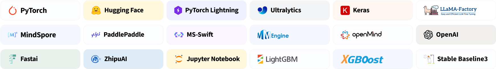

<div align="center">

<picture>
  <source media="(prefers-color-scheme: dark)" srcset="readme_files/swanlab-logo-single-dark.svg">
  <source media="(prefers-color-scheme: light)" srcset="readme_files/swanlab-logo-single.svg">
  
</picture>

<h1>SwanLab</h1>

An open-source, modern-designed deep learning training tracking and visualization tool  
Supports both cloud/offline usage, integrates with 30+ mainstream frameworks, and easily integrates with your experimental code.

<a href="https://swanlab.cn">🔥SwanLab Online</a> · <a href="https://docs.swanlab.cn">📃 Documentation</a> · <a href="https://github.com/swanhubx/swanlab/issues">Report Issues</a> · <a href="https://geektechstudio.feishu.cn/share/base/form/shrcnyBlK8OMD0eweoFcc2SvWKc">Feedback</a> · <a href="https://docs.swanlab.cn/zh/guide_cloud/general/changelog.html">Changelog</a>

[![][release-shield]][release-link]
[![][github-stars-shield]][github-stars-link]
[![][github-issues-shield]][github-issues-shield-link]
[![][github-contributors-shield]][github-contributors-link]
[![][license-shield]][license-shield-link]  
[![][tracking-swanlab-shield]][tracking-swanlab-shield-link]
[![][last-commit-shield]][last-commit-shield-link]
[![][pypi-version-shield]][pypi-version-shield-link]
[![][wechat-shield]][wechat-shield-link]
[![][pypi-downloads-shield]][pypi-downloads-shield-link]
[![][colab-shield]][colab-shield-link]


[中文](README.md) / English / [日本語](README_JP.md) / [Русский](README_RU.md)

👋 Join our [WeChat Group](https://docs.swanlab.cn/zh/guide_cloud/community/online-support.html)

</div>


## Table of Contents

- [🌟 Recent Updates](#-recent-updates)
- [👋🏻 What is SwanLab](#-what-is-swanlab)
- [📃 Online Demo](#-online-demo)
- [🏁 Quick Start](#-quick-start)
- [💻 Self-Hosting](#-self-hosting)
- [🚗 Framework Integration](#-framework-integration)
- [🆚 Comparison with Familiar Tools](#-comparison-with-familiar-tools)
- [👥 Community](#-community)
- [📃 License](#-license)

<br/>

## 🌟 Recent Updates

- 2025.03.04: Added **MLFlow** feature, supporting conversion of MLFlow experiments to SwanLab experiments. [Usage Guide](https://docs.swanlab.cn/guide_cloud/integration/integration-mlflow.html)

- 2025.03.01: Added **move experiment** feature, now you can move experiments to different projects in different organizations.

- 2025.02.24: We completed integration with [EasyR1](https://github.com/hiyouga/EasyR1). Now you can use SwanLab in EasyR1 to **track and visualize large model fine-tuning experiments**. [Usage Guide](https://github.com/hiyouga/EasyR1?tab=readme-ov-file#merge-checkpoint-in-hugging-face-format).

- 2025.02.18: We completed integration with [Swift](https://github.com/modelscope/ms-swift). Now you can use SwanLab in Swift's CLI/WebUI to **track and visualize large model fine-tuning experiments**. [Usage Guide](https://docs.swanlab.cn/guide_cloud/integration/integration-swift.html).

- 2025.02.16: Added **chart moving group** and **create group** features.

- 2025.02.09: We completed integration with [veRL](https://github.com/volcengine/verl). Now you can use SwanLab in veRL to **track and visualize large model reinforcement learning experiments**. [Usage Guide](https://docs.swanlab.cn/guide_cloud/integration/integration-verl.html).

- 2025.02.05: `swanlab.log` supports nested dictionaries [#812](https://github.com/SwanHubX/SwanLab/pull/812), adapting Jax framework features; supports `name` and `notes` parameters.

- 2025.01.22: Added `sync_tensorboardX` and `sync_tensorboard_torch` features, supporting synchronization of experiment tracking with these two TensorBoard frameworks.

- 2025.01.17: Added `sync_wandb` feature, [docs](https://docs.swanlab.cn/en/guide_cloud/integration/integration-wandb.html), supporting synchronization with Weights & Biases experiment tracking; significantly improved log rendering performance.

- 2025.01.11: The cloud version enhanced project table performance with drag-and-drop, sorting, and filtering support.

<details><summary>Full Changelog</summary>

- 2025.01.01: Added **persistent smoothing** for line charts and drag-to-resize functionality for line charts, improving chart browsing experience.

- 2024.12.22: We completed integration with [LLaMA Factory](https://github.com/hiyouga/LLaMA-Factory). Now you can use SwanLab in LLaMA Factory to **track and visualize large model fine-tuning experiments**. [Usage Guide](https://github.com/hiyouga/LLaMA-Factory?tab=readme-ov-file#use-swanlab-logger).

- 2024.12.15: **Hardware Monitoring (0.4.0)** is now available, supporting system-level information recording and monitoring for CPU, NPU (Ascend), and GPU (Nvidia).

- 2024.12.06: Added integration with [LightGBM](https://docs.swanlab.cn/guide_cloud/integration/integration-lightgbm.html) and [XGBoost](https://docs.swanlab.cn/guide_cloud/integration/integration-xgboost.html); increased the limit for single-line log length.

- 2024.11.26: Environment tab - Hardware section now supports identifying **Huawei Ascend NPU** and **Kunpeng CPU**; cloud provider section now supports identifying **QingCloud Jishi Computing**.

</details>

<br>

## 👋🏻 What is SwanLab

SwanLab is an open-source, lightweight AI model training tracking and visualization tool, providing a platform for tracking, recording, comparing, and collaborating on experiments.

SwanLab is designed for AI researchers, offering a friendly Python API and a beautiful UI interface, and providing features such as **training visualization, automatic logging, hyperparameter recording, experiment comparison, and multi-user collaboration**. With SwanLab, researchers can identify training issues through intuitive visual charts, compare multiple experiments to find research inspiration, and break down team communication barriers through **online web sharing** and **multi-user collaborative training** within organizations, improving organizational training efficiency.

Here is a list of its core features:

**1. 📊 Experiment Metrics and Hyperparameter Tracking**: Minimal code integration into your machine learning pipeline to track and record key training metrics.

- Supports **cloud** usage (similar to Weights & Biases), allowing you to check training progress anytime, anywhere. [How to view experiments on mobile](https://docs.swanlab.cn/guide_cloud/general/app.html).
- Supports **hyperparameter recording** and table display.
- **Supported metadata types**: Scalar metrics, images, audio, text, ...
- **Supported chart types**: Line charts, media charts (images, audio, text), ...
- **Automatic background logging**: Logging, hardware environment, Git repository, Python environment, Python library list, project runtime directory.

**2. ⚡️ Comprehensive Framework Integration**: PyTorch, 🤗HuggingFace Transformers, PyTorch Lightning, 🦙LLaMA Factory, MMDetection, Ultralytics, PaddleDetection, LightGBM, XGBoost, Keras, Tensorboard, Weights&Biases, OpenAI, Swift, XTuner, Stable Baseline3, Hydra, and more, totaling **30+** frameworks.



**3. 💻 Hardware Monitoring**: Supports real-time recording and monitoring of system-level hardware metrics for CPU, NPU (Ascend), GPU (Nvidia), and memory.

**4. 📦 Experiment Management**: Through a centralized dashboard designed for training scenarios, quickly overview and manage multiple projects and experiments.

**5. 🆚 Result Comparison**: Compare hyperparameters and results of different experiments through online tables and comparison charts to uncover iteration insights.

**6. 👥 Online Collaboration**: Collaborate with your team on training, supporting real-time synchronization of experiments under a single project. You can view team training records online and provide feedback and suggestions based on results.

**7. ✉️ Share Results**: Copy and send persistent URLs to share each experiment, easily send to partners, or embed in online notes.

**8. 💻 Self-Hosting Support**: Supports offline usage, and the self-hosted community edition also allows viewing dashboards and managing experiments.

> \[!IMPORTANT]
>
> **Star the project** to receive all release notifications from GitHub without delay～ ⭐️


<br>

## 📃 Online Demo

Check out SwanLab's online demos:

| [ResNet50 Cat-Dog Classification][demo-cats-dogs] | [Yolov8-COCO128 Object Detection][demo-yolo] |
| :--------: | :--------: |
| [![][demo-cats-dogs-image]][demo-cats-dogs] | [![][demo-yolo-image]][demo-yolo] |
| Track a simple ResNet50 model training on a cat-dog dataset for image classification. | Use Yolov8 on the COCO128 dataset for object detection, tracking training hyperparameters and metrics. |

| [Qwen2 Instruction Fine-Tuning][demo-qwen2-sft] | [LSTM Google Stock Prediction][demo-google-stock] |
| :--------: | :--------: |
| [![][demo-qwen2-sft-image]][demo-qwen2-sft] | [![][demo-google-stock-image]][demo-google-stock] |
| Track Qwen2 large language model instruction fine-tuning for simple instruction following. | Use a simple LSTM model on Google stock price dataset to predict future stock prices. |

| [ResNeXt101 Audio Classification][demo-audio-classification] | [Qwen2-VL COCO Dataset Fine-Tuning][demo-qwen2-vl] |
| :--------: | :--------: |
| [![][demo-audio-classification-image]][demo-audio-classification] | [![][demo-qwen2-vl-image]][demo-qwen2-vl] |
| Progressive experimental process from ResNet to ResNeXt on audio classification tasks. | Fine-tune Qwen2-VL multimodal large model on COCO2014 dataset using Lora. |

[More Examples](https://docs.swanlab.cn/zh/examples/mnist.html)

<br>

## 🏁 Quick Start

### 1. Installation

```bash
pip install swanlab
```

<details><summary>Install from Source</summary>

If you want to experience the latest features, you can install from the source code.

**Step 1**: Clone the project

```bash
git clone https://github.com/SwanHubX/SwanLab.git
cd SwanLab
```

**Step 2**: Modify the `version` field in `swanlab/package.json`, for example, to `0.10.0`

**Step 3**: Install

```bash
pip install -e .
```

</details>

### 2. Login and Get API Key

1. Register for free at [SwanLab](https://swanlab.cn).

2. Log in, and copy your API Key from User Settings > [API Key](https://swanlab.cn/settings).

3. Open the terminal and enter:

```bash
swanlab login
```

When prompted, enter your API Key, press Enter, and complete the login.

### 3. Integrate SwanLab with Your Code

```python
import swanlab

# Initialize a new SwanLab experiment
swanlab.init(
    project="my-first-ml",
    config={'learning-rate': 0.003},
)

# Log metrics
for i in range(10):
    swanlab.log({"loss": i, "acc": i})
```

Done! Head over to [SwanLab](https://swanlab.cn) to view your first SwanLab experiment.

<br>

## 💻 Self-Hosting

The self-hosted community edition supports offline viewing of the SwanLab dashboard.

### Offline Experiment Tracking

Set the `logdir` and `mode` parameters in `swanlab.init` to track experiments offline:

```python
...

swanlab.init(
    logdir='./logs',
    mode='local',
)

...
```

- Set the `mode` parameter to `local` to disable syncing experiments to the cloud.

- The `logdir` parameter is optional and specifies the location where SwanLab log files are saved (default is the `swanlog` folder).

  - Log files are created and updated during the experiment tracking process, and the offline dashboard is launched based on these log files.

Everything else is identical to cloud usage.

### Launch Offline Dashboard

Open the terminal and use the following command to launch a SwanLab dashboard:

```bash
swanlab watch ./logs
```

After running, SwanLab will provide you with a local URL link (default is [http://127.0.0.1:5092](http://127.0.0.1:5092)).

Visit this link to view experiments in the browser using the offline dashboard.

<br>

## 🚗 Framework Integration

Use your favorite frameworks with SwanLab!  
Below is a list of frameworks we have integrated. Feel free to submit an [Issue](https://github.com/swanhubx/swanlab/issues) to request integration for your desired framework.

**Basic Frameworks**
- [PyTorch](https://docs.swanlab.cn/guide_cloud/integration/integration-pytorch.html)
- [MindSpore](https://docs.swanlab.cn/guide_cloud/integration/integration-ascend.html)
- [Keras](https://docs.swanlab.cn/guide_cloud/integration/integration-keras.html)

**Specialized/Fine-Tuning Frameworks**
- [PyTorch Lightning](https://docs.swanlab.cn/guide_cloud/integration/integration-pytorch-lightning.html)
- [HuggingFace Transformers](https://docs.swanlab.cn/guide_cloud/integration/integration-huggingface-transformers.html)
- [OpenMind](https://modelers.cn/docs/zh/openmind-library/1.0.0/basic_tutorial/finetune/finetune_pt.html#%E8%AE%AD%E7%BB%83%E7%9B%91%E6%8E%A7)
- [LLaMA Factory](https://docs.swanlab.cn/guide_cloud/integration/integration-llama-factory.html)
- [Modelscope Swift](https://docs.swanlab.cn/guide_cloud/integration/integration-swift.html)
- [Sentence Transformers](https://docs.swanlab.cn/guide_cloud/integration/integration-sentence-transformers.html)
- [Torchtune](https://docs.swanlab.cn/guide_cloud/integration/integration-pytorch-torchtune.html)
- [XTuner](https://docs.swanlab.cn/guide_cloud/integration/integration-xtuner.html)
- [MMEngine](https://docs.swanlab.cn/guide_cloud/integration/integration-mmengine.html)
- [FastAI](https://docs.swanlab.cn/guide_cloud/integration/integration-fastai.html)
- [LightGBM](https://docs.swanlab.cn/guide_cloud/integration/integration-lightgbm.html)
- [XGBoost](https://docs.swanlab.cn/guide_cloud/integration/integration-xgboost.html)

**Computer Vision**
- [Ultralytics](https://docs.swanlab.cn/guide_cloud/integration/integration-ultralytics.html)
- [MMDetection](https://docs.swanlab.cn/guide_cloud/integration/integration-mmdetection.html)
- [MMSegmentation](https://docs.swanlab.cn/guide_cloud/integration/integration-mmsegmentation.html)
- [PaddleDetection](https://docs.swanlab.cn/guide_cloud/integration/integration-paddledetection.html)
- [PaddleYOLO](https://docs.swanlab.cn/guide_cloud/integration/integration-paddleyolo.html)

**Reinforcement Learning**
- [Stable Baseline3](https://docs.swanlab.cn/guide_cloud/integration/integration-sb3.html)
- [veRL](https://docs.swanlab.cn/guide_cloud/integration/integration-verl.html)
- [HuggingFace trl](https://docs.swanlab.cn/guide_cloud/integration/integration-huggingface-trl.html)
- [EasyR1](https://docs.swanlab.cn/guide_cloud/integration/integration-easyr1.html)

**Other Frameworks:**
- [Tensorboard](https://docs.swanlab.cn/guide_cloud/integration/integration-tensorboard.html)
- [Weights&Biases](https://docs.swanlab.cn/guide_cloud/integration/integration-wandb.html)
- [MLFlow](https://docs.swanlab.cn/guide_cloud/integration/integration-mlflow.html)
- [HuggingFace Accelerate](https://docs.swanlab.cn/guide_cloud/integration/integration-huggingface-accelerate.html)
- [Unsloth](https://docs.swanlab.cn/guide_cloud/integration/integration-unsloth.html)
- [Hydra](https://docs.swanlab.cn/guide_cloud/integration/integration-hydra.html)
- [Omegaconf](https://docs.swanlab.cn/guide_cloud/integration/integration-omegaconf.html)
- [OpenAI](https://docs.swanlab.cn/guide_cloud/integration/integration-openai.html)
- [ZhipuAI](https://docs.swanlab.cn/guide_cloud/integration/integration-zhipuai.html)

[More Integrations](https://docs.swanlab.cn/zh/guide_cloud/integration/integration-pytorch-lightning.html)

<br>

## 🆚 Comparison with Familiar Tools

### Tensorboard vs SwanLab

- **☁️ Online Support**:
  SwanLab allows convenient cloud-based synchronization and storage of training experiments, enabling remote viewing of training progress, managing historical projects, sharing experiment links, sending real-time notifications, and multi-device experiment viewing. Tensorboard, on the other hand, is an offline experiment tracking tool.

- **👥 Multi-User Collaboration**:
  SwanLab facilitates multi-user, cross-team machine learning collaboration by easily managing team training projects, sharing experiment links, and enabling cross-space discussions. Tensorboard is primarily designed for individual use, making multi-user collaboration and experiment sharing difficult.

- **💻 Persistent, Centralized Dashboard**:
  Regardless of where you train your models—on a local computer, a lab cluster, or a public cloud GPU instance—your results are recorded in the same centralized dashboard. TensorBoard requires time-consuming copying and management of TFEvent files from different machines.

- **💪 More Powerful Tables**:
  SwanLab tables allow you to view, search, and filter results from different experiments, making it easy to review thousands of model versions and identify the best-performing models for different tasks. TensorBoard is not suitable for large-scale projects.

### Weights and Biases vs SwanLab

- Weights and Biases is a closed-source MLOps platform that requires an internet connection.

- SwanLab not only supports online usage but also offers an open-source, free, self-hosted version.

<br>

## 👥 Community

### Community and Support

- [GitHub Issues](https://github.com/SwanHubX/SwanLab/issues): Errors and issues encountered while using SwanLab.
- [Email Support](zeyi.lin@swanhub.co): Feedback and questions about using SwanLab.
- <a href="https://docs.swanlab.cn/zh/guide_cloud/community/online-support.html">WeChat Group</a>: Discuss SwanLab usage and share the latest AI technologies.

### SwanLab README Badge

If you enjoy using SwanLab in your work, please add the SwanLab badge to your README:

[![][tracking-swanlab-shield]][tracking-swanlab-shield-link]、[![][visualize-swanlab-shield]][visualize-swanlab-shield-link]

```
[](your experiment url)
[](your experiment url)
```

More design materials: [assets](https://github.com/SwanHubX/assets)

### Citing SwanLab in Papers

If you find SwanLab helpful in your research journey, please consider citing it in the following format:

```bibtex
@software{Zeyilin_SwanLab_2023,
  author = {Zeyi Lin, Shaohong Chen, Kang Li, Qiushan Jiang, Zirui Cai,  Kaifang Ji and {The SwanLab team}},
  doi = {10.5281/zenodo.11100550},
  license = {Apache-2.0},
  title = {{SwanLab}},
  url = {https://github.com/swanhubx/swanlab},
  year = {2023}
}
```

### Contributing to SwanLab

Considering contributing to SwanLab? First, take a moment to read the [Contribution Guide](CONTRIBUTING.md).

We also greatly appreciate support through social media, events, and conference sharing. Thank you!

<br>

**Contributors**

<a href="https://github.com/swanhubx/swanlab/graphs/contributors">
  
</a>

<br>

## 📃 License

This repository is licensed under the [Apache 2.0 License](https://github.com/SwanHubX/SwanLab/blob/main/LICENSE).

## Star History

[](https://star-history.com/#swanhubx/swanlab&Date)

<!-- link -->

[release-shield]: https://img.shields.io/github/v/release/swanhubx/swanlab?color=369eff&labelColor=black&logo=github&style=flat-square
[release-link]: https://github.com/swanhubx/swanlab/releases

[license-shield]: https://img.shields.io/badge/license-apache%202.0-white?labelColor=black&style=flat-square
[license-shield-link]: https://github.com/SwanHubX/SwanLab/blob/main/LICENSE

[last-commit-shield]: https://img.shields.io/github/last-commit/swanhubx/swanlab?color=c4f042&labelColor=black&style=flat-square
[last-commit-shield-link]: https://github.com/swanhubx/swanlab/commits/main

[pypi-version-shield]: https://img.shields.io/pypi/v/swanlab?color=orange&labelColor=black&style=flat-square
[pypi-version-shield-link]: https://pypi.org/project/swanlab/

[pypi-downloads-shield]: https://static.pepy.tech/badge/swanlab?labelColor=black&style=flat-square
[pypi-downloads-shield-link]: https://pepy.tech/project/swanlab

[swanlab-cloud-shield]: https://img.shields.io/badge/Product-SwanLab云端版-636a3f?labelColor=black&style=flat-square
[swanlab-cloud-shield-link]: https://swanlab.cn/

[wechat-shield]: https://img.shields.io/badge/WeChat-微信-4cb55e?labelColor=black&style=flat-square
[wechat-shield-link]: https://docs.swanlab.cn/guide_cloud/community/online-support.html

[colab-shield]: https://colab.research.google.com/assets/colab-badge.svg
[colab-shield-link]: https://colab.research.google.com/drive/1RWsrY_1bS8ECzaHvYtLb_1eBkkdzekR3?usp=sharing

[github-stars-shield]: https://img.shields.io/github/stars/swanhubx/swanlab?labelColor&style=flat-square&color=ffcb47
[github-stars-link]: https://github.com/swanhubx/swanlab

[github-issues-shield]: https://img.shields.io/github/issues/swanhubx/swanlab?labelColor=black&style=flat-square&color=ff80eb
[github-issues-shield-link]: https://github.com/swanhubx/swanlab/issues

[github-contributors-shield]: https://img.shields.io/github/contributors/swanhubx/swanlab?color=c4f042&labelColor=black&style=flat-square
[github-contributors-link]: https://github.com/swanhubx/swanlab/graphs/contributors

[demo-cats-dogs]: https://swanlab.cn/@ZeyiLin/Cats_Dogs_Classification/runs/jzo93k112f15pmx14vtxf/chart
[demo-cats-dogs-image]: readme_files/example-catsdogs.png

[demo-yolo]: https://swanlab.cn/@ZeyiLin/ultratest/runs/yux7vclmsmmsar9ear7u5/chart
[demo-yolo-image]: readme_files/example-yolo.png

[demo-qwen2-sft]: https://swanlab.cn/@ZeyiLin/Qwen2-fintune/runs/cfg5f8dzkp6vouxzaxlx6/chart
[demo-qwen2-sft-image]: readme_files/example-qwen2.png

[demo-google-stock]:https://swanlab.cn/@ZeyiLin/Google-Stock-Prediction/charts
[demo-google-stock-image]: readme_files/example-lstm.png

[demo-audio-classification]:https://swanlab.cn/@ZeyiLin/PyTorch_Audio_Classification/charts
[demo-audio-classification-image]: readme_files/example-audio-classification.png

[demo-qwen2-vl]:https://swanlab.cn/@ZeyiLin/Qwen2-VL-finetune/runs/pkgest5xhdn3ukpdy6kv5/chart
[demo-qwen2-vl-image]: readme_files/example-qwen2-vl.jpg

[tracking-swanlab-shield-link]:https://swanlab.cn
[tracking-swanlab-shield]: https://raw.githubusercontent.com/SwanHubX/assets/main/badge2.svg

[visualize-swanlab-shield-link]:https://swanlab.cn
[visualize-swanlab-shield]: https://raw.githubusercontent.com/SwanHubX/assets/main/badge1.svg