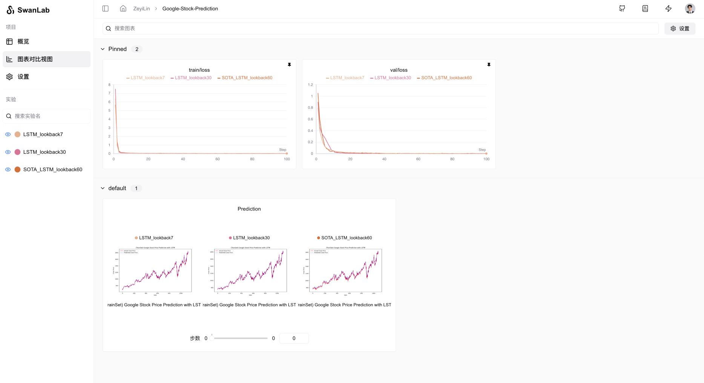

[](https://swanlab.cn/)

<div align="center">

<a href="https://swanlab.cn">🔥SwanLab オンライン版</a> · <a href="https://docs.swanlab.cn">📃 ドキュメント</a> · <a href="https://github.com/swanhubx/swanlab/issues">問題を報告</a> · <a href="https://geektechstudio.feishu.cn/share/base/form/shrcnyBlK8OMD0eweoFcc2SvWKc">提案フィードバック</a> · <a href="https://docs.swanlab.cn/zh/guide_cloud/general/changelog.html">更新ログ</a>

[![license][license-shield]][license-shield-link]
[![last-commit][last-commit-shield]][last-commit-shield-link]
[![pypi-version][pypi-version-shield]][pypi-version-shield-link]
[![pypi-downloads][pypi-downloads-shield]][pypi-downloads-shield-link]
[![issues][issues-shield]][issues-shield-link]
<br>
[![swanlab-cloud][swanlab-cloud-shield]][swanlab-cloud-shield-link]
[![wechat][wechat-shield]][wechat-shield-link]
[![colab][colab-shield]][colab-shield-link]

[中文](README.md) / [English](README_EN.md) / 日本語 / [Русский](README_RU.md)

👋 私たちの[WeChatグループ](https://geektechstudio.feishu.cn/wiki/NIZ9wp5LRiSqQykizbGcVzUKnic)に参加しよう

</div>

## 目次

- [👋🏻 SwanLabとは](#-swanlabとは)
- [📃 オンラインデモ](#-オンラインデモ)
- [🏁 はじめに](#-はじめに)
- [💻 自己ホスティング](#-自己ホスティング)
- [🚗 フレームワーク統合](#-フレームワーク統合)
- [🆚 おなじみのツールとの比較](#-おなじみのツールとの比較)
- [👥 コミュニティ](#-コミュニティ)
- [📃 ライセンス](#-ライセンス)

<br/>

## 👋🏻 SwanLabとは

SwanLabは、オープンソースで軽量なAI実験トラッキングツールであり、実験をトラッキング、比較、協力するためのプラットフォームを提供します。

SwanLabは、ユーザーフレンドリーなAPIと美しいインターフェースを提供し、超パラメータのトラッキング、指標の記録、オンラインコラボレーション、実験リンクの共有などの機能を組み合わせ、AI実験を迅速にトラッキングし、プロセスを可視化し、超パラメータを記録し、仲間と共有することができます。

以下はその核心的な特徴のリストです：

**1. 📊 実験指標と超パラメータのトラッキング**: 極めてシンプルなコードを機械学習パイプラインに埋め込み、トレーニングの重要指標をトラッキングします。

- 自由な超パラメータと実験設定の記録
- サポートされるメタデータタイプ：スカラー指標、画像、音声、テキスト、...
- サポートされるグラフタイプ：折れ線グラフ、メディアグラフ（画像、音声、テキスト）、...
- 自動記録：コンソールログ、GPUハードウェア、Git情報、Pythonインタープリタ、Pythonライブラリリスト、コードディレクトリ


**2. ⚡️ 包括的なフレームワーク統合**: PyTorch、Tensorflow、PyTorch Lightning、🤗HuggingFace、Transformers、MMEngine、Ultralytics、fastai、Tensorboard、OpenAI、ZhipuAI、Hydra、...

**3. 📦 実験の整理**: 集中型ダッシュボードで、複数のプロジェクトや実験を迅速に管理し、全体のビューでトレーニングの全体を一目で確認します。

**4. 🆚 結果の比較**: オンラインテーブルと比較グラフを使って、異なる実験の超パラメータと結果を比較し、反復的なインスピレーションを探ります。

**5. 👥 オンラインコラボレーション**: チームと協力してトレーニングを行うことができ、実験をリアルタイムで同期し、チームのトレーニング記録をオンラインで確認し、結果に基づいて意見や提案を発表できます。

**6. ✉️ 結果の共有**: 各実験を共有するために持続的なURLをコピーして送信し、仲間に簡単に送信したり、オンラインノートに埋め込んだりできます。

**7. 💻 自己ホスティングのサポート**: オフラインでの使用をサポートし、自己ホスト版でもダッシュボードを確認し、実験を管理できます。

> \[!IMPORTANT]
>
> **プロジェクトをスターしてください**。GitHubからすべてのリリース通知を遅延なく受け取れます～ ⭐️


<br>

## 📃 オンラインデモ

SwanLabのオンラインデモを見てみましょう：

|                    [ResNet50 猫犬分類](https://swanlab.cn/@ZeyiLin/Cats_Dogs_Classification/runs/jzo93k112f15pmx14vtxf/chart)                    |                [Yolov8-COCO128 物体検出](https://swanlab.cn/@ZeyiLin/ultratest/runs/yux7vclmsmmsar9ear7u5/chart)                 |
| :----------------------------------------------------------------------------------------------------------------------------------------------: | :------------------------------------------------------------------------------------------------------------------------------: |
| <a href="https://swanlab.cn/@ZeyiLin/Cats_Dogs_Classification/runs/jzo93k112f15pmx14vtxf/chart">  </a> | <a href="https://swanlab.cn/@ZeyiLin/ultratest/runs/yux7vclmsmmsar9ear7u5/chart">  </a> |
|                                          簡単なResNet50モデルを使用して、猫と犬のデータセットでの画像分類タスクをトラッキングします。                                          |                             Yolov8を使ってCOCO128データセットで物体検出タスクを行い、トレーニングの超パラメータと指標をトラッキングします。                              |

|                     [Qwen2 指示微調整](https://swanlab.cn/@ZeyiLin/Qwen2-fintune/runs/cfg5f8dzkp6vouxzaxlx6/chart)                      |                  [LSTM Google 株価予測](https://swanlab.cn/@ZeyiLin/Google-Stock-Prediction/charts)                  |
| :-----------------------------------------------------------------------------------------------------------------------------------: | :------------------------------------------------------------------------------------------------------------------: |
| <a href="https://swanlab.cn/@ZeyiLin/Qwen2-fintune/runs/cfg5f8dzkp6vouxzaxlx6/chart">  </a> | <a href="https://swanlab.cn/@ZeyiLin/Google-Stock-Prediction/charts">  </a> |
|                                       Qwen2大規模言語モデルの指示微調整トレーニングをトラッキングし、簡単な指示に従います。                                       |                        簡単なLSTMモデルを使用してGoogle株価データセットでトレーニングし、将来の株価を予測します。                        |

[さらに多くのケース](https://docs.swanlab.cn/zh/examples/mnist.html)

<br>

## 🏁 はじめに

### 1. インストール

```bash
pip install swanlab
```

### 2. ログインしてAPIキーを取得

1. 無料で[アカウントを登録](https://swanlab.cn)

2. アカウントにログインし、ユーザー設定 > [APIキー](https://swanlab.cn/settings)からAPIキーをコピーします。

3. ターミナルを開き、次のコマンドを入力します：

```bash
swanlab login
```

プロンプトが表示されたら、APIキーを入力し、Enterを押してログインを完了します。

### 3. SwanLabをあなたのコードに統合

```python
import swanlab

# 新しいswanlab実験を初期化
swanlab.init(
    project="my-first-ml",
    config={'learning-rate': 0.003},
)

# 指標を記録
for i in range(10):
    swanlab.log({"loss": i, "acc": i})
```

これで完了です！[SwanLab](https://swanlab.cn)にアクセスしてあなたの最初のSwanLab実験を確認してください。


<br>

## 💻 自己ホスティング

自己ホスティングコミュニティ版は、SwanLabダッシュボードをオフラインで表示することをサポートします。

### オフライン実験トラッキング

`swanlab.init`で`logdir`と`mode`の2つのパラメータを設定することで、オフラインで実験をトラッキングできます：

```python
...

swanlab.init(
    logdir='./logs',
    mode='local',
)

...
```

- パラメータ`mode`を`local`に設定し、実験をクラウドに同期しないようにします。

- パラメータ`logdir`の設定はオプションで、SwanLabログファイルの保存場所を指定します（デフォルトでは`swanlog`フォルダに保存されます）。

  - ログファイルは実験をトラッキングする過程で作成され、更新されます。オフラインダッシュボードの起動もこれらのログファイルに基づきます。

その他の部分はクラウドでの使用と完全に一致します。

### オフラインダッシュボードの起動

ターミナルを開き、次のコマンドを使用してSwanLabダッシュボードを起動します：

```bash
swanlab watch ./logs
```

実行が完了すると、SwanLabは1つのローカルURLリンクを提供します（デフォルトは[http://127.0.0.1:5092](http://127.0.0.1:5092)）。

そのリンクにアクセスすると、ブラウザでオフラインダッシュボードを使用して実験を確認できます。

<br>

## 🚗 フレームワーク統合

お気に入りのフレームワークをSwanLabと組み合わせて使用します。[さらに多くの統合](https://docs.swanlab.cn/zh/guide_cloud/integration/integration-pytorch-lightning.html)。

<details>
  <summary>
    <strong>⚡️ PyTorch Lightning</strong>
  </summary>
  <br>

`SwanLabLogger`を使用してサンプルを作成し、`Trainer`の`logger`パラメータに渡すことで、SwanLabがトレーニング指標を記録できます。

```python
from swanlab.integration.pytorch_lightning import SwanLabLogger
import importlib.util
import os
import pytorch_lightning as pl
from torch import nn, optim, utils
from torchvision.datasets import MNIST
from torchvision.transforms import ToTensor

encoder = nn.Sequential(nn.Linear(28 * 28, 128), nn.ReLU(), nn.Linear(128, 3))
decoder = nn.Sequential(nn.Linear(3, 128), nn.ReLU(), nn.Linear(128, 28 * 28))


class LitAutoEncoder(pl.LightningModule):
    def __init__(self, encoder, decoder):
        super().__init__()
        self.encoder = encoder
        self.decoder = decoder

    def training_step(self, batch, batch_idx):
        # training_stepはトレーニングループを定義します。
        # forwardとは独立しています
        x, y = batch
        x = x.view(x.size(0), -1)
        z = self.encoder(x)
        x_hat = self.decoder(z)
        loss = nn.functional.mse_loss(x_hat, x)
        # デフォルトで SwanLab（インストールされている場合）にログを記録
        self.log("train_loss", loss)
        return loss

    def test_step(self, batch, batch_idx):
        # test_stepはテストループを定義します。
        # forwardとは独立しています
        x, y = batch
        x = x.view(x.size(0), -1)
        z = self.encoder(x)
        x_hat = self.decoder(z)
        loss = nn.functional.mse_loss(x_hat, x)
        # デフォルトで SwanLab（インストールされている場合）にログを記録
        self.log("test_loss", loss)
        return loss

    def configure_optimizers(self):
        optimizer = optim.Adam(self.parameters(), lr=1e-3)
        return optimizer


# オートエンコーダを初期化
autoencoder = LitAutoEncoder(encoder, decoder)

# データを設定
dataset = MNIST(os.getcwd(), train=True, download=True, transform=ToTensor())
train_dataset, val_dataset = utils.data.random_split(dataset, [55000, 5000])
test_dataset = MNIST(os.getcwd(), train=False, download=True, transform=ToTensor())

train_loader = utils.data.DataLoader(train_dataset)
val_loader = utils.data.DataLoader(val_dataset)
test_loader = utils.data.DataLoader(test_dataset)

swanlab_logger = SwanLabLogger(
    project="swanlab_example",
    experiment_name="example_experiment",
    cloud=False,
)

trainer = pl.Trainer(limit_train_batches=100, max_epochs=5, logger=swanlab_logger)

trainer.fit(model=autoencoder, train_dataloaders=train_loader, val_dataloaders=val_loader)
trainer.test(dataloaders=test_loader)

```

</details>

<details>
<summary>
  <strong> 🤗HuggingFace Transformers</strong>
</summary>

<br>

`SwanLabCallback`を使用してサンプルを作成し、`Trainer`の`callbacks`パラメータに渡すことで、SwanLabがトレーニング指標を記録できます。

```python
import evaluate
import numpy as np
import swanlab
from swanlab.integration.huggingface import SwanLabCallback
from datasets import load_dataset
from transformers import AutoModelForSequenceClassification, AutoTokenizer, Trainer, TrainingArguments


def tokenize_function(examples):
    return tokenizer(examples["text"], padding="max_length", truncation=True)


def compute_metrics(eval_pred):
    logits, labels = eval_pred
    predictions = np.argmax(logits, axis=-1)
    return metric.compute(predictions=predictions, references=labels)


dataset = load_dataset("yelp_review_full")

tokenizer = AutoTokenizer.from_pretrained("bert-base-cased")

tokenized_datasets = dataset.map(tokenize_function, batched=True)

small_train_dataset = tokenized_datasets["train"].shuffle(seed=42).select(range(1000))
small_eval_dataset = tokenized_datasets["test"].shuffle(seed=42).select(range(1000))

metric = evaluate.load("accuracy")

model = AutoModelForSequenceClassification.from_pretrained("bert-base-cased", num_labels=5)

training_args = TrainingArguments(
    output_dir="test_trainer",
    report_to="none",
    num_train_epochs=3,
    logging_steps=50,
)

swanlab_callback = SwanLabCallback(experiment_name="TransformersTest", cloud=False)

trainer = Trainer(
    model=model,
    args=training_args,
    train_dataset=small_train_dataset,
    eval_dataset=small_eval_dataset,
    compute_metrics=compute_metrics,
    callbacks=[swanlab_callback],
)

trainer.train()
```

</details>

<details>
<summary>
  <strong> MMEngine(MMDetectionなど)</strong>
</summary>
<br>

SwanLabをMMEngineに特化した`SwanlabVisBackend`として統合することで、SwanLabが自動的にトレーニング指標を記録します。

あなたのMM設定ファイルに、以下のコードスニペットを追加して、トレーニングを開始します。

```python
custom_imports = dict(imports=["swanlab.integration.mmengine"], allow_failed_imports=False)

vis_backends = [
    dict(
        type="SwanlabVisBackend",
        save_dir="runs/swanlab",
        init_kwargs={
            "project": "swanlab-mmengine",
        },
    ),
]

visualizer = dict(
    type="Visualizer",
    vis_backends=vis_backends,
)
```

</details>

<details>
<summary>
  <strong> Ultralytics</strong>
</summary>
<br>

SwanLabをUltralyticsに統合するのは非常に簡単で、`add_swanlab_callback`関数を使うだけで実現できます。

```python
from ultralytics import YOLO
from swanlab.integration.ultralytics import add_swanlab_callback

model = YOLO("yolov8n.yaml")
model.load()

# swanlabコールバックを追加
add_swanlab_callback(model)

model.train(
    data="./coco.yaml",
    epochs=50,
    imgsz=320,
)
```

</details>

<br>

## 🆚 おなじみのツールとの比較

### Tensorboard vs SwanLab

- **☁️ オンライン使用のサポート**：
  SwanLabを使用すると、トレーニング実験をクラウドにオンラインで同期し、保存することが容易で、リモートでトレーニングの進捗を確認し、過去のプロジェクトを管理し、実験リンクを共有し、リアルタイムメッセージ通知を送信し、複数の端末で実験を確認できます。一方、Tensorboardはオフラインの実験トラッキングツールです。

- **👥 複数人のコラボレーション**：
  複数人やクロスチームの機械学習コラボレーションを行う際、SwanLabを使えば、複数のトレーニングプロジェクトを簡単に管理し、実験リンクを共有し、異なる空間でのコミュニケーションを行うことができます。Tensorboardは主に個人向けに設計されており、複数人のコラボレーションや実験の共有が難しいです。

- **💻 永続的で集中したダッシュボード**：
  どこでモデルをトレーニングしていても、ローカルコンピュータ、実験室のクラスター、またはパブリッククラウドのGPUインスタンスであっても、結果はすべて同じ集中型ダッシュボードに記録されます。一方、TensorBoardを使用する場合、異なるマシンからTFEventファイルをコピーして管理するのに時間がかかります。

- **💪 より強力なテーブル**：
  SwanLabのテーブルを使用すれば、異なる実験からの結果を表示、検索、フィルタリングでき、数千のモデルバージョンを簡単に確認し、さまざまなタスクに最適な性能モデルを見つけることができます。TensorBoardは大規模プロジェクトには適していません。

### Weights and Biases vs SwanLab

- Weights and Biasesは、オンラインでの使用が必須のクローズドソースのMLOpsプラットフォームです。

- SwanLabは、オンライン使用をサポートするだけでなく、オープンソース、無料、自己ホスティングのバージョンもサポートしています。

<br>

## 👥 コミュニティ

### コミュニティとサポート

- [GitHub Issues](https://github.com/SwanHubX/SwanLab/issues)：SwanLab使用中に遭遇したエラーや問題
- [メールサポート](zeyi.lin@swanhub.co)：SwanLab使用に関する問題のフィードバック
- <a href="https://geektechstudio.feishu.cn/wiki/NIZ9wp5LRiSqQykizbGcVzUKnic">WeChatグループ</a>：SwanLabの使用に関する問題を共有し、最新のAI技術を共有します。

### SwanLab READMEバッジ

SwanLabを仕事で使用している場合は、READMEにSwanLabバッジを追加してください：

[](https://github.com/swanhubx/swanlab)

```
[](https://github.com/swanhubx/swanlab)
```

### 論文でSwanLabを引用する

SwanLabがあなたの研究の旅に役立つと思った場合、以下の形式で引用を考慮してください：

```bibtex
@software{Zeyilin_SwanLab_2023,
  author = {Zeyi Lin, Shaohong Chen, Kang Li, Qiushan Jiang, Zirui Cai,  Kaifang Ji and {The SwanLab team}},
  doi = {10.5281/zenodo.11100550},
  license = {Apache-2.0},
  title = {{SwanLab}},
  url = {https://github.com/swanhubx/swanlab},
  year = {2023}
}
```

### SwanLabに貢献する

SwanLabに貢献を考えていますか？まずは[貢献ガイドライン](CONTRIBUTING.md)をお読みください。

また、私たちはソーシャルメディア、イベント、会議での共有を通じてSwanLabをサポートしてくれることを歓迎しています。心から感謝します！

### アイコンをダウンロード

[SwanLab-Icon-SVG](readme_files/swanlab-logo.svg)

<br>

**貢献者**

<a href="https://github.com/swanhubx/swanlab/graphs/contributors">
  
</a>

<br>

## 📃 ライセンス

本リポジトリは[Apache 2.0 License](https://github.com/SwanHubX/SwanLab/blob/main/LICENSE)オープンソースライセンスに従います。

<!-- link -->

[license-shield]: https://img.shields.io/github/license/SwanHubX/SwanLab.svg?color=brightgreen
[license-shield-link]: https://github.com/SwanHubX/SwanLab/blob/main/LICENSE
[last-commit-shield]: https://img.shields.io/github/last-commit/SwanHubX/SwanLab
[last-commit-shield-link]: https://github.com/SwanHubX/SwanLab/commits/main
[pypi-version-shield]: https://img.shields.io/pypi/v/swanlab?color=orange
[pypi-version-shield-link]: https://pypi.org/project/swanlab/
[pypi-downloads-shield]: https://static.pepy.tech/badge/swanlab
[pypi-downloads-shield-link]: https://pepy.tech/project/swanlab
[issues-shield]: https://img.shields.io/github/issues/swanhubx/swanlab
[issues-shield-link]: https://github.com/swanhubx/swanlab/issues
[swanlab-cloud-shield]: https://img.shields.io/badge/Product-SwanLab云端版-636a3f
[swanlab-cloud-shield-link]: https://swanlab.cn/
[wechat-shield]: https://img.shields.io/badge/WeChat-微信-4cb55e
[wechat-shield-link]: https://geektechstudio.feishu.cn/wiki/NIZ9wp5LRiSqQykizbGcVzUKnic
[colab-shield]: https://colab.research.google.com/assets/colab-badge.svg
[colab-shield-link]: https://colab.research.google.com/drive/1RWsrY_1bS8ECzaHvYtLb_1eBkkdzekR3?usp=sharing