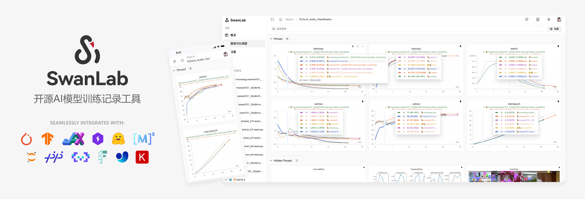

<div align="center">

<picture>
  <source media="(prefers-color-scheme: dark)" srcset="readme_files/swanlab-logo-type2-dark.svg">
  <source media="(prefers-color-scheme: light)" srcset="readme_files/swanlab-logo-type2-light.svg">
  
</picture>

オープンソースでモダンなデザインのディープラーニングトレーニング追跡・可視化ツール  
クラウド/オフライン使用に対応し、30 以上の主要フレームワークと互換性があり、実験コードと簡単に統合可能

<a href="https://swanlab.cn">🔥SwanLab オンライン版</a> · <a href="https://docs.swanlab.cn">📃 ドキュメント</a> · <a href="https://github.com/swanhubx/swanlab/issues">問題を報告</a> · <a href="https://geektechstudio.feishu.cn/share/base/form/shrcnyBlK8OMD0eweoFcc2SvWKc">フィードバックを提案</a> · <a href="https://docs.swanlab.cn/en/guide_cloud/general/changelog.html">更新履歴</a>

[![][release-shield]][release-link]
[![][dockerhub-shield]][dockerhub-link]
[![][github-stars-shield]][github-stars-link]
[![][github-issues-shield]][github-issues-shield-link]
[![][github-contributors-shield]][github-contributors-link]
[![][license-shield]][license-shield-link]  
[![][tracking-swanlab-shield]][tracking-swanlab-shield-link]
[![][last-commit-shield]][last-commit-shield-link]
[![][pypi-version-shield]][pypi-version-shield-link]
[![][wechat-shield]][wechat-shield-link]
[![][pypi-downloads-shield]][pypi-downloads-shield-link]
[![][colab-shield]][colab-shield-link]



[中文](README.md) / [English](README_EN.md) / 日本語 / [Русский](README_RU.md)

👋 [WeChat グループ](https://docs.swanlab.cn/en/guide_cloud/community/online-support.html)に参加する

</div>

## 目次

- [🌟 最近の更新](#-最近の更新)
- [👋🏻 SwanLab とは](#-swanlabとは)
- [📃 オンラインデモ](#-オンラインデモ)
- [🏁 クイックスタート](#-クイックスタート)
- [💻 セルフホスティング](#-セルフホスティング)
- [🚗 フレームワーク統合](#-フレームワーク統合)
- [🔌 プラグイン](#-プラグイン)
- [🆚 既存ツールとの比較](#-既存ツールとの比較)
- [👥 コミュニティ](#-コミュニティ)
- [📃 ライセンス](#-ライセンス)

<br/>

## 🌟 最近の更新

- 2025.12.01: 🕰 マウス上にホバーした状態で Shift をクリックすると詳細モードが有効になり、ログポイントの時間を表示できます；📊 チャートのグループ化で MIN/MAX 範囲エリアの表示をサポート；「リスト」パネルで複数回の非表示によって発生したバグおよびユーザーからのフィードバック問題を修正しました；

- 2025.11.17: 📊 グローバルチャート設定で**X軸データソース選択**と**ホバーモード**機能をサポート、グラフ分析体験を向上；`SWANLAB_WEBHOOK`機能を追加、[ドキュメント](https://docs.swanlab.cn/guide_cloud/experiment_track/webhook-setup.html)

- 2025.11.06: 🔪 **実験分組**が利用可能になりました——大量の実験の分組管理をサポート；ワークスペースページがアップグレードされ、複数の組織間での迅速な切り替えをサポート；折れ線グラフのレンダリングパフォーマンスを大幅に向上；`swanlab.init`が`group`と`job_type`パラメータをサポート；

- 2025.10.15: 📊 折れ線グラフ設定で**X 軸データソース選択**をサポート；サイドバーでテーブルビューの Pin 列を表示し、実験データの整合性を向上；

- 2025.09.22: 📊 新 UI が利用可能になりました；テーブルビューでグローバルソートとフィルタリングをサポート；データレベルでテーブルビューとグラフビューを統一；

- 2025.09.12: 🔢 **スカラーチャート**のサポートを追加、実験指標の統計値を柔軟に表示可能；組織管理ページ大アップグレード、より強力な権限制御とプロジェクト管理機能を提供；

- 2025.08.19: 🤔 より強力なグラフレンダリングパフォーマンスと低侵入性のローディングアニメーション、研究者が実験分析に集中できるように；優れた[MLX-LM](https://github.com/ml-explore/mlx-lm)、[SpecForge](https://github.com/sgl-project/SpecForge)フレームワークを統合、より多くのトレーニングシナリオを提供；

- 2025.08.06: 👥 **トレーニング軽度コラボレーション**が利用可能になりました、プロジェクト協作者の招待、プロジェクトリンクと QR コードの共有、プロジェクト Tags の表示をサポート；ワークスペースでリストビューをサポート；

- 2025.07.29: 🚀 実験のフィルタリングと並べ替えをサポート；📊 列コントロールパネルをテーブルビューに追加し、列の非表示と表示を簡単に実現可能；🔐 複数の API キーを管理できるようになり、データの安全性を向上；swanlab sync はトレーニングクラッシュログファイルをサポート；PR 曲線、ROC 曲線、混同行列が利用可能になりました、[ドキュメント](https://docs.swanlab.cn/api/py-pr_curve.html)；


<details><summary>完全な更新履歴</summary>

- 2025.07.10: 📚 更強力な**テキストビュー**をサポート、Markdown レンダリングと方向キー切り替えをサポート、`swanlab.echarts.table`と`swanlab.Text`で作成可能、[デモ](https://swanlab.cn/@ZeyiLin/ms-swift-rlhf/runs/d661ty9mslogsgk41fp0p/chart)

- 2025.07.06: 🚄 再開トレーニングをサポート；新プラグイン [ファイルロガー](https://docs.swanlab.cn/en/plugin/writer-filelogdir.html)；[ray](https://github.com/ray-project/ray) フレームワークを統合、[ドキュメント](https://docs.swanlab.cn/guide_cloud/integration/integration-ray.html)；[ROLL](https://github.com/volcengine/ROLL) フレームワークを統合、[@PanAndy](https://github.com/PanAndy) 氏に感謝、[ドキュメント](https://docs.swanlab.cn/guide_cloud/integration/integration-roll.html)

- 2025.06.27: **小折れ線グラフの局所拡大**をサポート；**単一折れ線グラフの平滑化**をサポート；大幅に画像グラフの拡大後のインタラクション効果を改善；

- 2025.06.20: 🤗 [accelerate](https://github.com/huggingface/accelerate) フレームワークを統合、[PR](https://github.com/huggingface/accelerate/pull/3605)、[ドキュメント](https://docs.swanlab.cn/guide_cloud/integration/integration-huggingface-accelerate.html)、分散トレーニング中の実験記録と分析の体験を向上させます。

- 2025.06.18: 🐜 [AREAL](https://github.com/inclusionAI/AReaL) フレームワークを統合、[@xichengpro](https://github.com/xichengpro) 氏に感謝、[PR](https://github.com/inclusionAI/AReaL/pull/98)、[ドキュメント](https://inclusionai.github.io/AReaL/tutorial/quickstart.html#monitoring-the-training-process); 🖱 サイドバーの実験にマウスをホバーすると対応する曲線がハイライト表示される機能をサポート; グループ間での折れ線グラフ比較をサポート; 実験名のトリミングルール設定をサポート;

- 2025.06.11: 📊 **swanlab.echarts.table** データ型のサポートを追加し、純粋なテキストチャートの表示をサポート；**グループのストレッチインタラクション**をサポートし、同時に表示されるチャート数を増やすことができます；テーブルビューに **指標の最大/最小値** オプションを追加；

- 2025.06.08: ♻️ ローカルで完全な実験ログファイルを保存し、**swanlab sync** を使用してローカルログファイルをクラウド/プライベートデプロイにアップロード；ハードウェア監視で**海光 DCU**をサポート；

- 2025.06.01: 🏸 グラフの**自由なドラッグ**をサポート；**ECharts カスタムグラフ**をサポート；**PaddleNLP**フレームワークを統合；ハードウェア監視で**MetaX GPU**をサポート；

- 2025.05.25: ログ機能で標準エラーストリームの記録をサポートし、PyTorch Lightning などのフレームワークからの出力情報をより適切に記録可能に；ハードウェア監視で Moore Threads をサポート；新たに実行コマンド記録のセキュリティ保護機能を追加、API キーは自動的に非表示に；

- 2025.05.14: **実験 Tag**をサポート；折れ線グラフの**Log Scale**をサポート；**分组拖拽**をサポート；大量の指標をアップロードする際の体験を大幅に最適化

- 2025.05.09：折れ線グラフ作成をサポート；グラフ設定機能にデータソース選択機能を追加、1 つのグラフで異なる指標を表示可能に；トレーニングプロジェクト用 GitHub バッジ生成をサポート

- 2025.04.23: 折れ線グラフの ​​ 編集 ​​ をサポート、グラフの X 軸・Y 軸のデータ範囲とタイトルスタイルを自由に設定可能に；グラフ検索で ​​ 正規表現 ​​ をサポート；​​Kunlun Core XPU​​ のハードウェア検出とモニタリングをサポート。

- 2025.04.11: 折線グラフの**局所選択**をサポート；現在のグラフの step 範囲をサポート。

- 2025.04.08: **swanlab.Molecule** データ型のサポートを追加し、生物化学分子データの記録と可視化をサポート；テーブルビューのソート、フィルタリング、列順序変更の状態を保存する機能を追加。

- 2025.04.07: [EvalScope](https://github.com/ModelScope/EvalScope) との共同統合を完了しました。これにより、EvalScope 内で **SwanLab** を使用して **大規模モデルの性能評価** が可能になりました。

- 2025.03.30: **swanlab.Settings** メソッドをサポートし、実験の動作をより詳細に制御可能に；**寒武紀 MLU** ハードウェアの監視をサポート；[Slack 通知](https://docs.swanlab.cn/plugin/notification-slack.html) と [Discord 通知](https://docs.swanlab.cn/plugin/notification-discord.html) をサポート。

- 2025.03.21: 🎉🤗 HuggingFace Transformers は正式に SwanLab（バージョン >=4.50.0）を統合しました、[#36433](https://github.com/huggingface/transformers/pull/36433)。Object3D チャートのサポートを追加しました。これにより、3D 点群を追跡および可視化できます, [docs](https://docs.swanlab.cn/en/api/py-object3d.html)。ハードウェア監視は、GPU メモリ（MB）、ディスク使用率、ネットワーク送受信の記録をサポートします。

- 2025.03.12: 🎉🎉SwanLab**セルフホスティング版**が利用可能になりました！！[🔗 ドキュメント](https://docs.swanlab.cn/en/guide_cloud/self_host/docker-deploy.html)；SwanLab はプラグイン拡張をサポートします。[メール通知](https://docs.swanlab.cn/en/plugin/notification-email.html)と[Lark 通知](https://docs.swanlab.cn/en/plugin/notification-lark.html)など。

- 2025.03.09: **実験サイドバーの拡張**に対応；**Git コードの表示**ボタンを追加；**sync_mlflow**機能を追加し、mlflow フレームワークとの実験追跡の同期をサポート；

- 2025.03.06: [DiffSynth Studio](https://github.com/modelscope/diffsynth-studio)との連携統合が完了し、現在は DiffSynth Studio で SwanLab を使用して**Diffusion モデルのテキストから画像/動画の実験を追跡および可視化**できます、[使用方法](https://docs.swanlab.cn/en/guide_cloud/integration/integration-diffsynth-studio.html)

- 2025.03.04: MLFlow の統合を追加し、MLFlow 実験を SwanLab 実験に変換する機能をサポートしました。[使用ガイド](https://docs.swanlab.cn/en/guide_cloud/integration/integration-mlflow.html)

- 2025.03.01：新機能として、実験の移動が追加されました。

- 2025.02.24：我們與[EasyR1](https://github.com/hiyouga/EasyR1)完成了聯合集成，[使用指引](https://github.com/hiyouga/EasyR1?tab=readme-ov-file#merge-checkpoint-in-hugging-face-format)

- 2025.02.18：我們與 [Swift](https://github.com/modelscope/ms-swift) 完成了聯合集成，現在你可以在 Swift 的 CLI/WebUI 中使用 SwanLab 來**跟踪和可視化大模型微調實驗**，[使用指引](https://docs.swanlab.cn/en/guide_cloud/integration/integration-swift.html)。

- 2025.02.16：新機能として、チャートの移動グループ化とグループ作成が追加されました。

- 2025.02.09: 我們與 [veRL](https://github.com/volcengine/verl) 完成了聯合集成，現在你可以在 veRL 中使用 SwanLab 來**跟踪和可視化大模型強化學習實驗**，[使用指引](https://docs.swanlab.cn/en/guide_cloud/integration/integration-verl.html)。

- 2025.02.05：`swanlab.log`はネストされた辞書をサポートし、Jax フレームワークの特性に適応 [#812](https://github.com/SwanHubX/SwanLab/pull/812)；`name`と`notes`パラメータをサポート

- 2025.01.22：`sync_tensorboardX`と`sync_tensorboard_torch`機能を追加し、この 2 つの TensorBoard フレームワークとの実験追跡の同期をサポート

- 2025.01.17：`sync_wandb`機能を追加し、[ドキュメント](https://docs.swanlab.cn/en/guide_cloud/integration/integration-wandb.html)、Weights & Biases 実験追跡との同期をサポート；ログレンダリング性能を大幅に最適化

- 2025.01.11：クラウド版はプロジェクトテーブルのパフォーマンスを大幅に最適化し、ドラッグ＆ドロップ、並べ替え、フィルタリングなどのインタラクションをサポートしました。

- 2025.01.01：折れ線グラフの**永続的スムージング**、折れ線グラフのドラッグによるサイズ変更を追加し、チャート閲覧体験を最適化

- 2024.12.22：[LLaMA Factory](https://github.com/hiyouga/LLaMA-Factory)との統合を完了し、LLaMA Factory で SwanLab を使用して**大規模モデルのファインチューニング実験を追跡・可視化**できるようになりました。[使用ガイド](https://github.com/hiyouga/LLaMA-Factory?tab=readme-ov-file#use-swanlab-logger)

- 2024.12.15：**ハードウェア監視（0.4.0）**機能をリリースし、CPU、NPU（Ascend）、GPU（Nvidia）のシステム情報の記録と監視をサポート

- 2024.12.06：[LightGBM](https://docs.swanlab.cn/en/guide_cloud/integration/integration-lightgbm.html)、[XGBoost](https://docs.swanlab.cn/en/guide_cloud/integration/integration-xgboost.html)の統合を追加；ログ記録の 1 行あたりの長さ制限を引き上げ

- 2024.11.26：環境タブのハードウェアセクションで**華為昇騰 NPU**と**鯤鵬 CPU**の識別をサポート；クラウドプロバイダーセクションで**青雲基石智算**の識別をサポート

</details>

<br>

## 👋🏻 SwanLab とは

SwanLab は、オープンソースで軽量な AI モデルトレーニング追跡・可視化ツールで、実験の追跡、記録、比較、コラボレーションのためのプラットフォームを提供します。

https://github.com/user-attachments/assets/7965fec4-c8b0-4956-803d-dbf177b44f54

SwanLab は AI 研究者向けに設計され、使いやすい Python API と美しい UI を提供し、**トレーニングの可視化、自動ログ記録、ハイパーパラメータ記録、実験比較、複数人でのコラボレーション**などの機能を提供します。SwanLab では、研究者が直感的な可視化チャートを通じてトレーニングの問題を発見し、複数の実験を比較して研究のインスピレーションを得ることができます。また、**オンラインページ**での共有や組織ベースの**複数人でのトレーニング**を通じて、チーム間のコミュニケーションの壁を打破し、組織のトレーニング効率を向上させます。

以下はその主な機能リストです：

**1. 📊 実験指標とハイパーパラメータの追跡**: 機械学習パイプラインに簡単に組み込めるコードで、トレーニングのキー指標を追跡

- **クラウド**使用をサポート（Weights & Biases のような）、どこからでもトレーニングの進捗を確認可能。[携帯で実験を見る方法](https://docs.swanlab.cn/en/guide_cloud/general/app.html)
- **ハイパーパラメータ記録**とテーブル表示をサポート
- **サポートするメタデータタイプ**: スカラー指標、画像、音声、テキスト、3D 点群、生物化学分子...
- **サポートするチャートタイプ**: 折れ線グラフ、メディアグラフ（画像、音声、テキスト、3D 点群、生物化学分子）、...
- **バックグラウンドでの自動記録**: ログ記録、ハードウェア環境、Git リポジトリ、Python 環境、Python ライブラリリスト、プロジェクト実行ディレクトリ

**2. ⚡️ 幅広いフレームワーク統合**: PyTorch、🤗HuggingFace Transformers、PyTorch Lightning、🦙LLaMA Factory、MMDetection、Ultralytics、PaddleDetetion、LightGBM、XGBoost、Keras、Tensorboard、Weights&Biases、OpenAI、Swift、XTuner、Stable Baseline3、Hydra など**30 以上**のフレームワーク


**3. 💻 ハードウェア監視**: CPU、NPU（昇騰 Ascend）、GPU（Nvidia）、MLU（寒武紀 MLU）、メモリのシステムレベルのハードウェア指標をリアルタイムで記録・監視

**4. 📦 実験管理**: トレーニングシーン向けに設計された集中型ダッシュボードで、全体ビューを一目で確認し、複数のプロジェクトと実験を迅速に管理

**5. 🆚 結果の比較**: オンラインテーブルと比較チャートを使用して、異なる実験のハイパーパラメータと結果を比較し、イテレーションのインスピレーションを発掘

**6. 👥 オンラインコラボレーション**: チームと協力してトレーニングを行い、実験をリアルタイムで同期させ、チームのトレーニング記録をオンラインで確認し、結果に基づいて意見や提案を共有可能

**7. ✉️ 結果の共有**: 各実験の永続的な URL をコピーして送信し、パートナーに簡単に送信したり、オンラインノートに埋め込んだり可能

**8. 💻 セルフホスティング対応**: オフライン環境での使用をサポートし、セルフホスティングのコミュニティ版でもダッシュボードの表示と実験の管理が可能

**9. 🔌 プラグイン拡張**: プラグインを使用して SwanLab の使用シナリオを拡張できます。[Lark 通知](https://docs.swanlab.cn/plugin/notification-lark.html)、[Slack 通知](https://docs.swanlab.cn/plugin/notification-slack.html)、[CSV 記録器](https://docs.swanlab.cn/plugin/writer-csv.html)など。

> \[!IMPORTANT]
>
> **プロジェクトをスター**すると、GitHub からすべてのリリース通知を遅延なく受け取れます～ ⭐️


<br>

## 📃 オンラインデモ

SwanLab のオンラインデモをご覧ください：

|               [ResNet50 猫犬分類][demo-cats-dogs]                |              [Yolov8-COCO128 物体検出][demo-yolo]              |
| :--------------------------------------------------------------: | :------------------------------------------------------------: |
|           [![][demo-cats-dogs-image]][demo-cats-dogs]            |               [![][demo-yolo-image]][demo-yolo]                |
| 猫犬データセットでの簡単な ResNet50 モデルのトレーニングを追跡。 | Yolov8 を使用して COCO128 データセットで物体検出タスクを追跡。 |

|     [Qwen2 指示ファインチューニング][demo-qwen2-sft]     |                        [LSTM Google 株価予測][demo-google-stock]                         |
| :------------------------------------------------------: | :--------------------------------------------------------------------------------------: |
|       [![][demo-qwen2-sft-image]][demo-qwen2-sft]        |                    [![][demo-google-stock-image]][demo-google-stock]                     |
| Qwen2 大規模言語モデルの指示ファインチューニングを追跡。 | 簡単な LSTM モデルを使用して Google 株価データセットでトレーニングし、将来の株価を予測。 |

|         [ResNeXt101 音声分類][demo-audio-classification]          |                [Qwen2-VL COCO データセットファインチューニング][demo-qwen2-vl]                |
| :---------------------------------------------------------------: | :-------------------------------------------------------------------------------------------: |
| [![][demo-audio-classification-image]][demo-audio-classification] |                           [![][demo-qwen2-vl-image]][demo-qwen2-vl]                           |
|    ResNet から ResNeXt への音声分類タスクの進化的実験プロセス     | Qwen2-VL 多モーダル大規模モデルを使用して COCO2014 データセットで Lora ファインチューニング。 |

|      [EasyR1 multimodal LLM RL Training][demo-easyr1-rl]      |         [Qwen2.5-0.5B GRPO Training][demo-qwen2-grpo]          |
| :-----------------------------------------------------------: | :------------------------------------------------------------: |
|          [![][demo-easyr1-rl-image]][demo-easyr1-rl]          |         [![][demo-qwen2-grpo-image]][demo-qwen2-grpo]          |
| EasyR1 フレームワークを使用した多モーダル LLM RL トレーニング | Qwen2.5-0.5B モデルを GSM8k データセットで GRPO トレーニング。 |

[その他の例](https://docs.swanlab.cn/en/examples/mnist.html)

<br>

## 🏁 クイックスタート

### 1.インストール

```bash
pip install swanlab
```

<details><summary>ソースコードからのインストール</summary>

最新の機能を体験したい場合は、ソースコードからインストールすることができます。

```bash
# Method 1
git clone https://github.com/SwanHubX/SwanLab.git
pip install -e .

# Method 2
pip install git+https://github.com/SwanHubX/SwanLab.git
```

</details>

<details><summary>ダッシュボード拡張機能のインストール</summary>

[ダッシュボード拡張機能ドキュメント](https://docs.swanlab.cn/en/guide_cloud/self_host/offline-board.html)

```bash
pip install 'swanlab[dashboard]'
```

</details>

### 2.ログインして API キーを取得

1. 無料で[アカウント登録](https://swanlab.cn)

2. アカウントにログインし、ユーザー設定 > [API キー](https://swanlab.cn/settings)で API キーをコピー

3. ターミナルを開き、以下を入力：

```bash
swanlab login
```

プロンプトが表示されたら、API キーを入力して Enter を押し、ログインを完了。

### 3.SwanLab をコードに統合

```python
import swanlab

# 新しいSwanLab実験を初期化
swanlab.init(
    project="my-first-ml",
    config={'learning-rate': 0.003},
)

# 指標を記録
for i in range(10):
    swanlab.log({"loss": i, "acc": i})
```

完了！[SwanLab](https://swanlab.cn)で最初の SwanLab 実験を確認できます。

<br>

## 💻 セルフホスティング

セルフホスティングコミュニティ版は、SwanLab ダッシュボードをオフラインで閲覧することをサポートしています。


### 1. Docker を使用してセルフホスティング版をデプロイ

詳細な手順については、以下を参照してください: [ドキュメント](https://docs.swanlab.cn/en/guide_cloud/self_host/docker-deploy.html)

```bash
git clone https://github.com/SwanHubX/self-hosted.git
cd self-hosted/docker
```

中国向けのクイックインストール:

```bash
./install.sh
```

DockerHub からイメージをプルしてインストール:

```bash
./install-dockerhub.sh
```

### 2. 実験をセルフホスティングサービスに指定

セルフホスティングサービスにログイン:

```bash
swanlab login --host http://localhost:8000
```

ログイン後、実験をセルフホスティングサービスに記録できます。

<br>

## 🚗 フレームワーク統合

お気に入りのフレームワークを SwanLab と統合しましょう！  
以下は既に統合されているフレームワークのリストです。統合してほしいフレームワークがあれば、[Issue](https://github.com/swanhubx/swanlab/issues)を提出してフィードバックをお願いします。

**基本フレームワーク**

- [PyTorch](https://docs.swanlab.cn/en/guide_cloud/integration/integration-pytorch.html)
- [MindSpore](https://docs.swanlab.cn/en/guide_cloud/integration/integration-ascend.html)
- [Keras](https://docs.swanlab.cn/en/guide_cloud/integration/integration-keras.html)

**専用/ファインチューニングフレームワーク**

- [PyTorch Lightning](https://docs.swanlab.cn/en/guide_cloud/integration/integration-pytorch-lightning.html)
- [HuggingFace Transformers](https://docs.swanlab.cn/en/guide_cloud/integration/integration-huggingface-transformers.html)
- [LLaMA Factory](https://docs.swanlab.cn/en/guide_cloud/integration/integration-llama-factory.html)
- [Modelscope Swift](https://docs.swanlab.cn/en/guide_cloud/integration/integration-swift.html)
- [DiffSynth Studio](https://docs.swanlab.cn/en/guide_cloud/integration/integration-diffsynth-studio.html)
- [Sentence Transformers](https://docs.swanlab.cn/en/guide_cloud/integration/integration-sentence-transformers.html)
- [PaddleNLP](https://docs.swanlab.cn/guide_cloud/integration/integration-paddlenlp.html)
- [OpenMind](https://modelers.cn/docs/zh/openmind-library/1.0.0/basic_tutorial/finetune/finetune_pt.html#%E8%AE%AD%E7%BB%83%E7%9B%91%E6%8E%A7)
- [Torchtune](https://docs.swanlab.cn/en/guide_cloud/integration/integration-pytorch-torchtune.html)
- [XTuner](https://docs.swanlab.cn/en/guide_cloud/integration/integration-xtuner.html)
- [MMEngine](https://docs.swanlab.cn/en/guide_cloud/integration/integration-mmengine.html)
- [FastAI](https://docs.swanlab.cn/en/guide_cloud/integration/integration-fastai.html)
- [LightGBM](https://docs.swanlab.cn/en/guide_cloud/integration/integration-lightgbm.html)
- [XGBoost](https://docs.swanlab.cn/en/guide_cloud/integration/integration-xgboost.html)
- [CatBoost](https://docs.swanlab.cn/en/guide_cloud/integration/integration-catboost.html)
- [MLX-LM](https://docs.swanlab.cn/en/guide_cloud/integration/integration-mlx-lm.html)

**コンピュータビジョン**

- [Ultralytics](https://docs.swanlab.cn/en/guide_cloud/integration/integration-ultralytics.html)
- [MMDetection](https://docs.swanlab.cn/en/guide_cloud/integration/integration-mmdetection.html)
- [MMSegmentation](https://docs.swanlab.cn/en/guide_cloud/integration/integration-mmsegmentation.html)
- [PaddleDetection](https://docs.swanlab.cn/en/guide_cloud/integration/integration-paddledetection.html)
- [PaddleYOLO](https://docs.swanlab.cn/en/guide_cloud/integration/integration-paddleyolo.html)

**強化学習**

- [Stable Baseline3](https://docs.swanlab.cn/en/guide_cloud/integration/integration-sb3.html)
- [veRL](https://docs.swanlab.cn/en/guide_cloud/integration/integration-verl.html)
- [HuggingFace trl](https://docs.swanlab.cn/en/guide_cloud/integration/integration-huggingface-trl.html)
- [EasyR1](https://docs.swanlab.cn/en/guide_cloud/integration/integration-easyr1.html)
- [AReaL](https://docs.swanlab.cn/en/guide_cloud/integration/integration-areal.html)
- [ROLL](https://docs.swanlab.cn/en/guide_cloud/integration/integration-roll.html)

**その他のフレームワーク：**

- [Tensorboard](https://docs.swanlab.cn/en/guide_cloud/integration/integration-tensorboard.html)
- [Weights&Biases](https://docs.swanlab.cn/en/guide_cloud/integration/integration-wandb.html)
- [MLFlow](https://docs.swanlab.cn/en/guide_cloud/integration/integration-mlflow.html)
- [HuggingFace Accelerate](https://docs.swanlab.cn/en/guide_cloud/integration/integration-huggingface-accelerate.html)
- [Ray](https://docs.swanlab.cn/en/guide_cloud/integration/integration-ray.html)
- [Unsloth](https://docs.swanlab.cn/en/guide_cloud/integration/integration-unsloth.html)
- [Hydra](https://docs.swanlab.cn/en/guide_cloud/integration/integration-hydra.html)
- [Omegaconf](https://docs.swanlab.cn/en/guide_cloud/integration/integration-omegaconf.html)
- [OpenAI](https://docs.swanlab.cn/en/guide_cloud/integration/integration-openai.html)
- [ZhipuAI](https://docs.swanlab.cn/en/guide_cloud/integration/integration-zhipuai.html)

[その他の統合](https://docs.swanlab.cn/en/guide_cloud/integration/integration-pytorch-lightning.html)

<br>

## 🔌 プラグイン

プラグインを通じて SwanLab の機能を拡張し、実験管理体験を向上させましょう！

- [プラグインのカスタマイズ](https://docs.swanlab.cn/en/plugin/custom-plugin.html)
- [メール通知](https://docs.swanlab.cn/en/plugin/notification-email.html)
- [Lark 通知](https://docs.swanlab.cn/en/plugin/notification-lark.html)
- [DingTalk 通知](https://docs.swanlab.cn/en/plugin/notification-dingtalk.html)
- [企業微信通知](https://docs.swanlab.cn/en/plugin/notification-wxwork.html)
- [Discord 通知](https://docs.swanlab.cn/en/plugin/notification-discord.html)
- [Slack 通知](https://docs.swanlab.cn/en/plugin/notification-slack.html)
- [Bark 通知](https://docs.swanlab.cn/plugin/notification-bark.html)
- [CSV ロガー](https://docs.swanlab.cn/en/plugin/writer-csv.html)
- [ファイルロガー](https://docs.swanlab.cn/en/plugin/writer-filelogdir.html)

<br>

## 🆚 既存ツールとの比較

### Tensorboard vs SwanLab

- **☁️ オンライン使用をサポート**：
  SwanLab を使用すると、トレーニング実験をクラウド上で簡単に同期・保存でき、リモートでトレーニングの進捗を確認したり、過去のプロジェクトを管理したり、実験リンクを共有したり、リアルタイムのメッセージ通知を送信したり、複数のデバイスで実験を確認したりできます。一方、Tensorboard はオフラインの実験追跡ツールです。

- **👥 複数人でのコラボレーション**：
  複数人やチーム間での機械学習コラボレーションを行う場合、SwanLab を使用すると、複数人のトレーニングプロジェクトを簡単に管理し、実験リンクを共有し、異なるスペースで議論や意見交換ができます。一方、Tensorboard は主に個人向けに設計されており、複数人でのコラボレーションや実験の共有が難しいです。

- **💻 永続的で集中型のダッシュボード**：
  どこでモデルをトレーニングしても、ローカルマシン、ラボのクラスター、またはパブリッククラウドの GPU インスタンスであっても、結果は同じ集中型ダッシュボードに記録されます。一方、TensorBoard を使用する場合、異なるマシンから TFEvent ファイルをコピーして管理するのに時間がかかります。

- **💪 より強力なテーブル**：
  SwanLab のテーブルを使用すると、異なる実験からの結果を表示、検索、フィルタリングでき、数千のモデルバージョンを簡単に確認し、さまざまなタスクに最適なパフォーマンスのモデルを見つけることができます。
  TensorBoard は大規模なプロジェクトには適していません。

### Weights and Biases vs SwanLab

- Weights and Biases は、インターネット接続が必須のクローズドソースの MLOps プラットフォームです。

- SwanLab は、インターネット接続をサポートするだけでなく、オープンソースで無料のセルフホスティング版も提供しています。

<br>

## 👥 コミュニティ

### 周辺リポジトリ

- [self-hosted](https://github.com/swanhubx/self-hosted): プライベートデプロイメントスクリプトリポジトリ。
- [SwanLab-Docs](https://github.com/swanhubx/swanlab-docs): 公式ドキュメントリポジトリ。
- [SwanLab-Dashboard](https://github.com/swanhubx/swanlab-dashboard): オフラインダッシュボードリポジトリ。`swanlab watch`で開かれる軽量オフラインダッシュボードのウェブコードが含まれています。

### コミュニティとサポート

- [GitHub Issues](https://github.com/SwanHubX/SwanLab/issues)：SwanLab 使用中に発生したエラーや問題
- [メールサポート](zeyi.lin@swanhub.co)：SwanLab の使用に関する問題のフィードバック
- <a href="https://docs.swanlab.cn/en/guide_cloud/community/online-support.html">WeChat グループ</a>：SwanLab の使用に関する問題の議論や最新の AI 技術の共有

### SwanLab README バッジ

SwanLab を仕事で使用している場合、SwanLab バッジを README に追加してください：

[![][tracking-swanlab-shield]][tracking-swanlab-shield-link]、[![][visualize-swanlab-shield]][visualize-swanlab-shield-link]

```
[](your experiment url)
[](your experiment url)
```

さらにデザイン素材：[assets](https://github.com/SwanHubX/assets)

### 論文で SwanLab を引用

SwanLab があなたの研究の旅に役立った場合は、以下の形式で引用を検討してください：

```bibtex
@software{Zeyilin_SwanLab_2023,
  author = {Zeyi Lin, Shaohong Chen, Kang Li, Qiushan Jiang, Zirui Cai,  Kaifang Ji and {The SwanLab team}},
  doi = {10.5281/zenodo.11100550},
  license = {Apache-2.0},
  title = {{SwanLab}},
  url = {https://github.com/swanhubx/swanlab},
  year = {2023}
}
```

### SwanLab への貢献

SwanLab に貢献したいですか？まず、[貢献ガイド](CONTRIBUTING.md)をお読みください。

また、ソーシャルメディア、イベント、カンファレンスでの共有を通じて SwanLab をサポートすることも大歓迎です。心から感謝します！

<br>

**貢献者**

<a href="https://github.com/swanhubx/swanlab/graphs/contributors">
  
</a>

<br>


## 📃 ライセンス

このリポジトリは [Apache 2.0 License](https://github.com/SwanHubX/SwanLab/blob/main/LICENSE) オープンソースライセンスに従います

## Star History

[](https://star-history.com/#swanhubx/swanlab&Date)

<!-- link -->

[release-shield]: https://img.shields.io/github/v/release/swanhubx/swanlab?color=369eff&labelColor=black&logo=github&style=flat-square
[release-link]: https://github.com/swanhubx/swanlab/releases
[license-shield]: https://img.shields.io/badge/license-apache%202.0-white?labelColor=black&style=flat-square
[license-shield-link]: https://github.com/SwanHubX/SwanLab/blob/main/LICENSE
[last-commit-shield]: https://img.shields.io/github/last-commit/swanhubx/swanlab?color=c4f042&labelColor=black&style=flat-square
[last-commit-shield-link]: https://github.com/swanhubx/swanlab/commits/main
[pypi-version-shield]: https://img.shields.io/pypi/v/swanlab?color=orange&labelColor=black&style=flat-square
[pypi-version-shield-link]: https://pypi.org/project/swanlab/
[pypi-downloads-shield]: https://static.pepy.tech/badge/swanlab?labelColor=black&style=flat-square
[pypi-downloads-shield-link]: https://pepy.tech/project/swanlab
[swanlab-cloud-shield]: https://img.shields.io/badge/Product-SwanLabクラウド版-636a3f?labelColor=black&style=flat-square
[swanlab-cloud-shield-link]: https://swanlab.cn/
[wechat-shield]: https://img.shields.io/badge/WeChat-微信-4cb55e?labelColor=black&style=flat-square
[wechat-shield-link]: https://docs.swanlab.cn/en/guide_cloud/community/online-support.html
[colab-shield]: https://colab.research.google.com/assets/colab-badge.svg
[colab-shield-link]: https://colab.research.google.com/drive/1RWsrY_1bS8ECzaHvYtLb_1eBkkdzekR3?usp=sharing
[github-stars-shield]: https://img.shields.io/github/stars/swanhubx/swanlab?labelColor&style=flat-square&color=ffcb47
[github-stars-link]: https://github.com/swanhubx/swanlab
[github-issues-shield]: https://img.shields.io/github/issues/swanhubx/swanlab?labelColor=black&style=flat-square&color=ff80eb
[github-issues-shield-link]: https://github.com/swanhubx/swanlab/issues
[github-contributors-shield]: https://img.shields.io/github/contributors/swanhubx/swanlab?color=c4f042&labelColor=black&style=flat-square
[github-contributors-link]: https://github.com/swanhubx/swanlab/graphs/contributors
[demo-cats-dogs]: https://swanlab.cn/@ZeyiLin/Cats_Dogs_Classification/runs/jzo93k112f15pmx14vtxf/chart
[demo-cats-dogs-image]: readme_files/example-catsdogs.png
[demo-yolo]: https://swanlab.cn/@ZeyiLin/ultratest/runs/yux7vclmsmmsar9ear7u5/chart
[demo-yolo-image]: readme_files/example-yolo.png
[demo-qwen2-sft]: https://swanlab.cn/@ZeyiLin/Qwen2-fintune/runs/cfg5f8dzkp6vouxzaxlx6/chart
[demo-qwen2-sft-image]: readme_files/example-qwen2.png
[demo-google-stock]: https://swanlab.cn/@ZeyiLin/Google-Stock-Prediction/charts
[demo-google-stock-image]: readme_files/example-lstm.png
[demo-audio-classification]: https://swanlab.cn/@ZeyiLin/PyTorch_Audio_Classification/charts
[demo-audio-classification-image]: readme_files/example-audio-classification.png
[demo-qwen2-vl]: https://swanlab.cn/@ZeyiLin/Qwen2-VL-finetune/runs/pkgest5xhdn3ukpdy6kv5/chart
[demo-qwen2-vl-image]: readme_files/example-qwen2-vl.jpg
[demo-easyr1-rl]: https://swanlab.cn/@Kedreamix/easy_r1/runs/wzezd8q36bb6dlza6wtpc/chart
[demo-easyr1-rl-image]: readme_files/example-easyr1-rl.png
[demo-qwen2-grpo]: https://swanlab.cn/@kmno4/Qwen-R1/runs/t0zr3ak5r7188mjbjgdsc/chart
[demo-qwen2-grpo-image]: readme_files/example-qwen2-grpo.png
[tracking-swanlab-shield-link]: https://swanlab.cn
[tracking-swanlab-shield]: https://raw.githubusercontent.com/SwanHubX/assets/main/badge2.svg
[visualize-swanlab-shield-link]: https://swanlab.cn
[visualize-swanlab-shield]: https://raw.githubusercontent.com/SwanHubX/assets/main/badge1.svg
[dockerhub-shield]: https://img.shields.io/docker/v/swanlab/swanlab-next?color=369eff&label=docker&labelColor=black&logoColor=white&style=flat-square
[dockerhub-link]: https://hub.docker.com/r/swanlab/swanlab-next/tags
