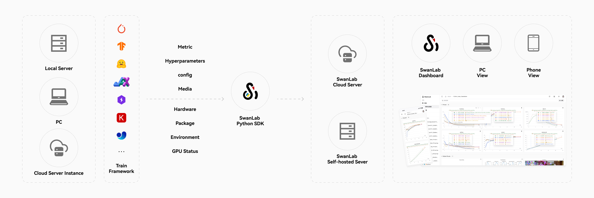

<div align="center">

<picture>
  <source media="(prefers-color-scheme: dark)" srcset="readme_files/swanlab-logo-type2-dark.svg">
  <source media="(prefers-color-scheme: light)" srcset="readme_files/swanlab-logo-type2-light.svg">
  
</picture>

Профессиональная платформа для анализа обучения искусственного интеллекта  
Глубокий анализ миллионов показателей, ускоренная итерация экспериментов, интеграция с 50+ ведущими фреймворками для обучения искусственного интеллекта

<a href="https://swanlab.cn">🔥SwanLab Online</a> · <a href="https://docs.swanlab.cn">📃 Документация</a> · <a href="https://github.com/swanhubx/swanlab/issues">Сообщить о проблеме</a> · <a href="https://geektechstudio.feishu.cn/share/base/form/shrcnyBlK8OMD0eweoFcc2SvWKc">Оставить отзыв</a> · <a href="https://docs.swanlab.cn/en/guide_cloud/general/changelog.html">История изменений</a>

[![][release-shield]][release-link]
[![][dockerhub-shield]][dockerhub-link]
[![][github-stars-shield]][github-stars-link]
[![][github-issues-shield]][github-issues-shield-link]
[![][github-contributors-shield]][github-contributors-link]
[![][license-shield]][license-shield-link]  
[![][tracking-swanlab-shield]][tracking-swanlab-shield-link]
[![][last-commit-shield]][last-commit-shield-link]
[![][pypi-version-shield]][pypi-version-shield-link]
[![][wechat-shield]][wechat-shield-link]
[![][pypi-downloads-shield]][pypi-downloads-shield-link]
[![][colab-shield]][colab-shield-link]


[中文](README.md) / [English](README_EN.md) / [日本語](README_JP.md) / Русский

👋 Присоединяйтесь к нашей [группе в WeChat](https://docs.swanlab.cn/en/guide_cloud/community/online-support.html)

</div>

## Содержание

- [🌟 Последние обновления](#-последние-обновления)
- [👋🏻 Что такое SwanLab](#-что-такое-swanlab)
- [📃 Онлайн-демонстрация](#-онлайн-демонстрация)
- [🏁 Быстрый старт](#-быстрый-старт)
- [💻 Самостоятельное размещение](#-самостоятельное-размещение)
- [🚗 Интеграция с фреймворками](#-интеграция-с-фреймворками)
- [🔌 Плагины](#-Плагины)
- [🆚 Сравнение с известными инструментами](#-сравнение-с-известными-инструментами)
- [👥 Сообщество](#-сообщество)
- [📃 Лицензия](#-лицензия)

<br/>

## 🌟 Последние обновления

- 2026.03/25: 📊 **Закрепление экспериментов** теперь доступно — закрепите лучшие эксперименты в самом удобном месте одним кликом; функция сравнения с **Baseline** теперь доступна, поддержка сравнения экспериментов с baseline с отображением процентного отклонения, ускоряя поиск оптимальных параметров;

https://github.com/user-attachments/assets/28d7bad4-7164-4407-ae72-8554f43412aa

- 2026.03.19: 📊 Добавлена функция **дублирования экспериментов**, поддержка создания копий экспериментов в разных проектах и командах; **parallel** режим теперь доступен, поддержка одновременного записи показателей в разных процессах; ID эксперимента теперь можно настраивать;

- 2026.02.06: 🔥**swanlab.Api** теперь доступен, предоставляя более мощный, объектно-ориентированный открытый API интерфейс, [документация](https://docs.swanlab.cn/api/py-api.html); ECharts.Table поддерживает CSV-загрузку; теперь поддерживается однократное размещение графиков на вершине групп;

- 2026.01.28: ⚡️ **LightningBoard V2** теперь доступен, значительно повышает производительность панели управления;

- 2026.01.16: ⚡️ **LightningBoard (Lightning Dashboard) V1** теперь доступен, предназначен для сценариев с очень большим количеством графиков; добавлена ссылка на встраивание графиков, теперь вы можете встраивать свои графики в онлайн-документы (например, Notion, Lark и т.д.);

- 2026.01.02: 🥳 Добавлена поддержка **AMD ROCm** и **Iluvatar GPU** мониторинга оборудования; SDK добавлена функция отправки сердцебиений, обеспечивающая более стабильное подключение к облаку/оффлайн;

- 2025.12.15: 🎉 SwanLab **Kubernetes版** теперь доступен! [🔗 Документация](https://docs.swanlab.cn/en/guide_cloud/self_host/kubernetes-deploy.html); [NVIDIA NeMo RL](https://github.com/NVIDIA-NeMo/RL) фреймворк теперь интегрирован с SwanLab, [документация](https://docs.swanlab.cn/en/guide_cloud/integration/integration-nvidia-nemo-rl.html);

- 2025.12.01: 🕰 Добавлено **подробное отображение информации линейного графика**, при наведении курсора на линейный график нажатие Shift включает подробный режим, позволяющий отображать время точки лога; 📊 Группировка графиков поддерживает **отображение диапазона областей MIN/MAX**;

- 2025.11.17: 📊 Добавлена поддержка выбора источника данных для оси X в глобальной настройке графиков и поддержка режима наведения, что повышает опыт анализа графиков; добавлена функция `SWANLAB_WEBHOOK`, [документация](https://docs.swanlab.cn/guide_cloud/experiment_track/webhook-setup.html)

<details><summary>Полный список изменений</summary>

- 2025.11.06: 🔪 **Группировка экспериментов** теперь доступна — поддержка управления группами для больших партий экспериментов; страница рабочего пространства обновлена, позволяя быстро переключаться между несколькими организациями; значительно улучшена производительность рендеринга линейных графиков; `swanlab.init` теперь поддерживает параметры `group` и `job_type`;

- 2025.10.15: 📊 Добавлена поддержка выбора источника данных для оси X в настройке линейных графиков; в боковой панели теперь отображаются закрепленные столбцы в табличном представлении, что повышает согласованность данных экспериментов;

- 2025.09.22: 📊 Новый UI запущен; табличное представление теперь поддерживает глобальную сортировку и фильтрацию; данные на уровне табличного представления и графического представления объединены.

- 2025.09.12: 🔢 Добавлена поддержка создания **скалярных графиков**, позволяющая гибко отображать статистические значения показателей экспериментов; страница управления организациями была обновлена, предоставляя более мощные возможности управления правами и управление проектами;

- 2025.08.19: 🤔 Более мощная производительность рендеринга графиков и низкая инвазия загрузки анимации, позволяет исследователям сосредоточиться на анализе экспериментов; интеграция отличных фреймворков [MLX-LM](https://github.com/ml-explore/mlx-lm) и [SpecForge](https://github.com/sgl-project/SpecForge), предоставляющих больше сценариев обучения;

- 2025.08.06: 👥 **Совместное обучение** теперь доступно, поддержка приглашения участников проекта, совместного просмотра проекта и QR-кода; поддержка спискового представления проекта;

- 2025.07.29: 🚀 Добавлена поддержка фильтрации и сортировки экспериментов в боковой панели; 📊 Добавлена панель управления столбцами в табличном представлении, позволяющая легко скрывать и отображать столбцы; 🔐 Добавлена поддержка управления несколькими API Key, что делает ваши данные более безопасными; swanlab sync теперь поддерживает файлы журналов сбоев обучения; PR кривая, ROC кривая, матрица путаницы теперь доступны, [документация](https://docs.swanlab.cn/api/py-pr_curve.html);

- 2025.07.17: 📊 Добавлена поддержка **настройки линейных графиков**, поддержка гибкой настройки типа линии, цвета, толщины, сетки, позиции легенды и т.д.; 📹 Добавлена поддержка типа данных **swanlab.Video**, поддержка записи и визуализации файлов в формате GIF; глобальная панель диаграмм теперь поддерживает настройку оси Y и максимальное количество отображаемых экспериментов;

- 2025.07.10: 📚 Добавлена поддержка **текстового представления**, поддержка Markdown-рендеринга и переключения направления клавиатуры, которые можно создать с помощью `swanlab.echarts.table` и `swanlab.Text`, [демонстрация](https://swanlab.cn/@ZeyiLin/ms-swift-rlhf/runs/d661ty9mslogsgk41fp0p/chart)

- 2025.07.06: 🚄 Поддержка возобновления обучения; новый плагин [Файловый логгер](https://docs.swanlab.cn/en/plugin/writer-filelogdir.html); интеграция [ray](https://github.com/ray-project/ray) фреймворка, [документация](https://docs.swanlab.cn/guide_cloud/integration/integration-ray.html); интеграция [ROLL](https://github.com/volcengine/ROLL) фреймворка, спасибо [@PanAndy](https://github.com/PanAndy), [документация](https://docs.swanlab.cn/guide_cloud/integration/integration-roll.html)

- 2025.06.27: Добавлена поддержка **малого масштабирования** для линейных графиков; добавлена поддержка **плавного масштабирования** для отдельных линейных графиков; значительно улучшена интерактивность изображений после масштабирования.

- 2025.06.20: 🤗 Интегрирована платформа [accelerate](https://github.com/huggingface/accelerate), [PR](https://github.com/huggingface/accelerate/pull/3605), [документация](https://docs.swanlab.cn/guide_cloud/integration/integration-huggingface-accelerate.html), улучшает опыт записи и анализа экспериментов в распределенном обучении.

- 2025.06.18: 🐜 Интегрирована платформа [AREAL](https://github.com/inclusionAI/AReaL), спасибо [@xichengpro](https://github.com/xichengpro), [PR](https://github.com/inclusionAI/AReaL/pull/98), [документация](https://inclusionai.github.io/AReaL/tutorial/quickstart.html#monitoring-the-training-process); 🖱 Добавлена подсветка соответствующих кривых при наведении мыши на эксперименты в боковой панели; Поддержка сравнения линейных графиков между группами; Возможность настройки правил обрезки названий экспериментов;

- 2025.06.11: 📊 Добавлена поддержка типа данных **swanlab.echarts.table**, позволяющая отображать чистые текстовые диаграммы; добавлена поддержка **растягивающего взаимодействия** для групп, позволяющая отображать больше диаграмм одновременно; добавлены опции **максимального/минимального значения** для табличных представлений;

- 2025.06.08: ♻️ Поддержка локального сохранения полных файлов журналов экспериментов и их синхронизации с облаком/частным размещением через **swanlab sync**; Мониторинг оборудования поддерживает **Hygon DCU**.

- 2025.06.01: 🏸 Поддержка свободного перетаскивания диаграмм; Поддержка настройки диаграмм ECharts с добавлением 20+ типов, включая столбчатые, круговые и гистограммы; Мониторинг оборудования поддерживает GPU 沐曦; Интеграция фреймворка PaddleNLP.

- 2025.05.25: Поддержка записи **стандартного потока ошибок**, позволяет лучше записывать вывод из фреймворков, таких как PyTorch Lightning; мониторинг оборудования поддерживает **Moore Threads**; добавлена функция защиты записи команд запуска, где API Key будет автоматически скрыт.

- 2025.05.14: Добавлена поддержка **экспериментов с тегами**; поддерживается **Log Scale** для линейных графиков; поддерживается **перетаскивание** для групп; значительно улучшена производительность загрузки и отображения больших объемов данных.

- 2025.05.09: Добавлена поддержка создания линейных графиков; в функции настройки графиков добавлена возможность выбора источника данных, что позволяет отображать разные показатели на одном графике; реализована возможность создания GitHub-значков для учебных проектов.

- 2025.04.23: Добавлена поддержка ​​редактирования​​ линейных графиков, возможность свободной настройки диапазонов данных осей X и Y и стилей заголовков; поиск в графиках теперь поддерживает ​​регулярные выражения​​; добавлено обнаружение и мониторинг оборудования ​​Kunlun Core XPU​​.

- 2025.04.14: Добавлена поддержка **Kunlunxin XPU** для мониторинга оборудования, [#940](https://github.com/SwanHubX/SwanLab/pull/940).

- 2025.04.11: Добавлена поддержка **локального выбора** для графика; поддерживается глобальный шаг для текущего графика.

- 2025.04.08: Добавлена поддержка типа данных **swanlab.Molecule**, позволяющая записывать и визуализировать биохимические молекулярные данные; поддерживается сохранение состояния сортировки, фильтрации и порядка столбцов в табличных представлениях.

- 2025.04.07: Мы завершили совместную интеграцию с [EvalScope](https://github.com/ModelScope/EvalScope). Теперь вы можете использовать **SwanLab** в EvalScope для **оценки производительности больших моделей**.

- 2025.03.30: Добавлена поддержка метода **swanlab.Settings**, обеспечивающего более точный контроль над поведением экспериментов; добавлена поддержка мониторинга оборудования **Cambricon MLU**; интегрированы уведомления через [Slack](https://docs.swanlab.cn/plugin/notification-slack.html) и [Discord](https://docs.swanlab.cn/plugin/notification-discord.html).

- 2025.03.21: 🎉🤗 HuggingFace Transformers официально интегрировал SwanLab (версия >=4.50.0), [#36433](https://github.com/huggingface/transformers/pull/36433). Добавлена поддержка графиков Object3D, теперь вы можете отслеживать и визуализировать 3D облака точек, [docs](https://docs.swanlab.cn/en/api/py-object3d.html). Мониторинг оборудования поддерживает запись памяти GPU (МБ), использования диска, а также отправленных и полученных данных сети.

- 2025.03.12: 🎉🎉 SwanLab**самостоятельное размещение** теперь доступно! [🔗 Документация](https://docs.swanlab.cn/en/guide_cloud/self_host/docker-deploy.html); SwanLab теперь поддерживает расширение плагинов, таких как [Email Notification](https://docs.swanlab.cn/en/plugin/notification-email.html) и [Lark Notification](https://docs.swanlab.cn/en/plugin/notification-lark.html).

- 2025.03.09: Добавлена интеграция с [MLFlow](https://docs.swanlab.cn/en/guide_cloud/integration/integration-mlflow.html), теперь вы можете использовать SwanLab для **отслеживания и визуализации экспериментов MLFlow**.

- 2025.03.06: Мы объединили усилия с [DiffSynth Studio](https://github.com/modelscope/diffsynth-studio), теперь вы можете использовать SwanLab в DiffSynth Studio для **отслеживания и визуализации экспериментов по тонкой настройке больших моделей** [инструкция по использованию](https://docs.swanlab.cn/en/guide_cloud/integration/integration-diffsynth-studio.html).

- 2025.03.04: Добавлена интеграция с [MLFlow](https://docs.swanlab.cn/en/guide_cloud/integration/integration-mlflow.html), теперь вы можете использовать SwanLab для **отслеживания и визуализации экспериментов MLFlow**.

- 2025.03.01: Добавлена функция **перемещения экспериментов**, теперь вы можете перемещать эксперименты между организациями и проектами.

- 2025.02.24: Мы объединили усилия с [EasyR1](https://github.com/hiyouga/EasyR1), теперь вы можете использовать SwanLab в EasyR1 для **отслеживания и визуализации экспериментов по тонкой настройке больших моделей** [инструкция по использованию](https://github.com/hiyouga/EasyR1?tab=readme-ov-file#merge-checkpoint-in-hugging-face-format).

- 2025.02.18: Мы объединили усилия с [Swift](https://github.com/modelscope/ms-swift), теперь вы можете использовать SwanLab в Swift's CLI/WebUI для **отслеживания и визуализации экспериментов по тонкой настройке больших моделей** [инструкция по использованию](https://docs.swanlab.cn/en/guide_cloud/integration/integration-swift.html).

- 2025.02.16: Добавлены функции перемещения групп и создания групп.

- 2025.02.09: Мы объединили усилия с [veRL](https://github.com/volcengine/verl), теперь вы можете использовать SwanLab в veRL для **отслеживания и визуализации экспериментов по тонкой настройке больших моделей** в LLaMA Factory, [инструкция по использованию](https://docs.swanlab.cn/en/guide_cloud/integration/integration-verl.html).

- 2025.02.05: `swanlab.log` поддерживает вложенные словари [#812](https://github.com/SwanHubX/SwanLab/pull/812), поддерживает параметры `name` и `notes`.

- 2025.01.22: Добавлена функция `sync_tensorboardX` и `sync_tensorboard_torch`, поддерживающая синхронизацию с этими двумя TensorBoard фреймворками.

- 2025.01.17: Добавлена функция `sync_wandb`, [документация](https://docs.swanlab.cn/en/guide_cloud/integration/integration-wandb.html), поддерживающая синхронизацию с отслеживанием экспериментов Weights & Biases; значительно улучшена производительность рендеринга логов.

- 2025.01.11: Облачная версия значительно оптимизировала производительность таблиц проектов и добавила поддержку таких функций, как перетаскивание, сортировка и фильтрация.

- 2025.01.01: Добавлено **сглаживание графиков** и возможность изменения размера графиков перетаскиванием, улучшено взаимодействие с графиками.

- 2024.12.22: Интеграция с [LLaMA Factory](https://github.com/hiyouga/LLaMA-Factory), теперь можно использовать SwanLab для **отслеживания и визуализации экспериментов по тонкой настройке больших моделей** в LLaMA Factory, [инструкция по использованию](https://github.com/hiyouga/LLaMA-Factory?tab=readme-ov-file#use-swanlab-logger).

- 2024.12.15: Добавлена функция **мониторинга оборудования (0.4.0)**, поддерживается запись и мониторинг системной информации для CPU, NPU (Ascend), GPU (Nvidia).

- 2024.12.06: Добавлена интеграция с [LightGBM](https://docs.swanlab.cn/en/guide_cloud/integration/integration-lightgbm.html) и [XGBoost](https://docs.swanlab.cn/en/guide_cloud/integration/integration-xgboost.html); увеличено ограничение на длину строки в логах.

- 2024.11.26: Вкладка "Окружение" — раздел "Оборудование" теперь поддерживает распознавание **Huawei Ascend NPU** и **Kunpeng CPU**; раздел "Облачные провайдеры" поддерживает распознавание **QingCloud**.

</details>

<br>

## 👋🏻 Что такое SwanLab

SwanLab — это открытый и легковесный инструмент для отслеживания и визуализации обучения моделей искусственного интеллекта, предоставляющий платформу для отслеживания, записи, сравнения и совместной работы над экспериментами.

https://github.com/user-attachments/assets/7965fec4-c8b0-4956-803d-dbf177b44f54

SwanLab ориентирован на исследователей в области ИИ, предлагая удобный Python API и красивый интерфейс, а также функции **визуализации обучения, автоматической записи логов, записи гиперпараметров, сравнения экспериментов и совместной работы**. С помощью SwanLab исследователи могут обнаруживать проблемы в обучении на основе наглядных графиков, сравнивать несколько экспериментов для поиска идей и делиться результатами через **онлайн-страницы** и **совместное обучение в организациях**, что упрощает коммуникацию в команде и повышает эффективность обучения.

Основные функции:

**1. 📊 Отслеживание метрик и гиперпараметров**: Минималистичный код для встраивания в ваш ML pipeline, отслеживание ключевых метрик обучения.

- Поддержка **облачного** использования (аналогично Weights & Biases), возможность просмотра прогресса обучения в любое время. [Как смотреть эксперименты на телефоне](https://docs.swanlab.cn/en/guide_cloud/general/app.html)
- Поддержка **записи гиперпараметров** и их отображения в таблицах.
- **Поддерживаемые типы данных**: скалярные метрики, изображения, аудио, текст, 3D точки, биохимические молекулы...
- **Поддерживаемые типы графиков**: линейные графики, медиа-графики (изображения, аудио, текст, 3D точки, биохимические молекулы), ...
- **Автоматическая запись логов**: логирование, информация об оборудовании, Git-репозитории, окружение Python, список библиотек Python, рабочая директория проекта.



**2. ⚡️ Полная интеграция с фреймворками**: PyTorch, 🤗HuggingFace Transformers, PyTorch Lightning, 🦙LLaMA Factory, MMDetection, Ultralytics, PaddleDetetion, LightGBM, XGBoost, Keras, Tensorboard, Weights&Biases, OpenAI, Swift, XTuner, Stable Baseline3, Hydra и более **30+** фреймворков.


**3. 💻 Мониторинг оборудования**: Поддержка записи и мониторинга системных показателей CPU, NPU (Ascend), GPU (Nvidia), MLU (Cambricon), памяти.

**4. 📦 Управление экспериментами**: Централизованная панель управления, разработанная для сценариев обучения, позволяет быстро просматривать и управлять несколькими проектами и экспериментами.

**5. 🆚 Сравнение результатов**: Сравнение гиперпараметров и результатов разных экспериментов через онлайн-таблицы и графики, поиск идей для улучшения.

**6. 👥 Онлайн-сотрудничество**: Возможность совместного обучения с командой, синхронизация экспериментов в реальном времени в одном проекте, просмотр записей обучения команды и обсуждение результатов.

**7. ✉️ Поделиться результатами**: Копирование и отправка постоянных URL для обмена каждым экспериментом, удобная отправка партнерам или встраивание в онлайн-заметки.

**8. 💻 Поддержка самостоятельного размещения**: Поддержка оффлайн использования, локальная версия также позволяет просматривать панель управления и управлять экспериментами.

**9. 🔌 Плагины**: Поддержка расширения сценариев использования SwanLab с помощью плагинов, например [Lark Notification](https://docs.swanlab.cn/plugin/notification-lark.html), [Slack Notification](https://docs.swanlab.cn/plugin/notification-slack.html), [CSV Logger](https://docs.swanlab.cn/plugin/writer-csv.html) и т.д.

> \[!IMPORTANT]
>
> **Добавьте проект в избранное**, чтобы получать уведомления о всех новых выпусках без задержек ～ ⭐️


<br>

## 📃 Онлайн-демонстрация

Ознакомьтесь с онлайн-демонстрацией SwanLab:

|                         [Классификация кошек и собак с ResNet50][demo-cats-dogs]                          |                                       [Обнаружение объектов с Yolov8-COCO128][demo-yolo]                                       |
| :-------------------------------------------------------------------------------------------------------: | :----------------------------------------------------------------------------------------------------------------------------: |
|                                [![][demo-cats-dogs-image]][demo-cats-dogs]                                |                                               [![][demo-yolo-image]][demo-yolo]                                                |
| Отслеживание простой модели ResNet50 для задачи классификации изображений на наборе данных кошек и собак. | Использование Yolov8 для задачи обнаружения объектов на наборе данных COCO128, отслеживание гиперпараметров и метрик обучения. |

|                            [Тонкая настройка Qwen2][demo-qwen2-sft]                            |                        [Прогнозирование акций Google с LSTM][demo-google-stock]                        |
| :--------------------------------------------------------------------------------------------: | :----------------------------------------------------------------------------------------------------: |
|                          [![][demo-qwen2-sft-image]][demo-qwen2-sft]                           |                           [![][demo-google-stock-image]][demo-google-stock]                            |
| Отслеживание тонкой настройки большой языковой модели Qwen2 для выполнения простых инструкций. | Использование простой модели LSTM для прогнозирования будущих цен акций Google на наборе данных акций. |

|            [Классификация аудио с ResNeXt101][demo-audio-classification]            |                 [Тонкая настройка Qwen2-VL на наборе данных COCO][demo-qwen2-vl]                  |
| :---------------------------------------------------------------------------------: | :-----------------------------------------------------------------------------------------------: |
|          [![][demo-audio-classification-image]][demo-audio-classification]          |                             [![][demo-qwen2-vl-image]][demo-qwen2-vl]                             |
| Постепенный процесс экспериментов от ResNet к ResNeXt в задаче классификации аудио. | Тонкая настройка мультимодальной модели Qwen2-VL на наборе данных COCO2014 с использованием Lora. |

|   [EasyR1 multimodal LLM RL Training][demo-easyr1-rl]    |                   [Qwen2.5-0.5B GRPO Training][demo-qwen2-grpo]                    |
| :------------------------------------------------------: | :--------------------------------------------------------------------------------: |
|       [![][demo-easyr1-rl-image]][demo-easyr1-rl]        |                   [![][demo-qwen2-grpo-image]][demo-qwen2-grpo]                    |
| Использование EasyR1 для многомодального RL обучения LLM | Тонкая настройка Qwen2.5-0.5B модели на наборе данных GSM8k с использованием GRPO. |

[Больше примеров](https://docs.swanlab.cn/en/examples/mnist.html)

<br>

## 🏁 Быстрый старт

### 1. Установка

```bash
pip install swanlab
```

<details><summary>Установка из исходного кода</summary>

Если вы хотите испытать новейшие функции, вы можете установить программу из исходного кода.

```bash
# Method 1
git clone https://github.com/SwanHubX/SwanLab.git
pip install -e .

# Method 2
pip install git+https://github.com/SwanHubX/SwanLab.git
```

</details>

<details><summary>Установка расширения панели управления</summary>

[Документация по расширению панели управления](https://docs.swanlab.cn/en/guide_cloud/self_host/offline-board.html)

```bash
pip install 'swanlab[dashboard]'
```

</details>

### 2. Вход и получение API Key

1. Бесплатная [регистрация аккаунта](https://swanlab.cn)

2. Войдите в аккаунт, скопируйте ваш API Key в разделе пользовательских настроек > [API Key](https://swanlab.cn/settings)

3. Откройте терминал и введите:

```bash
swanlab login
```

При появлении запроса введите ваш API Key, нажмите Enter, чтобы завершить вход.

### 3. Интеграция SwanLab с вашим кодом

```python
import swanlab

# Инициализация нового эксперимента SwanLab
swanlab.init(
    project="my-first-ml",
    config={'learning-rate': 0.003},
)

# Запись метрик
for i in range(10):
    swanlab.log({"loss": i, "acc": i})
```

Готово! Перейдите на [SwanLab](https://swanlab.cn), чтобы увидеть ваш первый эксперимент.

<br>

## 💻 Самостоятельное размещение

Самостоятельная версия для сообщества поддерживает офлайн-просмотр панели управления SwanLab.


Подробные инструкции по развертыванию:

- [🔗 Kubernetes развертывание документация](https://docs.swanlab.cn/en/guide_cloud/self_host/kubernetes-deploy.html)
- [🔗 Docker развертывание документация](https://docs.swanlab.cn/en/guide_cloud/self_host/docker-deploy.html)
- [🔗 Документация по миграции с Docker на Kubernetes](https://docs.swanlab.cn/en/guide_cloud/self_host/migration-docker-kubernetes.html)

<br>

## 🚗 Интеграция с фреймворками

Используйте ваш любимый фреймворк вместе с SwanLab!  
Ниже приведен список уже интегрированных фреймворков. Если вы хотите предложить интеграцию с другим фреймворком, создайте [Issue](https://github.com/swanhubx/swanlab/issues).

**Основные фреймворки**
- [PyTorch](https://docs.swanlab.cn/en/guide_cloud/integration/integration-pytorch.html)
- [MindSpore](https://docs.swanlab.cn/en/guide_cloud/integration/integration-ascend.html)
- [Keras](https://docs.swanlab.cn/en/guide_cloud/integration/integration-keras.html)

**Фреймворки для обучения LLM**
- [HuggingFace Transformers](https://docs.swanlab.cn/en/guide_cloud/integration/integration-huggingface-transformers.html)
- [LLaMA Factory](https://docs.swanlab.cn/en/guide_cloud/integration/integration-llama-factory.html)
- [MS-Swift](https://docs.swanlab.cn/en/guide_cloud/integration/integration-swift.html)
- [Unsloth](https://docs.swanlab.cn/en/guide_cloud/integration/integration-unsloth.html)
- [MLX-LM](https://docs.swanlab.cn/en/guide_cloud/integration/integration-mlx-lm.html)
- [Torchtune](https://docs.swanlab.cn/en/guide_cloud/integration/integration-pytorch-torchtune.html)
- [Sentence Transformers](https://docs.swanlab.cn/en/guide_cloud/integration/integration-sentence-transformers.html)
- [XTuner](https://docs.swanlab.cn/en/guide_cloud/integration/integration-xtuner.html)
- [OpenMind](https://modelers.cn/docs/en/openmind-library/1.0.0/basic_tutorial/finetune/finetune_pt.html#install-swanlab)

**Фреймворки для обучения с подкреплением LLM**
- [veRL](https://docs.swanlab.cn/en/guide_cloud/integration/integration-verl.html)
- [HuggingFace trl](https://docs.swanlab.cn/en/guide_cloud/integration/integration-huggingface-trl.html)
- [NVIDIA-NeMo RL](https://docs.swanlab.cn/en/guide_cloud/integration/integration-nvidia-nemo-rl.html)
- [EasyR1](https://docs.swanlab.cn/en/guide_cloud/integration/integration-easyr1.html)
- [AReaL](https://docs.swanlab.cn/en/guide_cloud/integration/integration-areal.html)
- [ROLL](https://docs.swanlab.cn/en/guide_cloud/integration/integration-roll.html)

**Робототехнические фреймворки**
- [RLinf](https://docs.swanlab.cn/en/guide_cloud/integration/integration-rlinf.html)

**Фреймворки для текста в изображение/видео**
- [DiffSynth Studio](https://docs.swanlab.cn/en/guide_cloud/integration/integration-diffsynth-studio.html)

**Фреймворки глубокого обучения**
- [PyTorch Lightning](https://docs.swanlab.cn/en/guide_cloud/integration/integration-pytorch-lightning.html)
- [MMEngine](https://docs.swanlab.cn/en/guide_cloud/integration/integration-mmengine.html)
- [FastAI](https://docs.swanlab.cn/en/guide_cloud/integration/integration-fastai.html)

**Фреймворки компьютерного зрения**
- [Ultralytics](https://docs.swanlab.cn/en/guide_cloud/integration/integration-ultralytics.html)
- [MMDetection](https://docs.swanlab.cn/en/guide_cloud/integration/integration-mmdetection.html)
- [MMSegmentation](https://docs.swanlab.cn/en/guide_cloud/integration/integration-mmsegmentation.html)
- [PaddleDetection](https://docs.swanlab.cn/en/guide_cloud/integration/integration-paddledetection.html)
- [PaddleYOLO](https://docs.swanlab.cn/en/guide_cloud/integration/integration-paddleyolo.html)
- [PaddleNLP](https://docs.swanlab.cn/en/guide_cloud/integration/integration-paddlenlp.html)

**Фреймворки машинного обучения**
- [LightGBM](https://docs.swanlab.cn/en/guide_cloud/integration/integration-lightgbm.html)
- [XGBoost](https://docs.swanlab.cn/en/guide_cloud/integration/integration-xgboost.html)
- [CatBoost](https://docs.swanlab.cn/en/guide_cloud/integration/integration-catboost.html)

**Оценочные фреймворки**
- [EvalScope](https://docs.swanlab.cn/en/guide_cloud/integration/integration-evalscope.html)

**Традиционные фреймворки обучения с подкреплением**
- [Stable Baseline3](https://docs.swanlab.cn/en/guide_cloud/integration/integration-sb3.html)

**Другие фреймворки:**
- [Tensorboard](https://docs.swanlab.cn/en/guide_cloud/integration/integration-tensorboard.html)
- [Weights&Biases](https://docs.swanlab.cn/en/guide_cloud/integration/integration-wandb.html)
- [MLFlow](https://docs.swanlab.cn/en/guide_cloud/integration/integration-mlflow.html)
- [HuggingFace Accelerate](https://docs.swanlab.cn/en/guide_cloud/integration/integration-huggingface-accelerate.html)
- [Ray](https://docs.swanlab.cn/en/guide_cloud/integration/integration-ray.html)
- [Hydra](https://docs.swanlab.cn/en/guide_cloud/integration/integration-hydra.html)
- [Omegaconf](https://docs.swanlab.cn/en/guide_cloud/integration/integration-omegaconf.html)
- [OpenAI](https://docs.swanlab.cn/en/guide_cloud/integration/integration-openai.html)
- [ZhipuAI](https://docs.swanlab.cn/en/guide_cloud/integration/integration-zhipuai.html)
- [SpecForge](https://docs.swanlab.cn/en/guide_cloud/integration/integration-specforge.html)

[Больше интеграций](https://docs.swanlab.cn/en/guide_cloud/integration/)

<br>

## 🆚 Сравнение с известными инструментами

### Tensorboard vs SwanLab

- **☁️ Поддержка онлайн-использования**:
  SwanLab позволяет легко синхронизировать и сохранять эксперименты в облаке, что удобно для удаленного просмотра прогресса обучения, управления историей проектов, обмена ссылками на эксперименты, отправки уведомлений и просмотра экспериментов на разных устройствах. Tensorboard — это оффлайн инструмент для отслеживания экспериментов.

- **👥 Совместная работа**:
  При совместной работе над проектами машинного обучения SwanLab упрощает управление проектами, обмен ссылками на эксперименты и обсуждение результатов. Tensorboard в основном предназначен для индивидуального использования и не поддерживает совместную работу.

- **💻 Постоянная и централизованная панель управления**:
  Независимо от того, где вы обучаете модель — на локальном компьютере, в лабораторном кластере или на облачном GPU, результаты будут записываться в одну централизованную панель управления. Tensorboard требует ручного копирования и управления файлами TFEvent с разных машин.

- **💪 Более мощные таблицы**:
  SwanLab позволяет просматривать, искать и фильтровать результаты из разных экспериментов, что упрощает поиск лучшей модели для различных задач. Tensorboard не подходит для крупных проектов.

### Weights and Biases vs SwanLab

- Weights and Biases — это закрытая MLOps платформа, требующая подключения к интернету.

- SwanLab поддерживает как онлайн, так и оффлайн использование, а также предоставляет открытую и бесплатную версию для самостоятельного размещения.

<br>

## 🔌 Плагины

Расширьте функциональность SwanLab и улучшите управление экспериментами с помощью плагинов!

- [Настройте свой плагин](https://docs.swanlab.cn/en/plugin/custom-plugin.html)
- [Уведомления по электронной почте](https://docs.swanlab.cn/en/plugin/notification-email.html)
- [Уведомления в Lark](https://docs.swanlab.cn/en/plugin/notification-lark.html)
- [Уведомления в DingTalk](https://docs.swanlab.cn/en/plugin/notification-dingtalk.html)
- [Уведомления в WXWork](https://docs.swanlab.cn/en/plugin/notification-wxwork.html)
- [Уведомления в Discord](https://docs.swanlab.cn/en/plugin/notification-discord.html)
- [Уведомления в Slack](https://docs.swanlab.cn/en/plugin/notification-slack.html)
- [Уведомления в Bark](https://docs.swanlab.cn/plugin/notification-bark.html)
- [CSV-логгер](https://docs.swanlab.cn/en/plugin/writer-csv.html)
- [Файловый логгер](https://docs.swanlab.cn/en/plugin/writer-filelogdir.html)

<br>

## 👥 Сообщество

### Периферийные репозитории

- [self-hosted](https://github.com/swanhubx/self-hosted): Репозиторий скриптов для частного развертывания.
- [SwanLab-Docs](https://github.com/swanhubx/swanlab-docs): Официальный репозиторий документации.
- [SwanLab-Dashboard](https://github.com/swanhubx/swanlab-dashboard): Репозиторий оффлайн-дашборда, содержащий веб-код для легковесного оффлайн-дашборда, открываемого командой `swanlab watch`.

### Сообщество и поддержка

- [GitHub Issues](https://github.com/SwanHubX/SwanLab/issues): Ошибки и проблемы при использовании SwanLab.
- [Электронная почта](zeyi.lin@swanhub.co): Отправка отзывов и вопросов по использованию SwanLab.
- <a href="https://docs.swanlab.cn/en/guide_cloud/community/online-support.html">Группа в WeChat</a>: Обсуждение вопросов по использованию SwanLab, обмен новыми технологиями в области ИИ.

### Значок SwanLab для README

Если вам нравится использовать SwanLab в вашей работе, добавьте значок SwanLab в ваш README:

[![][tracking-swanlab-shield]][tracking-swanlab-shield-link]、[![][visualize-swanlab-shield]][visualize-swanlab-shield-link]

```
[](your experiment url)
[](your experiment url)
```

Больше дизайнерских материалов：[assets](https://github.com/SwanHubX/assets)

### Цитирование SwanLab в научных работах

Если SwanLab помог вам в ваших исследованиях, рассмотрите возможность цитирования в следующем формате:

```bibtex
@software{Zeyilin_SwanLab_2023,
  author = {Zeyi Lin, Shaohong Chen, Kang Li, Qiushan Jiang, Zirui Cai,  Kaifang Ji and {The SwanLab team}},
  doi = {10.5281/zenodo.11100550},
  license = {Apache-2.0},
  title = {{SwanLab}},
  url = {https://github.com/swanhubx/swanlab},
  year = {2023}
}
```

### Вклад в развитие SwanLab

Хотите внести вклад в SwanLab? Сначала ознакомьтесь с [руководством по вкладу](CONTRIBUTING.md).

Мы также приветствуем поддержку через социальные сети, мероприятия и конференции. Спасибо!

<br>

**Участники**

<a href="https://github.com/swanhubx/swanlab/graphs/contributors">
  
</a>

<br>


## 📃 Лицензия

Этот репозиторий распространяется под лицензией [Apache 2.0 License](https://github.com/SwanHubX/SwanLab/blob/main/LICENSE).

## История звезд

[](https://star-history.com/#swanhubx/swanlab&Date)

<!-- ссылки -->

[release-shield]: https://img.shields.io/github/v/release/swanhubx/swanlab?color=369eff&labelColor=black&logo=github&style=flat-square
[release-link]: https://github.com/swanhubx/swanlab/releases
[license-shield]: https://img.shields.io/badge/license-apache%202.0-white?labelColor=black&style=flat-square
[license-shield-link]: https://github.com/SwanHubX/SwanLab/blob/main/LICENSE
[last-commit-shield]: https://img.shields.io/github/last-commit/swanhubx/swanlab?color=c4f042&labelColor=black&style=flat-square
[last-commit-shield-link]: https://github.com/swanhubx/swanlab/commits/main
[pypi-version-shield]: https://img.shields.io/pypi/v/swanlab?color=orange&labelColor=black&style=flat-square
[pypi-version-shield-link]: https://pypi.org/project/swanlab/
[pypi-downloads-shield]: https://static.pepy.tech/badge/swanlab?labelColor=black&style=flat-square
[pypi-downloads-shield-link]: https://pepy.tech/project/swanlab
[swanlab-cloud-shield]: https://img.shields.io/badge/Product-SwanLab云端版-636a3f?labelColor=black&style=flat-square
[swanlab-cloud-shield-link]: https://swanlab.cn/
[wechat-shield]: https://img.shields.io/badge/WeChat-微信-4cb55e?labelColor=black&style=flat-square
[wechat-shield-link]: https://docs.swanlab.cn/en/guide_cloud/community/online-support.html
[colab-shield]: https://colab.research.google.com/assets/colab-badge.svg
[colab-shield-link]: https://colab.research.google.com/drive/1RWsrY_1bS8ECzaHvYtLb_1eBkkdzekR3?usp=sharing
[github-stars-shield]: https://img.shields.io/github/stars/swanhubx/swanlab?labelColor&style=flat-square&color=ffcb47
[github-stars-link]: https://github.com/swanhubx/swanlab
[github-issues-shield]: https://img.shields.io/github/issues/swanhubx/swanlab?labelColor=black&style=flat-square&color=ff80eb
[github-issues-shield-link]: https://github.com/swanhubx/swanlab/issues
[github-contributors-shield]: https://img.shields.io/github/contributors/swanhubx/swanlab?color=c4f042&labelColor=black&style=flat-square
[github-contributors-link]: https://github.com/swanhubx/swanlab/graphs/contributors
[demo-cats-dogs]: https://swanlab.cn/@ZeyiLin/Cats_Dogs_Classification/runs/jzo93k112f15pmx14vtxf/chart
[demo-cats-dogs-image]: readme_files/example-catsdogs.png
[demo-yolo]: https://swanlab.cn/@ZeyiLin/ultratest/runs/yux7vclmsmmsar9ear7u5/chart
[demo-yolo-image]: readme_files/example-yolo.png
[demo-qwen2-sft]: https://swanlab.cn/@ZeyiLin/Qwen2-fintune/runs/cfg5f8dzkp6vouxzaxlx6/chart
[demo-qwen2-sft-image]: readme_files/example-qwen2.png
[demo-google-stock]: https://swanlab.cn/@ZeyiLin/Google-Stock-Prediction/charts
[demo-google-stock-image]: readme_files/example-lstm.png
[demo-audio-classification]: https://swanlab.cn/@ZeyiLin/PyTorch_Audio_Classification/charts
[demo-audio-classification-image]: readme_files/example-audio-classification.png
[demo-qwen2-vl]: https://swanlab.cn/@ZeyiLin/Qwen2-VL-finetune/runs/pkgest5xhdn3ukpdy6kv5/chart
[demo-qwen2-vl-image]: readme_files/example-qwen2-vl.jpg
[demo-easyr1-rl]: https://swanlab.cn/@Kedreamix/easy_r1/runs/wzezd8q36bb6dlza6wtpc/chart
[demo-easyr1-rl-image]: readme_files/example-easyr1-rl.png
[demo-qwen2-grpo]: https://swanlab.cn/@kmno4/Qwen-R1/runs/t0zr3ak5r7188mjbjgdsc/chart
[demo-qwen2-grpo-image]: readme_files/example-qwen2-grpo.png
[tracking-swanlab-shield-link]: https://swanlab.cn
[tracking-swanlab-shield]: https://raw.githubusercontent.com/SwanHubX/assets/main/badge2.svg
[visualize-swanlab-shield-link]: https://swanlab.cn
[visualize-swanlab-shield]: https://raw.githubusercontent.com/SwanHubX/assets/main/badge1.svg
[dockerhub-shield]: https://img.shields.io/docker/v/swanlab/swanlab-next?color=369eff&label=docker&labelColor=black&logoColor=white&style=flat-square
[dockerhub-link]: https://hub.docker.com/r/swanlab/swanlab-next/tags
